# BLUEPRINT.md

日期：2026-05-20

执行者：Human + `@000 / AIE`

## 定位

本文档是 MTPRO 的 canonical Root / Complete Blueprint。

它同时承担：

- Root Blueprint：项目总览、默认读取顺序、Current / Future 边界。
- Complete Blueprint：Product Blueprint、Architecture Blueprint、Design Blueprint、Infrastructure Blueprint、Trading Capability Blueprint、Live Gate Blueprint、Blueprint -> Architecture -> Roadmap Handoff。

蓝图本体只维护在根目录 `BLUEPRINT.md`。不再维护 `docs/design/` 下的兼容蓝图入口，避免双写漂移。

本文档不是 Linear Project，不是 Linear issue，不授权执行，不推进 `Todo`，不启动额外调度 / 图谱服务，不写业务代码。只有 Linear live-read 中唯一 configured executable issue 可以进入正式开发。

## 默认读取顺序

1. `README.md`
2. `AGENTS.md`
3. `GOAL.md`
4. `BLUEPRINT.md`
5. `environment.md`
6. `architecture.md`
7. `docs/roadmap.md`
8. `docs/domain/context.md`
9. `docs/validation/latest-verification-summary.md`

执行或验证时，再按当前 Linear issue scope 读取 `docs/contracts/`、`docs/product/`、`docs/validation/`、`docs/automation/agent-engineering-practices.md`、`docs/automation/`、Stage Code Audit Report 和当前 Linear issue body。完整 `verification.md` 只在审计、追溯或 debug 时读取。

## Root Docs Responsibility Contract

| 文件 | 只回答 | 不负责 |
| --- | --- | --- |
| `GOAL.md` | 为什么建、服务谁、硬边界、成功标准 | 不展开最终产品蓝图，不列完整系统结构，不决定下一阶段 Project |
| `BLUEPRINT.md` | 最终产品要建成什么、产品 / 架构 / 设计如何组织、Current / Future 如何分界 | 不记录完成进度条，不替代 `docs/roadmap.md`，不授权 Linear execution |
| `environment.md` | 当前环境、验证入口、外部系统使用边界和禁区 | 不定义工程模块，不决定施工顺序，不授权外部系统写能力 |
| `architecture.md` | Engineering Module Map / 工程模块地图：承接 `BLUEPRINT.md`，把蓝图翻译为工程模块、模块边界、数据流、接口、约束和技术分层 | 不重新定义产品目标，不维护完整未来蓝图，不记录 Stage Audit 流水账 |
| `docs/roadmap.md` | 根据蓝图和工程模块定义施工顺序、当前已批准阶段、目标切片、Project closure、下一步 planning handoff | 不替代蓝图，不创建 Linear，不推进 `Todo` |

`architecture.md`、`environment.md` 是根目录高权重承接文档，`docs/roadmap.md` 是施工路线文档。它们承接并细化 `BLUEPRINT.md`，但不能推翻 `GOAL.md` 或 `BLUEPRINT.md`。

维护原则：

- 目标冲突先看 `GOAL.md`。
- 终局设计和 Future Construction Zones / 未来建设区先看 `BLUEPRINT.md`。
- 蓝图如何落成工程模块、模块边界、数据流、接口和技术分层先看 `architecture.md`。
- 当前施工进度和下一步 planning handoff 先看 `docs/roadmap.md`。

## 来源

| 来源 | 用途 |
| --- | --- |
| `GOAL.md` | Project Charter、服务对象、永久硬边界和当前成功标准 |
| `environment.md` | 本地环境、验证入口和外部系统禁区 |
| `architecture.md` | 承接蓝图后的工程模块地图、目标数据流和不变量 |
| `docs/roadmap.md` | 已完成阶段、当前路线和非授权边界 |
| `docs/domain/context.md` | MTPRO shared language、领域术语和禁止混用词 |
| `docs/automation/agent-engineering-practices.md` | Agent Engineering Practices：从 `mattpocock/skills` 吸收的 Agent 工程实践 |
| `docs/reference/nautilus-trader/` | NautilusTrader 产品 / 设计 / 架构参考研究 |
| `docs/reference/nautilus-trader/root-docs-delta-proposal.md` | Root Docs Delta Proposal，进入完整蓝图前的候选 root docs delta |
| `docs/product/mtpro-workbench-user-flow-blueprint-v1.md` | Figma canonical `15:2` 的产品层用户动线蓝图，定义用户动线、页面角色和 Current / Future 边界 |
| `docs/product/mtpro-product-interaction-model-v1.md` | 产品层交互模型，定义页面能看什么、判断什么、点什么、不能点什么，以及 evidence navigation 串联规则 |
| `docs/product/mtpro-workbench-user-dashboard-content-model-v1.md` | 产品层 dashboard content model，定义最终用户每天使用的工作台主屏 summary、页面内容优先级和 `69:*` 高保真草案的用户面板修正方向 |
| `docs/product/mtpro-product-surface-split-v1.md` | 产品层 surface boundary 文档，明确当前 Workbench 与未来 Live PRO Console 是两个产品面，`85:*` 只代表 Workbench dashboard |
| `docs/product/mtpro-reference-alignment-gap-map-v1.md` | 产品层 reference alignment / gap map，对齐 `atxinbao/nautilus_trader` 后补充 Product Surface、Engineering Capability、Maturity Gap 和 Future Boundary 地图；不授权执行 |
| `docs/product/mtpro-codebase-reference-gap-map-v1.md` | 产品层代码级 reference gap map，记录分别阅读 MTPRO 与 `nautilus_trader` 代码后的 Workbench productization、data / backtest maturity、runtime / engine parity、release readiness 和 Future Live Boundary 差距；不授权执行 |
| `docs/product/mtpro-core-engine-architecture-module-maturity-map-v1.md` | 产品 / 架构层 Core Engine Architecture & Module Maturity Map，把 MTPRO 与 `nautilus_trader` 的模块成熟度差距归入 Domain Model、System Kernel、Connectivity / Adapter、Data、Strategy、Analysis / Research、Simulation / Backtest、Risk、Execution、Portfolio、State & Persistence、Workbench Interface 和 Future Live PRO Console；不授权执行 |
| `docs/product/mtpro-live-readiness-roadmap-v1.md` | 产品 / 架构层 Live Readiness 路线图，记录 L3.0 到 L3.4 和 L4 的 Future Gated 路线；不授权 endpoint、broker、Live PRO Console 或 trading command |
| `docs/product/mtpro-paper-trading-runtime-foundation-blueprint-v1.md` | 产品 / 架构层 paper-only runtime foundation 蓝图，定义 Paper Order Lifecycle、Local Order Manager / paper lifecycle coordinator、Simulated Fill、Fee / Slippage、Paper Account / Portfolio、Paper Risk 和 replay / dashboard evidence 地图；包含非授权 Event-Driven Paper Trading Runtime 候选方向，不授权执行 |
| `docs/planning/projects/mtpro-event-driven-paper-trading-runtime-v1-plan.md` | 写入 Linear 前的 Project Planning Record，承接 Paper Trading Runtime Foundation Blueprint，只记录 event-driven paper runtime 的 Project 级计划摘要和格式门槛，不授权执行 |
| `docs/planning/projects/mtpro-data-catalog-scenario-replay-v1-plan.md` | 写入 Linear 前的 Project Planning Record，规划 Data Engine / State & Persistence Engine / Workbench Interface 的 local-first scenario replay 数据地基；不授权执行 |
| `docs/planning/projects/mtpro-simulated-exchange-backtest-parity-v1-plan.md` | 写入 Linear 前的 Project Planning Record，规划 Simulation / Backtest、paper-only Execution、Portfolio、Data、State & Persistence 和 Workbench Interface 的 L2 Backtest / Simulation Parity；不授权执行 |
| `docs/planning/projects/mtpro-workbench-beta-readiness-v1-plan.md` | 写入 Linear 前的 Project Planning Record，已完成执行和 closure；作为 L2+ Workbench Beta Readiness 的 historical planning evidence，不授权下一阶段执行 |
| `docs/planning/projects/mtpro-account-position-balance-read-model-only-v1-plan.md` | 写入 Linear 前的 Project Planning Record，规划 L3.1 Account / Position / Balance read-model-only evidence、fixture / simulated source boundary、forbidden real account tests 和 Workbench / Report / Events 只读展示边界；不授权执行 |
| `docs/planning/projects/mtpro-private-stream-account-snapshot-simulation-gate-v1-plan.md` | 写入 Linear 前的 Project Planning Record，规划 L3.2 Private Stream / Account Snapshot Simulation Gate 的 local fixture / simulated / read-model-only source identity、snapshot input、freshness / stale / blocked evidence、forbidden endpoint tests 和 Workbench / Report / Events 只读展示边界；不授权执行 |
| `docs/planning/projects/mtpro-live-monitoring-read-only-console-v2-plan.md` | 写入 Linear 前的 Project Planning Record，规划 L3.3 Live Monitoring Read-only Console v2 的 monitoring source identity、health / freshness / stale / blocked / missing evidence、connection readiness explanation、forbidden runtime / endpoint / UI command tests 和 Workbench / Report / Events 只读 evidence surface；不授权执行 |
| `docs/planning/projects/mtpro-engine-module-boundary-consolidation-v1-plan.md` | 写入 Linear 前的 Project Planning Record，规划 architecture-graph-aligned Engine module boundary、固定目标 `Sources/*` 模块目录、milestone / issue acceptance criteria 和 L4 planning input material；不授权 execution、Linear 写入、Live runtime、ExecutionClient implementation、OMS implementation、Live PRO Console 或 trading command |
| `docs/planning/projects/mtpro-target-module-physical-layout-source-migration-v1-plan.md` | 写入 Linear 前的 Project Planning Record，规划 target module physical layout、source migration order、SwiftPM target strategy、compatibility shell、import boundary 和 validation evidence；不授权 source move、`Package.swift` target graph change、business code、L4 implementation、ExecutionClient implementation、OMS implementation、Live PRO Console 或 trading command |
| `docs/planning/projects/mtpro-trader-owned-strategies-layout-correction-v1-plan.md` | 写入 Linear 前的 Project Planning Record，规划把 `Sources/Strategies/<strategy>` 修正为 `Sources/Trader/Strategies/<strategy>`，明确 Trader-owned strategy instances / definitions、StrategyBindings binding protocol boundary、corrected issue order、dependencies、validation 和 compatibility envelope；不授权 source move、`Package.swift` change、SwiftPM target graph split、Strategy runtime、Trader runtime、ExecutionClient implementation、OMS、broker gateway、Live PRO Console 或 trading command |
| `docs/planning/projects/mtpro-trader-ema-strategy-layout-consolidation-v1-plan.md` | 写入 Linear 前的 Project Planning Record，规划把 Trader-owned strategy layout 收紧为当前 active concrete strategy only `EMA`、canonical active path only `Sources/Trader/Strategies/EMA`，并把非 EMA strategies 保持为 future candidates、把 `StrategyBindings` binding / adapter 语义归入 `Trader/Coordination`；不授权 source move、`Package.swift` change、SwiftPM target graph split、Strategy runtime、Trader runtime、ExecutionClient implementation、OMS、broker gateway、Live PRO Console 或 trading command |
| `docs/planning/projects/mtpro-trader-accounts-coordination-compatibility-consolidation-v1-plan.md` | 写入 Linear 前的 Project Planning Record，规划补齐 `Sources/Trader/Accounts` account context boundary、清理残留旧 `StrategyBindings` wording、清理 stale `Package.swift` `Sources/Strategies` compatibility excludes 和 Trader container completeness validation；不授权 Trader runtime、real account read、ExecutionClient implementation、OMS、broker gateway、SwiftPM target graph split 或 L4 implementation |
| `docs/planning/projects/mtpro-persistence-validation-repair-v1-plan.md` | 写入 Linear 前的 repair Project Planning Record，规划修复 `PersistenceTests/testFileEventLogStoreRejectsOutOfOrderAppendToProtectAppendOnlyInvariant` 触发的 `xctest` signal 11 validation blocker，并恢复 `bash checks/run.sh` baseline；不授权 production code repair、Persistence implementation change、test behavior change、source move、`Package.swift` change、SwiftPM target graph split 或 L4 implementation |
| `docs/planning/projects/mtpro-swiftpm-target-graph-module-split-v1-plan.md` | 写入 Linear 前的 Project Planning Record，已完成执行和 closure；作为 SwiftPM target graph module split 的 historical planning evidence，不授权新的 source move、business code、Trader runtime、Strategy runtime、Live runtime、ExecutionClient implementation、OMS、broker gateway 或 L4 implementation |
| `docs/planning/projects/mtpro-targetgraph-anchor-retirement-real-module-source-root-migration-v1-plan.md` | 写入 Linear 前的 Project Planning Record，规划把 `Sources/TargetGraph` 过渡编译锚点退休为 historical evidence，并把 target boundary anchors 迁回真实模块 source roots；不授权修改 `Package.swift`、移动 `Sources`、拆 SwiftPM target graph、实现 runtime、broker gateway、OMS 或 L4 capability |
| `docs/audit/mtpro-event-driven-paper-trading-runtime-v1-stage-code-audit.md` | `MTPRO Event-Driven Paper Trading Runtime v1` 的 canonical Stage Code Audit Report，记录 `MTP-96` 至 `MTP-102` 已完成、Linear Project `Completed/type=completed`、L1 Paper Runtime evidence chain、validation、Root Docs Delta 和 forbidden capability audit |
| `docs/audit/mtpro-data-catalog-scenario-replay-v1-stage-code-audit.md` | `MTPRO Data Catalog / Scenario Replay v1` 的 canonical Stage Code Audit Report，记录 `MTP-103` 至 `MTP-109` 已完成、Linear Project `Completed/type=completed`、L1.5 Data Catalog / Scenario Replay evidence chain、validation、Root Docs Delta 和 forbidden capability audit |
| `docs/audit/mtpro-simulated-exchange-backtest-parity-v1-stage-code-audit.md` | `MTPRO Simulated Exchange / Backtest Parity v1` 的 canonical Stage Code Audit Report，记录 `MTP-110` 至 `MTP-117` 已完成、Linear Project `Completed/type=completed`、L2 Simulated Exchange / Backtest Parity evidence chain、validation、Root Docs Delta 和 forbidden capability audit |
| `docs/audit/mtpro-workbench-beta-readiness-v1-stage-code-audit.md` | `MTPRO Workbench Beta Readiness v1` 的 canonical Stage Code Audit Report，记录 `MTP-118` 至 `MTP-125` 已完成、Linear Project `Completed/type=completed`、L2+ Workbench Beta Readiness evidence chain、validation、Root Docs Delta 和 forbidden capability audit |
| `docs/audit/mtpro-private-stream-account-snapshot-simulation-gate-v1-stage-code-audit.md` | `MTPRO Private Stream / Account Snapshot Simulation Gate v1` 的 canonical Stage Code Audit Report，记录 `MTP-140` 至 `MTP-146` 已完成、Linear Project `Completed/type=completed`、L3.2 Private Stream / Account Snapshot Simulation Gate evidence chain、validation、Root Docs Delta 和 forbidden capability audit |
| `docs/audit/mtpro-trader-accounts-coordination-compatibility-consolidation-v1-stage-code-audit.md` | `MTPRO Trader Accounts / Coordination Compatibility Consolidation v1` 的 canonical Stage Code Audit Report，记录 `MTP-205` 至 `MTP-211` 已完成、Trader = Accounts + Strategies/EMA + Coordination compatibility evidence、validation、Root Docs Delta 和 forbidden capability audit |
| `docs/audit/mtpro-persistence-validation-repair-v1-stage-code-audit.md` | `MTPRO Persistence Validation Repair v1` 的 canonical Stage Code Audit Report，记录 `MTP-213` 至 `MTP-215` 已完成、`MTP-212` Duplicate / non-canonical、Persistence signal 11 在 clean build 当前 main 未复现、no production repair without evidence、validation baseline restored 和 forbidden capability audit |
| `docs/audit/mtpro-swiftpm-target-graph-module-split-v1-stage-code-audit.md` | `MTPRO SwiftPM Target Graph Module Split v1` 的 canonical Stage Code Audit Report，记录 `MTP-216` 至 `MTP-223` 已完成、Linear Project `Completed/type=completed`、SwiftPM target graph evidence chain、compatibility envelope audit、validation、Root Docs Delta 和 forbidden capability audit |
| `docs/audit/mtpro-targetgraph-anchor-retirement-real-module-source-root-migration-v1-stage-code-audit.md` | `MTPRO TargetGraph Anchor Retirement / Real Module Source Root Migration v1` 的 canonical Stage Code Audit Report，记录 `MTP-224` 至 `MTP-232` 已完成、Linear Project `Completed/type=completed`、TargetGraph active compile anchor retirement、real module source root migration、compatibility envelope audit、validation、Root Docs Delta 和 forbidden capability audit |
| `docs/design/mtpro-workbench-screen-layout-v1.md` | 设计层 screen layout 依据，承接产品用户动线和交互模型，定义 macOS 工作台页面区域、信息优先级和禁止动作 |
| `docs/design/mtpro-workbench-ui-ux-design-rules-v1.md` | 设计层 UI/UX rules 依据，承接 Screen Layout v1，定义 macOS native 工作台视觉方向、状态表达、evidence components 和禁止 UI 表面 |
| `docs/design/mtpro-workbench-component-layout-specification-v1.md` | 设计层组件 / 布局规格依据，承接 UI/UX Design Rules v1，定义 layout primitives、evidence components、state components、partition components 和边界组件 |
| `docs/design/mtpro-workbench-visual-style-direction-v1.md` | 设计层视觉方向依据，承接组件 / 布局规格，定义 macOS native 工作台视觉方向、色彩语义、typography、density 和关键视觉样例 |
| `docs/design/mtpro-workbench-user-facing-dashboard-high-fidelity-v2.md` | 设计层用户面 dashboard 高保真关键页面依据，承接 User Dashboard Content Model v1，定义 Figma canonical `85:2` 的 Workbench dashboard v2；不是 Live PRO Console 或实盘操作台 |
| `docs/design/mtpro-workbench-user-facing-dashboard-high-fidelity-v3.md` | 设计层业务判断 dashboard 高保真关键页面依据，记录 Figma canonical `91:2` 的 macOS native refined Workbench dashboard v3；不是 Live PRO Console、实盘操作台或 SwiftUI 实现授权 |
| `docs/audit/` | 已完成 Project 的 Stage Code Audit Reports |
| `docs/validation/trading-validation-matrix.md` | 交易语义验证证据地图 |
| `docs/planning/projects/mtpro-live-audit-incident-stop-boundary-v1-plan.md` | 写入 Linear 前的 Project Planning Record，承接 Final Product Goal Slice #9，只记录 audit / incident / stop boundary 规划摘要和格式门槛，不授权执行 |
| `docs/planning/project-role-map.md` | MTPRO 角色编号、职责和边界 |

## Blueprint Design Lenses / 蓝图设计视角

`BLUEPRINT.md` 必须同时从产品、架构和设计三条线考虑，不能只写功能清单。

| 视角 | 需要回答 | 落到本文档 |
| --- | --- | --- |
| Product / 产品 | 服务谁、解决什么问题、主路径是什么、为什么用户可信 | Product Blueprint、Final Product Goal Slices、Product Workflow Blueprint |
| Architecture / 架构 | 什么系统能力支撑最终产品、模块怎么分层、Paper / Live 怎么隔离 | Architecture Blueprint、Infrastructure Blueprint、Trading Capability Blueprint、Live Gate Blueprint |
| Design / 工作台设计 | 用户在界面中看到什么、怎么理解状态、怎么操作、如何避免误触实盘 | Design Blueprint、Current / Future Boundary、Live Gate Blueprint |

大白话：Product 定义酒店服务谁和提供什么服务；Architecture 定义地基、水电、消防、电梯和后厨；Design 定义客人进门后怎么走、看到什么、怎么操作。

## Product Blueprint / 产品蓝图

MTPRO 最终要成为一个 local-first 的 macOS 原生专业交易工作台。

它先完成 Research -> Backtest -> Report -> Paper 的本地证据链，再演进为支持 Live trading、实盘监控、实盘执行控制、实盘风险控制和实盘审计 / 事故回放 / 停机控制的专业版本产品。

产品可信度来自 evidence chain：数据来源、策略信号、回测结果、Paper 行为、风险证据、组合变化、事件时间线和报告 artifact 都必须可追溯、可回放、可验证。Future Live 必须作为独立 Future Construction Zones / 未来建设区进入，不能从 paper-only 能力偷渡。

## Final Product Goal Slices

最终产品目标分为 9 个目标切片：

| # | 目标切片 | 当前状态 | 中文说明 |
| --- | --- | --- | --- |
| 1 | 研究 / 回测 / 报告基础能力（Research / Backtest / Report foundation） | Complete | 能研究策略、跑回测、生成报告，并说明数据、策略和结果来源。 |
| 2 | Paper 模拟执行基础能力（Paper execution foundation） | Complete | 能跑模拟交易，有 paper order、simulated fill、paper portfolio，但不碰真实资金和真实订单。 |
| 3 | 工作台证据导航与本地控制壳（Workbench evidence navigation and local control shell） | Complete | 能在 Mac 工作台里观察 Research、Backtest、Report、Paper、Risk、Portfolio、Events，并做本地 Paper session 控制。 |
| 4 | 行情数据回放运营能力（Market data replay operations） | Complete | 能管理行情批次、回放数据、检查 freshness / retention / consistency，为研究和 Paper 提供稳定数据底座。 |
| 5 | 实盘交易基础边界（Live trading foundation） | Complete | 已完成 taxonomy、future gates、forbidden capability、blocked evidence 和只读 evidence surface；不代表真实 Live trading 已实现。 |
| 6 | 实盘监控台（Live monitoring console） | Complete / read-model-only evidence surface | 已完成 health、connection、stream、latency、error evidence 的 read-model-only 监控面，不接真实 live runtime。 |
| 7 | 实盘执行控制（Live execution control） | Complete / contract + blocked evidence | 已完成 execution-control terminology、submit / cancel / replace future gates、execution report / broker fill / reconciliation future gates、paper / real command isolation、blocked evidence 和 read-model-only evidence surface；不代表真实执行能力已实现。 |
| 8 | 实盘风险控制（Live risk control） | Complete / contract + blocked evidence | 已完成 risk gate terminology、exposure / notional / frequency / loss / drawdown / circuit breaker / no-trade future gates、paper / live risk isolation、blocked evidence 和 read-model-only evidence surface；不代表真实 live risk engine 已实现。 |
| 9 | 实盘审计 / 事故回放 / 停机控制（Live audit / incident replay / stop controls） | Complete / contract + blocked evidence | 已完成 audit / incident / stop terminology、audit trail / incident replay / stop future gates、blocked evidence isolation、read-model-only evidence surface 和 forbidden capability tests；不代表真实 audit trail runtime、incident replay runtime、emergency stop、shutdown、restore、production operations、Live PRO Console、live command 或 trading button 已实现。 |

Current Foundation Progress 已完成 4 / 4；Final Product Goal Progress 当前为 9 / 9。完整进度口径由 `docs/roadmap.md` 维护，蓝图只定义目标结构。

## Target Users / Jobs

| 用户 | 核心任务 | MTPRO 应提供 |
| --- | --- | --- |
| 个人专业交易者 / 独立策略研究者 | 用 Binance public market data 研究策略和市场状态 | Research / Backtest / Report / Paper evidence 工作台 |
| 策略验证用户 | 确认 backtest、paper、risk、cost、portfolio evidence 是否一致 | trading validation matrix、report artifact、event timeline |
| Paper readiness 用户 | 在不触碰真实交易的前提下观察 paper workflow | paper-only session、order intent、simulated fill、portfolio projection |
| 未来实盘准备用户 | 判断何时可以独立进入 Live 规划 | Live future zone、实盘交易基础边界、实盘监控台、实盘执行控制、实盘风险控制、实盘审计 / 事故回放 / 停机控制、禁区说明和风险条件 |

## Complete Capability Map

当前 foundation 已覆盖：

- Binance public read-only ingest、Event Log / Replay、Research / Backtest / Report、Trading Validation。
- Paper Session Runtime、Paper Execution Workflow、Dashboard / Workbench、Market Data Replay Operations。
- Portfolio 和 Risk 当前只表达 paper-only exposure / blocker evidence，Live 前不得读取真实账户、broker position 或升级为真实 pre-trade engine。

Future / gated capability 必须独立规划：

- 实盘交易基础边界 / Live trading foundation：已完成 API key、signed endpoint、account endpoint、broker / exchange adapter、real order lifecycle 的 future gate 和 blocked evidence；不实现真实能力。
- 实盘监控台 / Live monitoring console：已完成 read-model-only health、connection、market stream、order stream、latency、error evidence surface；真实 live runtime、signed/account stream 和 broker stream 仍 gated。
- 实盘执行控制 / Live execution control：已完成 contract + blocked evidence；真实 order submit / cancel / replace、execution reconciliation 和 incident fallback 仍 gated。
- 实盘风险控制 / Live risk control：已完成 contract + blocked evidence；真实 pre-trade risk gate、熔断、禁交易状态和 operations readiness 仍 gated。
- 实盘审计 / 事故回放 / 停机控制 / Live audit / incident replay / stop controls：已完成 contract + blocked evidence；真实 audit trail runtime、incident replay runtime、emergency stop、shutdown、restore、production operations、Live PRO Console、live command 和 trading button 仍 gated。
- 实盘审计 / 事故回放 / 停机控制：audit trail、incident replay、emergency stop、停机 / 恢复策略。
- OMS / broker integration：完整订单管理、broker reconciliation、adapter capability contract。

## Product Workflow Blueprint

最终产品工作流以 evidence 为主线，而不是以交易按钮为中心：

```text
Market Data
-> Research
-> Backtest
-> Report
-> Paper Session
-> Paper Execution Evidence
-> Portfolio / Risk / Events
-> Future gated Live trading foundation
-> Completed read-model-only Live monitoring
-> Future gated live execution control / risk control / audit
-> Stage Audit
-> Future gated Live decision
```

用户应能看到数据来源、策略和 signal evidence、Backtest / Paper parity、Report artifact、Paper session / paper order / simulated fill / portfolio projection、Replay / freshness / event timeline，以及 Live 当前为什么被阻断。

## Product Workbench Map / 产品工作台地图

MTPRO 是 macOS native professional trading workstation。Workbench 的主导航以 evidence navigation 为中心，不以交易按钮为中心。用户看到的是工作区、状态、证据、回放和阻断原因；不能看到可执行的实盘下单入口。

```mermaid
flowchart LR
    subgraph Current["Current / 已完成基础工作台"]
        O["Overview<br/>总体状态 / 最新证据"]
        MR["Market Replay<br/>行情批次 / 回放 / freshness"]
        RS["Research<br/>策略输入 / signal evidence"]
        BT["Backtest<br/>回测结果 / parity / cost evidence"]
        RP["Report<br/>报告 artifact / evidence summary"]
        PP["Paper<br/>session / intent / simulated fill"]
        PF["Portfolio<br/>paper exposure"]
        RK["Risk<br/>paper blocker / risk evidence"]
        EV["Events / Audit<br/>事件时间线 / replay / audit evidence"]
        LR["Live Readiness<br/>blocked gates / 禁区说明"]
    end

    subgraph CompletedEvidence["Completed read-model-only evidence surfaces<br/>已完成只读证据面"]
        LM["Live Monitoring<br/>health / connection / stream / latency / error evidence"]
        LEC["Live Execution Control<br/>contract / blocked evidence"]
        LRG["Live Risk Gate<br/>contract / blocked evidence"]
        LIS["Live Incident / Stop<br/>contract / blocked evidence"]
    end

    subgraph Future["Future Gated / 未来门禁区"]
        LE["Future Live Execution Runtime<br/>真实订单执行控制"]
        LRisk["Future Live Risk Runtime<br/>实盘风控 / 熔断 / 禁交易"]
        IR["Future Incident Replay / Stop Runtime<br/>事故回放 / 停机 / 恢复"]
    end

    O --> MR --> RS --> BT --> RP --> PP --> PF --> RK --> EV --> LR
    LR -. read-model-only evidence .-> LM
    LM -. blocked evidence .-> LEC
    LEC -. blocked evidence .-> LRG
    LRG -. blocked evidence .-> LIS
    LIS -. future runtime gate .-> LE
    LE -. future runtime gate .-> LRisk
    LRisk -. future runtime gate .-> IR
```



Figma canonical `15:2` 的 `MTPRO Workbench User Flow Blueprint v1` 已作为产品层用户动线蓝图记录在 `docs/product/mtpro-workbench-user-flow-blueprint-v1.md`。该蓝图用于确定用户动线、页面角色、状态边界和禁止动作，不是最终 UI/UX 设计稿、组件规范或 SwiftUI 实现稿。

`docs/product/mtpro-product-interaction-model-v1.md` 承接用户动线蓝图，定义产品层交互模型：用户在每个页面能看什么、判断什么、点什么、不能点什么，以及页面之间如何通过 evidence navigation 串联。该文档用于指导后续 `Workbench Screen Layout v1`，不定义最终视觉风格、组件规范或 SwiftUI 实现。

`docs/product/mtpro-workbench-user-dashboard-content-model-v1.md` 承接用户动线和交互模型，定义用户每天打开工作台时的 Dashboard 内容优先级：主屏先给用户可读 summary 和下一步建议，source / trace / timeline / validation anchor 下沉到 inspector、drill-down 或 Events / Audit。该文档用于指导后续 `User-Facing Dashboard High-Fidelity v2`，并明确 Figma `69:*` 只作为 architecture-safe draft 参考，不作为最终用户面板设计依据。

`docs/design/mtpro-workbench-user-facing-dashboard-high-fidelity-v2.md` 记录 Figma canonical `85:2` 的用户面 dashboard 高保真关键页面。该设计依据把 Workbench 主屏从 evidence-heavy 调整为用户可读 dashboard，保留 source / trace / validation 的追溯入口但下沉到 inspector / Events / docs anchor。它不是 SwiftUI 实现稿，不是 Live PRO Console，不授权真实交易、Linear execution 或业务代码开发。

`docs/design/mtpro-workbench-user-facing-dashboard-high-fidelity-v3.md` 记录 Figma canonical `91:2` 的业务判断 dashboard 高保真关键页面。该设计依据承接 `MTPRO Workbench Business Dashboard Content Model v2` 草案，并经过 macOS native desktop refinement，将 Workbench 从 system health / evidence / gate dashboard 推进为 sidebar / toolbar / workspace / inspector 结构的原生桌面工作台。它不是 SwiftUI 实现稿，不是组件库，不是 Live PRO Console，不授权真实交易、Linear execution 或业务代码开发。

`docs/product/mtpro-product-surface-split-v1.md` 明确当前 `MTPRO Workbench` 与未来 `MTPRO Live PRO Console` 是两个产品面。Workbench 当前承载 Research、Backtest、Report、Paper、Portfolio、Risk、Events / Audit、Live Readiness 和 read-model-only Live Monitoring；Future Live PRO Console 必须经过 Human decision、独立 Project Definition、signed / account / broker / risk / ops gates 后，才允许进入 IA / UI / implementation。该文档不授权真实交易、Linear execution、SwiftUI 实现或业务代码开发。

`Live Monitoring` 已完成，但只代表 read-model-only 的健康、连接、行情流 / 订单事件流、延迟和错误证据。订单流 / 订单事件流只表达 blocked / simulated / future evidence，不表示真实订单状态机，不提供 live command，不新增交易按钮。

## Architecture Blueprint / 架构蓝图

本节承接 Product Blueprint，把最终产品要求翻译为系统结构原则。具体模块边界、数据流、接口、约束和技术分层由 `architecture.md` 维护。

```text
Adapters
-> Runtime ingest
-> Core domain / kernel
-> MessageBus / Cache
-> Strategy
-> Risk
-> Paper / future Live execution boundary
-> Portfolio
-> Event Log
-> Replay
-> Projections
-> Read Models
-> ViewModels
-> Workbench
-> Report / Audit
```

Target System Architecture 由三件事组成：

- Product Workbench Map：说明用户看到哪些工作区，以及哪些是 Current completed / Completed read-model-only evidence surfaces / Future Gated。
- Engineering Layer Map：由 `architecture.md` 维护，说明 Workbench UI、App Interface、Evidence Read Model、Local Runtime / Eventing、Domain + Adapter Boundary 五层如何分工。
- Evidence Data Flow：由 `architecture.md` 维护，说明 input source 如何变成 event fact、replay、projection、read model、ViewModel 和 Workbench evidence surface。

核心原则：

- Core 保存稳定领域语义，不保存 UI 状态。
- Adapter 能力必须显式声明；read-only data adapter 和 future execution adapter 不能混用。
- Event Log 是 append-only facts source。
- Replay 是跨 Research / Backtest / Paper / future Live 的审计能力。
- SQLite / DuckDB 是 projection，不是 UI contract。
- App / Dashboard 只消费 ViewModel / Read Model。
- Future Live 必须有独立 adapter capability、risk gate、reconciliation evidence、operations readiness 和 audit trail。
- Live Execution Control 已完成 contract + blocked evidence，但真实 execution runtime、order submit / cancel / replace、execution report、broker fill 和 reconciliation 仍是 gated；Live Risk Control 已完成 contract + blocked evidence，但真实 live risk engine、真实账户风控、real pre-trade allow / reject runtime、circuit breaker command、stop trading command 和 production runtime 仍是 gated；Live Audit / Incident Stop 已完成 contract + blocked evidence，但真实 audit trail runtime、incident replay runtime、emergency stop、shutdown、restore、production operations、Live PRO Console、live command 和 trading button 仍是 gated。

## Design Blueprint / 工作台设计蓝图

MTPRO Workbench 最终应包含：

| Surface | 目的 |
| --- | --- |
| Overview | 展示整体状态、最新 report、paper-only / live-gated 边界 |
| Research | 管理研究输入、策略配置、signal evidence |
| Backtest | 展示 backtest run、parity、cost、risk evidence |
| Report | 作为 research / backtest / paper evidence artifact 中心 |
| Paper | 展示 session、proposal、order intent、simulated fill、paper execution evidence |
| Portfolio | 展示 paper exposure，未来可扩展真实账户视图 |
| Risk | 展示 blocker、risk status、paper-only / future live gate |
| Events | 展示 append-only events、replay、projection freshness、audit trail |
| Operations | 展示 local validation、automation readiness、GitHub / Linear / Post-Issue Ledger 状态 |
| Live Readiness | 展示实盘 gate、blocked capability、禁区说明和只读 evidence |
| Live Monitoring | 已完成 read-model-only health / connection / stream / latency / error evidence，不提供实盘控制 |
| Future Live | 当前包含已完成的 execution-control blocked evidence 和后续 gated readiness；未来仍需独立规划真实执行、风险控制、审计 / 事故回放 / 停机控制 |

当前 UI 仍保持 read-model-only，不提供真实交易按钮，不直接读取 database schema、adapter request 或 runtime object。

产品层交互模型见 `docs/product/mtpro-product-interaction-model-v1.md`。后续设计层 `Workbench Screen Layout v1` 必须承接该交互模型，再定义屏幕布局、信息优先级和 macOS native UI / UX rules。

`docs/design/mtpro-workbench-screen-layout-v1.md` 已记录 Figma canonical `40:2` 的 `MTPRO Workbench Screen Layout v1` 作为设计层依据。该文档只定义 screen layout、页面区域、信息优先级、状态表达和禁止动作，不是最终高保真视觉稿、组件规范、SwiftUI 实现稿或 Linear execution 授权。

`docs/design/mtpro-workbench-ui-ux-design-rules-v1.md` 已记录 Figma canonical `51:2` 的 `MTPRO Workbench UI/UX Design Rules v1` 作为设计层依据。该文档承接 Product User Flow Blueprint、Product Interaction Model 和 Screen Layout v1，定义 macOS native 工作台的 UI/UX 规则、状态标签、evidence components、三态分区、Paper 本地控制、Live Monitoring 只读证据面、Future Gated placeholder 和 Forbidden UI Surface Checklist；它不是高保真最终视觉稿、组件规范、SwiftUI 实现稿或 Linear execution 授权。

`docs/design/mtpro-workbench-component-layout-specification-v1.md` 已记录 Figma canonical `57:2` 的 `MTPRO Workbench Component / Layout Specification v1` 作为设计层组件 / 布局规格依据。该文档承接 UI/UX Design Rules v1，定义 layout primitives、evidence components、state components、partition components、Paper 本地 session controls、Live Monitoring 只读证据组件、Future Gated placeholder 和 sizing / spacing / density tokens；它不是高保真最终视觉稿、SwiftUI 实现稿、真实交易能力或 Linear execution 授权。

`docs/design/mtpro-workbench-visual-style-direction-v1.md` 已记录 Figma canonical `64:2` 的 `MTPRO Workbench Visual Style Direction v1` 作为设计层视觉方向依据。该文档承接 Product User Flow Blueprint、Product Interaction Model、Screen Layout v1、UI/UX Design Rules v1 和 Component / Layout Specification v1，定义 macOS native professional workstation 的视觉方向、色彩语义、typography hierarchy、density、核心组件视觉样例和关键页面视觉样例；它不是最终高保真 UI、组件库、SwiftUI 实现稿、真实交易能力或 Linear execution 授权。

`docs/design/mtpro-workbench-user-facing-dashboard-high-fidelity-v3.md` 已记录 Figma canonical `91:2` 的 `MTPRO Workbench User-Facing Dashboard High-Fidelity v3` 作为设计层业务判断 dashboard 高保真关键页面依据。该文档承接 `MTPRO Workbench Business Dashboard Content Model v2` 草案，并经过 macOS native desktop refinement，定义 sidebar / toolbar / workspace / inspector 结构下的 Workbench business dashboard；它不是 SwiftUI 实现稿、组件库、Live PRO Console、实盘操作台或 Linear execution 授权。

`docs/product/mtpro-reference-alignment-gap-map-v1.md` 已记录 9 / 9 后与 `atxinbao/nautilus_trader` 的产品层对标差距图。该文档把 MTPRO 当前 Workbench baseline 与参考项目的 engine runtime、adapters、OMS / risk / execution、reconciliation、release operations 和 examples 做对照，用于补充 Product Surface Map、Engineering Capability Map、Maturity Gap Map 和 Non-authorization Boundary Map；它不生成下一阶段 Project Draft，不授权 Linear execution、SwiftUI implementation、Live PRO Console 或真实 Live trading。

`docs/product/mtpro-codebase-reference-gap-map-v1.md` 已记录分别阅读 MTPRO 与 `atxinbao/nautilus_trader` 代码后的代码级差距地图。该文档确认 MTPRO 当前代码是 local-first SwiftPM macOS Workbench / evidence shell，而参考项目是 production-grade event-driven trading engine；差距被归入 Workbench Productization、Data / Backtest Maturity、Runtime / Engine Parity、Release / Beta Readiness 和 Future Live PRO Console Boundary 五类地图。该文档只补现有地图，不创建下一阶段 Project Draft，不授权 SwiftUI implementation、Live PRO Console、broker adapter、OMS、real order lifecycle、live risk runtime、reconciliation runtime、incident replay runtime 或 production operations。

`docs/product/mtpro-core-engine-architecture-module-maturity-map-v1.md` 已记录 `MTPRO Core Engine Architecture & Module Maturity Map v1`。该文档参考 Human 提供的 core engine data-flow 图和 `atxinbao/nautilus_trader` 的 engine / crate 组织，把 MTPRO 后续路线从零散模块表升级为 Engine 级架构地图：Domain Model Foundation、System Kernel、Connectivity / Adapter Engine、Data Engine、Strategy Engine、Analysis / Research Engine、Simulation / Backtest Engine、Risk Engine、Execution Engine、Portfolio Engine、State & Persistence Engine、Workbench Interface 和 Future Live PRO Console。该文档只作为产品 / 架构层蓝图，不创建 Linear Project / Issue，不推进 Todo，不启动额外调度 / 图谱服务，不修改 Figma，不写业务代码，不实现 Paper runtime，也不授权 signed endpoint、account endpoint / listenKey、broker adapter、`LiveExecutionAdapter`、OMS、real order lifecycle、real submit / cancel / replace、execution report、broker fill、reconciliation runtime、Live PRO Console、trading button 或 live command。

`docs/product/mtpro-paper-trading-runtime-foundation-blueprint-v1.md` 已记录 `MTPRO Paper Trading Runtime Foundation Blueprint v1`。该文档把代码级交易运行时差距收敛为 paper-only runtime foundation 地图，定义 Paper Order Lifecycle、Local Order Manager / paper lifecycle coordinator、Simulated Fill Model、Fee / Slippage Model、Paper Account Model、Paper Portfolio / Position Projection、Paper Pre-trade RiskEngine、Deterministic Replay / Projection / Report / Dashboard Evidence 的产品 / 架构关系。后续 `MTPRO Event-Driven Paper Trading Runtime v1` 已完成该蓝图中的 L1 paper-only runtime foundation 闭环，canonical evidence 见 `docs/audit/mtpro-event-driven-paper-trading-runtime-v1-stage-code-audit.md`；这不授权 SwiftUI implementation、Live PRO Console、真实交易、signed endpoint、account endpoint / listenKey、broker adapter、`LiveExecutionAdapter`、OMS、real submit / cancel / replace、execution report、broker fill、reconciliation runtime、live risk engine、trading button 或 live command。

## Infrastructure Blueprint / 基础设施蓝图

基础设施蓝图定义“地基承重和市政管线”：数据、事件、回放、投影、读模型、命令模型、审计和自动化如何支撑最终专业交易工作台。

长期 evidence chain：

```text
Market event
-> Strategy signal
-> Backtest / Paper parity evidence
-> Cost assumption
-> Risk decision
-> Paper order intent
-> Simulated fill evidence
-> Portfolio projection
-> Report artifact
-> Event log / replay evidence
-> Stage Code Audit
```

基础设施必须覆盖：

- Data infrastructure：market data、batch、fixture、retention、freshness、event log、replay、projection。
- Trading evidence infrastructure：strategy signal、parity、cost assumption、risk decision、paper order、simulated fill、future real order evidence。
- Read / command infrastructure：read model、ViewModel、Command Model、UI 只消费稳定边界。
- Audit infrastructure：event timeline、report artifact、Stage Code Audit、future incident replay。
- Automation infrastructure：Linear、Parent Codex queue preflight、Codex Execution Agent、GitHub PR Automation、Post-Issue Ledger、Root Docs Refresh。

## Trading Capability Blueprint / 交易能力蓝图

当前 paper-only 能力：

```text
Strategy signal
-> Paper action proposal
-> Risk blocker evidence
-> Paper order intent
-> Simulated fill evidence
-> Paper portfolio projection
-> Report / Dashboard / Event Timeline evidence
```

当前 paper-only 能力不能被解释为真实订单、真实成交、broker fill、account update 或 Live fallback。

Paper Trading Runtime Foundation 的下一层蓝图见 `docs/product/mtpro-paper-trading-runtime-foundation-blueprint-v1.md`。该蓝图只描述 paper / sandbox runtime foundation：所有本地 paper lifecycle、simulated fill、fee / slippage、paper account / portfolio / position projection 和 paper risk evidence 都必须进入 append-only Event Log，并通过 replay / projection / read model / ViewModel 进入 Report / Dashboard / Events；它不授权单笔 order-level UI 操作，不授权真实订单或 live runtime。

Future live 能力：

```text
Strategy signal
-> Live risk decision
-> Real order intent
-> Broker / exchange adapter
-> Execution report / fill
-> Real portfolio / account state
-> Reconciliation
-> Audit / incident replay / stop controls
```

Future live 能力必须作为独立 Project Definition 和独立 execution contract 进入，不能从 paper-only 类型、命令或 ViewModel 偷渡。

## Live Gate Blueprint / 实盘准入蓝图

Live trading 是最终产品目标的一部分，但不是当前 execution scope。进入 Live 前必须至少满足：

- Human 独立确认进入 Live 方向。
- 独立 Project Definition，不复用 paper-only issue scope。
- API key / secret policy。
- signed endpoint / account endpoint / listenKey capability contract。
- broker / exchange adapter capability contract。
- real order submit / cancel / replace contract。
- live risk gate、熔断、禁交易状态和 stop controls。
- execution reconciliation、account / position sync 和 incident replay。
- operations readiness、monitoring、rollback / shutdown policy。

任何缺少上述 gate 的变更都只能作为 Future Construction Zone 记录在蓝图中，不能进入 Linear execution。

## Current / Future Boundary / 当前与未来边界

当前已批准并 closure 的 construction baseline：

- Bootstrap / contract-first baseline。
- Runtime Research Workbench v1。
- Trading Validation and Parity Hardening。
- Paper Session Runtime v1。
- Paper Execution Workflow v1。
- Paper Workflow Control Shell v1。
- Market Data Replay Operations v1。
- Live Trading Boundary Definition v1。
- Live Monitoring Console v1。
- Live Execution Control Contract v1。
- Live Risk Gate Contract v1。
- Live Audit Incident Stop Boundary v1。
- Event-Driven Paper Trading Runtime v1。
- Workbench Beta Readiness v1。
- Live Read-only Readiness Boundary v1。
- Account / Position / Balance Read-model-only v1。
- NautilusTrader reference study。
- `mattpocock/skills` 方法论整合。

当前 foundation / final product 采用两层进度口径：

- Current Foundation Progress：4 / 4（100%）。
- Final Product Goal Progress：9 / 9（100%）。
- Engine Maturity Roadmap Progress：4 / 4（100%）。

最近完成的 construction scope 为 `MTPRO TargetGraph Anchor Retirement / Real Module Source Root Migration v1`。它在 SwiftPM Target Graph Module Split before L4 complete 后，退休 `Sources/TargetGraph` active compile anchor，并把 active target boundary source roots 固定到真实 module roots：当前 `Sources/TargetGraph/` directory 不再存在，`Package.swift` 不再包含 active `Sources/TargetGraph` target path；active target roots 为 `Sources/DomainModel`、`Sources/MessageBus`、`Sources/Database`、`Sources/DataClient`、`Sources/Cache`、`Sources/DataEngine`、`Sources/Trader/Strategies/EMA`、`Sources/Trader`、`Sources/Portfolio`、`Sources/RiskEngine`、`Sources/ExecutionClient`、`Sources/ExecutionEngine`、`Sources/Workbench` 和 `Sources/Dashboard`。上一项 `MTPRO SwiftPM Target Graph Module Split v1` 已完成 buildable SwiftPM target graph evidence chain；更早的 `MTPRO Persistence Validation Repair v1` 已恢复完整 validation baseline；`MTPRO Trader Accounts / Coordination Compatibility Consolidation v1` 已固定 `Trader = Accounts + Strategies/EMA + Coordination`。上述 completed scope 不进入真实 Live trading、真实 Live read-only runtime、Strategy runtime、Trader runtime、Portfolio runtime、RiskEngine runtime、ExecutionEngine runtime、Live runtime、ExecutionClient implementation、OMS implementation、broker adapter、production release、notarization、App Store distribution、auto-update、production operations、production trading engine、production data platform、large-scale ingestion pipeline、Live PRO Console、signed endpoint、account endpoint / listenKey、private WebSocket runtime、private stream runtime、account snapshot runtime、`LiveExecutionAdapter`、real account read、broker position sync、real balance、margin、leverage、real PnL runtime、real submit / cancel / replace、execution report、broker fill、reconciliation、真实 exchange runtime、production backtest engine 或 L4 runtime。旧 Engine Maturity Roadmap 已达到 `4 / 4 (100%)` 并闭合，TargetGraph Anchor Retirement / Real Module Source Root Migration 只作为 L4 前的 no-active-TargetGraph-path、real module source root、compatibility envelope、validation matrix 和 forbidden capability audit 追加，不扩大旧分母；下一条 Live Readiness planning candidate 是 `L4 Live Production / Trading Commands`，仍不是 execution 授权。

`MTPRO Trader-Owned Strategies Layout Correction v1` 已完成 Project closure。该 Project 修正上一阶段里 `Sources/Strategies/<strategy>` 与 `Trader` 平级的架构心智，把 concrete strategy canonical path 调整为 `Sources/Trader/Strategies/<strategy>`，完成 EMA Trader-owned source placement，并把 OrderBookImbalance 保留为 historical / compatibility source placement evidence；MTP-198 之后当前 active concrete strategy 只有 EMA。当前 closure 口径固定为 `Trader = Accounts + Strategies + Coordination`；binding / adapter 语义归入 `Trader/Coordination`，不再作为 Trader 下一级策略目录。旧 `Sources/Strategies/<strategy>` 在 root docs 中只能作为 historical / compatibility / superseded path 出现，不能再表达 forward-looking canonical layout。该 closure 不授权 SwiftPM target graph split、Strategy runtime、Trader runtime、ExecutionClient implementation、OMS、broker gateway、Live PRO Console、trading button、live command 或 order form；下一阶段仍必须先经 Human + `@001 / PLN` 规划、Linear 写入和 Parent Codex queue preflight。

`MTPRO Trader EMA Strategy Layout Consolidation v1` 已完成 Project closure、Stage Code Audit 和 Root Docs Refresh Gate 输入事实。该 Project 将 current active concrete strategy 收口为 only `EMA`，canonical active path 固定为 `Sources/Trader/Strategies/EMA/`；`RSI`、`Momentum`、`MeanReversion` 和 `OrderBookImbalance` 不能写成当前 active strategy。OrderBookImbalance 的当前保留形态是 `Sources/Core/Research/OrderBookImbalanceResearchEvidence.swift` historical research evidence；Trader Coordination `RiskBinding` 只表达 binding / coordination boundary，不授权 Strategy -> ExecutionClient / broker / OMS shortcut。该 closure 不授权 SwiftPM target graph split、Strategy runtime、Trader runtime、Live runtime、ExecutionClient implementation、OMS、broker gateway、Live PRO Console、trading button、live command 或 order form；下一阶段仍必须先经 Human + `@001 / PLN` 规划、Linear 写入和 Parent Codex queue preflight。

`MTPRO Trader Accounts / Coordination Compatibility Consolidation v1` 已完成 Project closure、Stage Code Audit 和 Root Docs Refresh Gate 输入事实。该 Project 补齐 `Trader = Accounts + Strategies/EMA + Coordination` 的 compatibility gap：新增 `Sources/Trader/Accounts` account context boundary、清理残留旧 `StrategyBindings` wording、清理 stale `Package.swift` `Sources/Strategies` compatibility excludes，并增加 Trader container completeness validation。该 closure 不授权 Trader runtime、Strategy runtime、Live runtime、real account read、ExecutionClient implementation、OMS、broker gateway、SwiftPM target graph split、Live PRO Console、trading button、live command 或 L4 implementation；下一阶段仍必须先经 Human + `@001 / PLN` 规划、Linear 写入和 Parent Codex queue preflight。

`MTPRO Persistence Validation Repair v1` 已完成 Project closure、Stage Code Audit 和 Root Docs Refresh Gate 输入事实。该 Project 只恢复 validation baseline：原 `PersistenceTests/testFileEventLogStoreRejectsOutOfOrderAppendToProtectAppendOnlyInvariant -> xctest signal 11` 在 clean build 当前 main 未复现，MTP-214 没有做无根据 production repair，MTP-215 已恢复完整 `bash checks/run.sh` baseline，315 个 XCTest、0 failures。该 closure 不授权 production code repair、Persistence implementation change、test behavior change、source move、`Package.swift` change、SwiftPM target graph split、architecture module layout change、Trader runtime、Strategy runtime、Live runtime、ExecutionClient implementation、OMS、broker gateway 或 L4 implementation；下一阶段仍必须先经 Human + `@001 / PLN` 规划、Linear 写入和 Parent Codex queue preflight。

`MTPRO SwiftPM Target Graph Module Split v1` 已完成 Project closure、Stage Code Audit 和 Root Docs Refresh Gate 输入事实。该 Project 已把 MTP-216 至 MTP-223 的 SwiftPM target graph split contract、foundation / data / trader / execution / workbench target split、compatibility anchor retirement 和 stage closeout 收口为完整 evidence chain。当前 active SwiftPM target graph 以 `DomainModel`、`MessageBus`、`Database`、`DataClient`、`Cache`、`DataEngine`、`TraderStrategies`、`Trader`、`Portfolio`、`RiskEngine`、`ExecutionClient`、`ExecutionEngine`、`Workbench` 和 `Dashboard` 为准。该 closure 不授权 Strategy runtime、Trader runtime、Live runtime、ExecutionClient implementation、OMS implementation、broker gateway、signed/account endpoint、private stream runtime、real order lifecycle、Live PRO Console、trading button、live command、order form 或 L4 implementation；下一阶段仍必须先经 Human + `@001 / PLN` 规划、Linear 写入和 Parent Codex queue preflight。

`MTPRO TargetGraph Anchor Retirement / Real Module Source Root Migration v1` 已完成 Project closure、Stage Code Audit 和 Root Docs Refresh Gate 输入事实。该 Project 已把 MTP-224 至 MTP-232 的 `Sources/TargetGraph` transitional compile anchor retirement、real module source root migration、no active TargetGraph path validation、compatibility envelope audit 和 stage closeout 收口为完整 evidence chain。当前不再存在 active `Sources/TargetGraph` directory 或 active `Package.swift` `Sources/TargetGraph` target path；historical `Sources/TargetGraph/<Module>` wording 只能作为 before-state / retired evidence。该 closure 不授权 Strategy runtime、Trader runtime、Live runtime、ExecutionClient implementation、OMS implementation、broker gateway、signed/account endpoint、private stream runtime、real order lifecycle、Live PRO Console、trading button、live command、order form 或 L4 implementation；下一阶段仍必须先经 Human + `@001 / PLN` 规划、Linear 写入和 Parent Codex queue preflight。

`MTPRO Account / Position / Balance Read-model-only v1` 已完成 `L3.1 Account / Position / Balance Read-model-only` 的 terminology、snapshot identity、source / freshness evidence、position exposure evidence、balance paper-vs-real interpretation boundary、deterministic fixture、forbidden real account tests、Workbench / Report / Events read-model-only surface、validation matrix、automation readiness 和 Stage Code Audit Report。该 L3.1 事实仍不授权真实 Live read-only runtime、account / position / balance runtime、account snapshot runtime、private WebSocket runtime、real account read、broker position sync、real balance、margin、leverage、real PnL、broker adapter、`LiveExecutionAdapter`、OMS、Live PRO Console、trading button 或 live command。

`MTPRO Live Read-only Readiness Boundary v1` 已完成 `L3.0 Live Read-only Readiness Boundary` 的 terminology、credential / secret policy、endpoint taxonomy、adapter capability matrix、account / position / balance read-model-only future gates、private stream / account snapshot simulation gate input material、Workbench / Dashboard / Report / Events read-model-only boundary、validation matrix、automation readiness 和 Stage Code Audit Report。该 L3.0 事实仍不授权真实 Live read-only runtime、signed endpoint、account endpoint / listenKey、private WebSocket runtime、account snapshot runtime、broker adapter、`LiveExecutionAdapter`、real account read、broker position sync 或 Live PRO Console。

`docs/planning/projects/mtpro-live-audit-incident-stop-boundary-v1-plan.md` 已记录 `MTPRO Live Audit Incident Stop Boundary v1` 的写入 Linear 前 planning record。该记录只保存 Project 级计划摘要、issue order、dependencies、validation、evidence、first executable issue candidate、WIP=1 和边界；它不创建 Linear Project / Issue，不推进 Todo，不启动 `@002 / PAR`、Symphony 或 Graphify，不授权 incident replay runtime、emergency stop、shutdown、restore、production operations、Live PRO Console、交易按钮或 live command。

`MTPRO Event-Driven Paper Trading Runtime v1` 已由 Parent Codex 完成 Project closure，canonical Stage Code Audit Report 已落仓到 `docs/audit/mtpro-event-driven-paper-trading-runtime-v1-stage-code-audit.md`。该 Project 承接 `MTPRO Paper Trading Runtime Foundation Blueprint v1`，已完成 TradingClock / paper runtime kernel、CommandBus / EventBus / MessageBus、Paper Pre-trade RiskEngine、paper lifecycle coordinator、simulated fill / fee / slippage、paper account / portfolio / position projection 和 Event Log / Replay / Report / Dashboard evidence 的 L1 paper-only runtime 闭环；它不授权 signed endpoint、account endpoint / listenKey、broker adapter、`LiveExecutionAdapter`、OMS、real order lifecycle、real submit / cancel / replace、execution report、broker fill、reconciliation runtime、Live PRO Console、trading button 或 live command。

`MTPRO Data Catalog / Scenario Replay v1` 已由 Parent Codex 完成 Project closure，canonical Stage Code Audit Report 已落仓到 `docs/audit/mtpro-data-catalog-scenario-replay-v1-stage-code-audit.md`。该 Project 承接 `MTPRO Data Catalog / Scenario Replay v1` planning record，已完成 Data Engine / State & Persistence Engine / Workbench Interface 的 L1.5 local-first scenario replay 数据地基；它不授权 production data platform、large-scale ingestion pipeline、Simulated Exchange / Backtest Parity runtime、signed endpoint、account endpoint / listenKey、broker adapter、`LiveExecutionAdapter`、OMS、real order lifecycle、real submit / cancel / replace、execution report、broker fill、reconciliation runtime、Live PRO Console、trading button 或 live command。

`MTPRO Simulated Exchange / Backtest Parity v1` 已由 Parent Codex 完成 Project closure，canonical Stage Code Audit Report 已落仓到 `docs/audit/mtpro-simulated-exchange-backtest-parity-v1-stage-code-audit.md`。该 Project 承接 `MTPRO Simulated Exchange / Backtest Parity v1` planning record，已完成 Simulation / Backtest Engine、Execution Engine、Portfolio Engine、State & Persistence Engine 和 Workbench Interface 的 L2 deterministic parity evidence chain；它不授权 production backtest engine、真实 exchange runtime、signed endpoint、account endpoint / listenKey、broker adapter、`LiveExecutionAdapter`、OMS、real order lifecycle、real submit / cancel / replace、execution report、broker fill、reconciliation runtime、Live PRO Console、trading button 或 live command。

`MTPRO Workbench Beta Readiness v1` 已由 Parent Codex 完成 Project closure，canonical Stage Code Audit Report 已落仓到 `docs/audit/mtpro-workbench-beta-readiness-v1-stage-code-audit.md`。该 Project 承接 `MTPRO Workbench Beta Readiness v1` planning record，已完成 Workbench Interface / Evidence Read Model / Docs Validation layer 的 L2+ local beta acceptance evidence chain；它不授权 production release、notarization、App Store distribution、auto-update、production operations、signed endpoint、account endpoint / listenKey、broker adapter、`LiveExecutionAdapter`、OMS、real order lifecycle、real submit / cancel / replace、execution report、broker fill、reconciliation runtime、Live PRO Console、trading button 或 live command。

`docs/roadmap.md` 已补充 9 / 9 后的 Engine Maturity Roadmap / 引擎成熟度路线。该路线把 MTPRO 与 `atxinbao/nautilus_trader` 的成熟度差距拆成当前可计数的四个 maturity slice：`L1 Paper Runtime` Done；`L1.5 Data Catalog / Scenario Replay` Done；`L2 Simulated Exchange / Backtest Parity` Done；`L2+ Workbench Beta Readiness` Done。当前 Engine Maturity Roadmap Progress 为 `4 / 4 (100%)`，旧分母已闭合。新的 `docs/product/mtpro-live-readiness-roadmap-v1.md` 单独记录 Live Readiness 细分路线：`L3.0 Live Read-only Readiness Boundary` Done；`L3.1 Account / Position / Balance Read-model-only` Done；`L3.2 Private Stream / Account Snapshot Simulation Gate` Done；`L3.3 Live Monitoring Read-only Console v2` Done；`L3.4 Strategy / Trader Instance Readiness v1` Done；`Engine Module Boundary Consolidation before L4` Done；`Target Module Physical Layout / Source Migration before L4` Done；`Trader-Owned Strategies Layout Correction before L4` Done；`Trader EMA Strategy Layout Consolidation before L4` Done；`Trader Accounts / Coordination Compatibility Consolidation before L4` Done；`Persistence Validation Repair baseline restored` Done；`SwiftPM Target Graph Module Split before L4` Done；`TargetGraph Anchor Retirement / Real Module Source Root Migration before L4` Done；`L4 Live Production / Trading Commands` Future Gated。当前 maturity statement 为 `TargetGraph Anchor Retirement / Real Module Source Root Migration before L4 complete`；下一条 planning candidate 为 `L4 Live Production / Trading Commands`，但不授权执行、不创建 Linear Project / Issue、不推进 Todo。TargetGraph Anchor Retirement / Real Module Source Root Migration 只证明 no active TargetGraph path、real module source roots 和 compatibility envelope evidence 已闭环；不实现 Strategy runtime、Trader runtime、Live runtime、ExecutionClient implementation、OMS implementation、broker gateway、signed/account endpoint、private stream runtime、real order lifecycle、Live PRO Console、trading button、live command、order form 或 L4 implementation。

后续所有 Project Draft 必须对齐 `MTPRO Core Engine Architecture & Module Maturity Map v1`：说明补的是哪个 Engine / Layer、目标 maturity level、当前 evidence、允许施工范围、forbidden capabilities 和 validation anchors。`MTPRO Event-Driven Paper Trading Runtime v1` 已完成 paper-only L1 起点，不等于完整交易系统，也不授权 Live PRO Console。

`docs/planning/projects/mtpro-simulated-exchange-backtest-parity-v1-plan.md` 已完成执行和 closure。该记录仍只作为 Project Planning Record evidence，不作为下一阶段授权；Simulated Exchange / Backtest Parity stage closure 的 canonical 事实以 `docs/audit/mtpro-simulated-exchange-backtest-parity-v1-stage-code-audit.md`、Root Docs Refresh Gate 和 Linear live-read 为准。当前不创建下一 Project / Issue，不推进 Todo，不启动 `@002 / PAR`、Symphony 或 Graphify，不修改 Figma，不写业务代码，不授权 Live read-only、Live Production、signed endpoint、account endpoint / listenKey、broker adapter、`LiveExecutionAdapter`、OMS、real order lifecycle、real submit / cancel / replace、execution report、broker fill、reconciliation、real account / broker position、Live PRO Console、trading button 或 live command。

`docs/planning/projects/mtpro-workbench-beta-readiness-v1-plan.md` 已完成执行和 closure。该记录仍只作为 Project Planning Record evidence，不作为下一阶段授权；Workbench Beta Readiness stage closure 的 canonical 事实以 `docs/audit/mtpro-workbench-beta-readiness-v1-stage-code-audit.md`、Root Docs Refresh Gate 和 Linear live-read 为准。当前不创建下一 Project / Issue，不推进 Todo，不启动 `@002 / PAR`、Symphony 或 Graphify，不修改 Figma，不写业务代码，不新增 engine core capability，不授权 production release、notarization、App Store distribution、auto-update、production operations、Live PRO Console、trading button、live command、signed endpoint、account endpoint / listenKey、broker adapter、`LiveExecutionAdapter`、OMS、real order lifecycle 或 real submit / cancel / replace。

### Future Construction Zones / 未来建设区

Future Construction Zones / 未来建设区指完整产品蓝图里明确需要但当前不施工的长期能力区。它们可以被蓝图描述，但不能自动变成当前 Project、Linear issue 或执行授权。

| Zone | 内容 | Gate |
| --- | --- | --- |
| 实盘交易基础边界 / Live Trading Foundation | API key、signed endpoint、account endpoint、broker / exchange adapter、real order lifecycle 的 future gate 和 blocked evidence | 已完成 boundary / blocked evidence；真实能力仍需 Human decision、独立 Project Definition、secret / risk / operations gates |
| 实盘监控台 / Live Monitoring Console | read-model-only live health、连接、行情流、订单事件流、错误、延迟 evidence | Completed / current evidence surface；真实 live runtime、signed/account stream、broker stream 仍 gated |
| 实盘执行控制 / Live Execution Control | order submit / cancel / replace、execution reconciliation、执行失败处理 | Completed / contract + blocked evidence；真实 submit / cancel / replace、execution report、broker fill、reconciliation 和 incident fallback 仍需独立 Future gate |
| 实盘风险控制 / Live Risk Control | exposure / order notional / frequency / loss / drawdown / circuit breaker / no-trade future gates 和 read-model-only blocked evidence | Completed / contract + blocked evidence；真实 live risk engine、真实账户风控、real pre-trade allow / reject runtime、risk command、stop command 和 emergency stop 仍需独立 Future gate |
| 实盘审计 / 事故回放 / 停机控制 | signal / order / risk decision / fill 审计、incident replay、紧急停止、停机和恢复 | audit trail、stop policy、restore policy |
| OMS / Execution Management | 完整订单管理、broker reconciliation | 独立架构蓝图、adapter capability contract、incident replay |
| Real Portfolio / Account | account state、position sync、real balance | broker contract、account data audit、read-only / write split |
| Deployment / Operations | packaging、release、telemetry、runtime monitoring | OPS project、signing / notarization / telemetry gates |
| 高级研究平台 / Advanced Research Platform | 多策略、多标的、长周期数据、参数实验 | market data operations、eval strategy、storage policy |

## Gated / Forbidden Capabilities / 受门禁保护或当前禁止的能力

Gated / Forbidden Capabilities / 受门禁保护或当前禁止的能力指未来可能需要，但当前必须被门禁或禁止的能力。进入这些能力前必须先有独立 Human decision、独立 Project Definition、清晰的 signed endpoint / broker / risk / operations gates，以及可审计的验证证据。

| Capability | Blueprint reason | Current status | Required gate |
| --- | --- | --- | --- |
| Live trading | 最终产品可能需要从研究到实盘闭环 | 当前禁止 | Human 新决策 + 独立 Live Project + signed endpoint / broker / risk / ops gate |
| signed endpoint | 实盘订单和账户能力需要 | 当前禁止 | API key / secret policy、adapter capability contract、audit evidence |
| broker action | 最终交易动作需要 | 当前禁止 | broker contract、execution reconciliation、risk gate、rollback policy |
| real order lifecycle | Live / OMS 需要 | 当前禁止 | 完整 OMS blueprint 和 validation |
| real account state | Portfolio / risk live 需要 | 当前禁止 | account endpoint boundary、read model isolation、privacy / ops policy |

## Execution / Automation Blueprint

- Human + `@000 / AIE`：完整蓝图设计、docs-only PR、验证和边界守护。
- Human + `@001 / PLN`：蓝图确认后的下一阶段 Project / Issue 草案。
- `@002 / PAR`：Project 写入 Linear 后，执行 queue preflight、eligible issue 调度、child Codex 监督、Stage Code Audit。
- Codex Execution Agent：只执行 Parent Codex queue preflight 推进后的当前唯一 Linear issue scope，并按 issue contract 完成实现、验证、PR 和 handoff。
- GitHub PR Automation：required checks、auto-merge、squash merge、Linear bot auto Done。
- Post-Issue Ledger：PR merge / Linear Done 后写入本地只读摘要，不依赖额外图谱或调度服务。

完整蓝图不触发上述执行层。

## Blueprint -> Architecture -> Roadmap Handoff / 蓝图到架构和路线交接

```text
GOAL.md
-> BLUEPRINT.md
-> architecture.md
-> docs/roadmap.md
-> Linear Project / Issues
```

- `BLUEPRINT.md` 定义最终产品、基础设施、交易能力、工作台设计和 Current / Future 边界。
- `architecture.md` 承接 `BLUEPRINT.md`，把蓝图翻译成工程模块、模块边界、数据流、接口、约束和技术分层。
- `docs/roadmap.md` 根据 `GOAL.md`、`BLUEPRINT.md` 和工程模块维护施工顺序、阶段 closure 和进度条。
- Linear 只接收 Human 确认后的 Project / Issue execution contract。

后续顺序：

```text
Human confirms blueprint
-> Human + @001 / PLN selects Current Construction Scope slice
-> Project Planning Record
-> Human confirms Linear write
-> Linear Project / Issues created as Backlog
-> @002 / PAR startup gate
-> unique eligible issue
-> Todo
```

当前 handoff 状态：`MTPRO TargetGraph Anchor Retirement / Real Module Source Root Migration v1` 已完成 issue chain、Project closure、Stage Code Audit 和 Root Docs Refresh Gate。Live Readiness Roadmap v1 已更新为 `TargetGraph Anchor Retirement / Real Module Source Root Migration before L4 complete`；`L4 Live Production / Trading Commands` 仍是 Future Gated。当前没有自动推进的下一 Project / Issue；下一阶段必须先经 Human + `@001 / PLN` 重新规划、Linear 写入和 Parent Codex queue preflight，不能从本 closure 自动进入 Strategy runtime、Trader runtime、ExecutionClient implementation、broker command、OMS、Live PRO Console、trading button 或 live command。

## Blueprint Update Rule

修改本文档时必须保持三条线分开：

- Product / Architecture / Design Blueprint：可以描述长期终局、系统承载能力、工作台体验和 Future Construction Zones / 未来建设区。
- Current Construction Scope：只能描述已经完成或 Human 明确允许进入 planning 的当前施工范围。
- Execution Authorization：只能来自 Linear live-read 中唯一 configured executable issue。

因此，本文档可以帮助 `@001 / PLN` 形成下一阶段 Project 草案，但不能直接创建 Linear Project / Issue，不能推进 `Todo`，不能启动 `@002 / PAR` 或任何额外 issue 调度服务。

## Validation Checklist

已确认：

- NautilusTrader reference study 和 `mattpocock/skills` 已收敛为 MTPRO 自己的蓝图、shared language、feedback loop、diagnosis 和 handoff 规则。
- Root Blueprint 和 Complete Blueprint 已统一到根目录 `BLUEPRINT.md`；旧 `docs/design/mtpro-complete-blueprint.md` 兼容入口已移除。
- Goal / Blueprint / Engineering Module / Roadmap 分工明确；Product / Architecture / Design Blueprint 三线明确。
- Infrastructure Blueprint、Trading Capability Blueprint、Live Gate Blueprint、Blueprint -> Architecture -> Roadmap Handoff、Future Construction Zones / 未来建设区均已明确。
- Live / signed endpoint / broker / OMS 被标记为 future / gated；蓝图不创建 Linear Project / Issue，不推进 `Todo`，不启动额外调度服务，不写业务代码。

## 执行边界

`BLUEPRINT.md`、`docs/roadmap.md`、Project Planning Record、Backlog issue、label、priority 和 assignee 都不授权执行。

只有 Linear live-read 中唯一 configured executable issue 可以进入正式开发。
