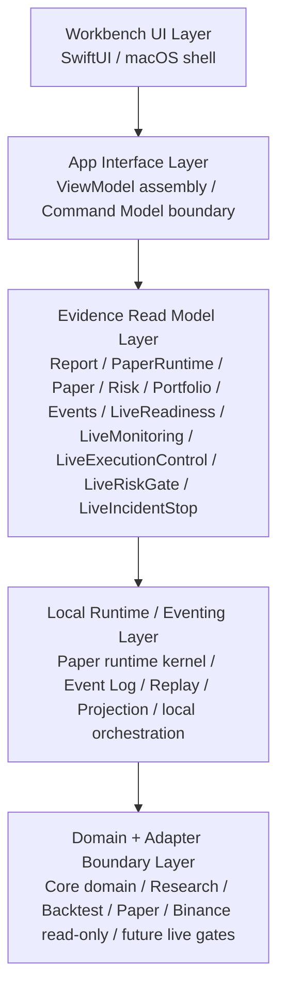

# architecture.md

## 工程模块地图定位

本文档是 MTPRO 的 Engineering Module Map / 工程模块地图。它是根目录高权重承接文档，负责把 `BLUEPRINT.md` 的完整蓝图翻译成系统模块、模块边界、数据流、接口关系、依赖方向和架构不变量。

本文档不能推翻 `BLUEPRINT.md`，不重新定义产品目标，不作为 Stage Code Audit、validation 或 PR evidence 流水账。已完成 Project 的事实证据进入 `docs/audit/`、`docs/validation/` 和 `verification.md`。

MTPRO 是 SwiftPM-first、Swift-only、local-first 的 macOS 交易研究工作台。架构借鉴 NautilusTrader 的 Kernel、MessageBus、Cache、DataEngine、StrategyEngine、RiskEngine、ExecutionEngine、Portfolio 和 Adapter 职责拆分，但不引入 NautilusTrader 作为运行依赖。

## Architecture Responsibility / 架构职责

`architecture.md` 只回答五个问题：

1. 当前有哪些模块。
2. 模块之间允许怎么依赖。
3. 数据和事件如何流动。
4. 哪些接口边界不能被绕过。
5. Future Live 能力如何被隔离在当前 scope 之外。

它不复制完整产品蓝图，不维护 Project 进度条，也不记录每个 PR 的审计流水账。

## Current Architecture Flow / 当前架构流

大白话：MTPRO 的交易系统分成“输入、内部处理、策略判断、执行意图、未来外部输出”几段。

```text
DataClient/<venue>
-> DataEngine
-> MessageBus
-> Cache / Database
-> Trader/Strategies/EMA + Trader/Coordination
-> Portfolio + RiskEngine
-> ExecutionEngine
-> ExecutionClient future gate
```

| 模块 | 大白话职责 | 当前状态 | 禁止越界 |
| --- | --- | --- | --- |
| `DataClient/<venue>/` | 从交易所 / venue 拿外部数据的输入适配器。一个 venue 一个目录，例如 `DataClient/Binance/`。 | 当前只允许 Binance public market data read-only 和 future-gated private stream label。 | 不接 signed endpoint、account endpoint、listenKey、broker execution adapter。 |
| `DataEngine/` | 把 DataClient 拿到的数据变成系统内部可用的事实：ingest、replay、quality、scenario、cursor、freshness。 | 当前服务 deterministic fixture、scenario replay 和 read-model evidence。 | 不直接写 UI，不执行交易，不绕过 MessageBus / Cache / Database。 |
| `MessageBus/` | 内部事实和请求 / 响应的脊柱，让 Data、Trader、Risk、Execution、Portfolio 通过统一事件 / 命令边界沟通。 | 当前是 boundary / evidence spine，不是外部 API。 | 不暴露 HTTP、broker payload、adapter request、DB schema 或 UI command surface。 |
| `Cache/` | 系统内的近线状态：instruments、market data、orders、positions 等可重建状态。 | 当前承接 projection / evidence cache boundary。 | 不成为唯一事实源，不替代 Database / Event Log。 |
| `Database/` | 持久化 facts / projections，包含 SQLite runtime projection 和 DuckDB analytical projection。 | 当前是 state / projection / replay evidence boundary。 | 不暴露 schema 给 Workbench，不成为 UI contract。 |
| `Trader/` | account + strategy instances + coordination 的容器。它消费策略输出、组合状态、风险上下文和执行上下文。 | 当前只完成 layout / evidence / coordination boundary，不是 Trader runtime。 | 不直连 `ExecutionClient`、broker、OMS 或 live command。 |
| `Trader/Strategies/EMA/` | 当前唯一 active concrete strategy 的定义区。策略只产生 signal / proposal / evidence。 | 当前 active concrete strategy only：EMA。 | 不新增 RSI / OBI / Momentum 等 active source；不提交订单。 |
| `Trader/Coordination/` | 串联 account、strategy、portfolio、risk、execution context 的协调边界；binding / adapter 语义归这里。 | 当前 `RiskBinding` 归入该层。 | 不作为具体 strategy code 落点，不绕过 RiskEngine / ExecutionEngine。 |
| `Portfolio/` | 组合视角：position、net position、margin、open value 等 read-model / projection context。 | 当前是 read-model / evidence boundary。 | 不读取 broker account state，不表达 real account truth。 |
| `RiskEngine/` | 执行前风险判断和 blocked evidence。 | 当前是 paper / simulated / future live risk gate boundary。 | 不调用 broker，不调用 `ExecutionClient`，不实现 live risk runtime。 |
| `ExecutionEngine/` | 系统内部的执行生命周期脑子：paper / simulated order lifecycle、fill、fee / slippage、portfolio projection。 | 当前已拆出 paper / simulated / OMS future gate boundary。 | 不调用交易所，不实现 broker adapter，不处理 real order lifecycle。 |
| `ExecutionClient/` | 未来对外执行适配器：把已授权订单意图翻译成交易所 / broker API 请求，并接收 execution report / broker fill。 | 当前只有 future gate / capability matrix，没有实现。 | 当前禁止 signed request、submit / cancel / replace、execution report parser、broker fill、reconciliation。 |
| `Workbench/` | 只读消费 ReadModel / ViewModel，展示报告、Dashboard、Events、evidence surface。 | 当前是 local-first macOS Workbench evidence surface。 | 不读 Runtime object、Adapter request、DB schema，不提供 trading button / live command。 |

`DataClient` 和 `ExecutionClient` 是一进一出，但当前只实现了输入侧的 public read-only 能力：

- `DataClient` 是“从外部拿数据进来”的输入适配器。
- `DataEngine` 把外部数据整理成内部事件、回放、质量证据和 read model 输入。
- `Trader/Strategies/EMA` 消费内部模型和上下文，只产出 proposal / signal / evidence。
- `ExecutionEngine` 是内部 paper / simulated 执行生命周期，不负责和交易所通话。
- `ExecutionClient` 是未来“把订单发出去”的外部执行适配器；当前 MTPRO 只保留 future gate，不实现任何真实下单路径。

因此，正确心智不是“策略直接调用 ExecutionClient”，而是：

```text
策略只提出建议
-> Trader 协调上下文
-> RiskEngine 做风险门
-> ExecutionEngine 处理内部 paper / simulated lifecycle
-> ExecutionClient 未来在 L4 授权后才可能接外部交易所 / broker
```

## Current Source Layout / 当前源码模块地形

当前源码已经从早期 `Core / Adapters / Persistence / Runtime / App / Dashboard` 兼容层，迁移到 architecture-graph-aligned 的目录优先结构。MTP-217 至 MTP-221 已建立可编译的 SwiftPM target graph；旧 `Core`、`Adapters`、`Persistence`、`Runtime` 和 `App` 只作为 retained compatibility envelopes / compatibility exports，服务既有 implementation 和 import 面，不再代表当前 active module graph。

```text
Sources/
  DomainModel/
  MessageBus/
  DataClient/
    Binance/
  DataEngine/
  Cache/
  Database/
  Trader/
    Coordination/
      RiskBinding/
    Strategies/
      EMA/
  Portfolio/
  RiskEngine/
  ExecutionEngine/
  ExecutionClient/
  Dashboard/
```

当前需要继续守住的事实：

- active concrete strategy 只有 `EMA`，canonical path 是 `Sources/Trader/Strategies/EMA/`。
- 非 EMA strategy 只能作为 future candidate，不进入当前 active source / tests / Package path。
- `StrategyBindings` 不再是 Trader 下的一级策略目录；binding / adapter 语义归入 `Trader/Coordination`。
- `ExecutionClient` 只存在 future gate / capability matrix，不是 broker / exchange execution implementation。
- `Workbench` product / target 和 `Sources/Workbench/` 已退休；当前 active UI surface 统一为 `Dashboard read-model-only boundary`。
- 当前 active SwiftPM target graph 以 MTP-217 至 MTP-221 的 split targets 为准；implementation-level envelope retirement、`App` compatibility export retirement 和 L4 runtime 仍需后续独立授权。

## Package Dependency Direction / SwiftPM 依赖方向

当前 active SwiftPM target graph snapshot 是：

```text
DomainModel
MessageBus -> DomainModel
Database -> DomainModel / MessageBus / CSQLite / DuckDB(macOS)
DataClient -> DomainModel
Cache -> DomainModel / MessageBus
DataEngine -> DomainModel / DataClient / MessageBus / Cache
Portfolio -> DomainModel / MessageBus / Cache / Database
RiskEngine -> DomainModel / MessageBus / Cache / Portfolio
ExecutionClient -> DomainModel / MessageBus
ExecutionEngine -> DomainModel / MessageBus / Cache / Portfolio / RiskEngine / ExecutionClient
TraderStrategies -> DomainModel / MessageBus / Cache / Portfolio / RiskEngine
Trader -> DomainModel / MessageBus / Cache / TraderStrategies / Portfolio / RiskEngine
Dashboard -> Core / Persistence
```

Retained compatibility envelopes 仍存在，但只能解释 buildability / import compatibility：

```text
Core
Adapters -> Core
Persistence -> Core, CSQLite, DuckDB(macOS)
Runtime -> Core, Adapters, Persistence
```

兼容壳规则：

- `Core` 不能依赖 Adapter、Persistence、Runtime、App 或 Dashboard。
- `Adapters` 只能表达外部 market data 边界，并通过 Core 类型输出事件或证据。
- `Persistence` 只能保存 facts / projections，不能成为 UI contract。
- `Runtime` 可以编排 Core、Adapters、Persistence，但不能直接变成 UI。
- `App` product / target 和 `Sources/AppCompatibility` 已退休；旧 `import App` surface 不再作为 active compatibility envelope。
- `Dashboard` 只能依赖 `Core` / `Persistence` 导出的 read model、ViewModel 和 projection snapshot，不读取 SQLite / DuckDB schema、adapter request 或 runtime object。

目标模块依赖方向以 active target graph 为准：

```text
DomainModel
MessageBus -> DomainModel
Database -> DomainModel / MessageBus / CSQLite / DuckDB(macOS)
DataClient -> DomainModel
Cache -> DomainModel / MessageBus
DataEngine -> DomainModel / DataClient / MessageBus / Cache
Portfolio -> DomainModel / MessageBus / Cache / Database
RiskEngine -> DomainModel / MessageBus / Cache / Portfolio
ExecutionClient -> DomainModel / MessageBus
ExecutionEngine -> DomainModel / MessageBus / Cache / Portfolio / RiskEngine / ExecutionClient
TraderStrategies -> DomainModel / MessageBus / Cache / Portfolio / RiskEngine
Trader -> DomainModel / MessageBus / Cache / TraderStrategies / Portfolio / RiskEngine
Dashboard -> Core / Persistence
```

`GH-392-TRADER-NO-DIRECT-EXECUTIONENGINE-DEPENDENCY` 已把 direct `Trader -> ExecutionEngine` target dependency 从当前 active `Package.swift` dependency snapshot 中移除。目标方向收敛为 Trader 管 Accounts + Strategies/EMA + Coordination，策略只产出 proposal / signal，RiskEngine / ExecutionEngine 作为下游 context 通过 contract / MessageBus / read-model evidence 消费，Trader 不直接拥有 ExecutionEngine implementation。

Forbidden path taxonomy：

- `DataClient -> signed/account/listenKey/private runtime` 禁止。
- `Trader/Strategies -> ExecutionClient` 禁止。
- `Trader -> ExecutionClient` 当前禁止，未来只能经 L4 Project 重新授权。
- `Trader -> ExecutionEngine` direct target dependency 禁止；历史 MTP-220 / GH-391 文档只能作为 before-state evidence，不得写成当前目标方向。
- `RiskEngine -> broker / ExecutionClient` 禁止。
- `Portfolio -> broker account state` 禁止。
- `ExecutionEngine -> current OMS / broker adapter` 禁止。
- `Dashboard -> Runtime object / Adapter request / Database schema` 禁止。

## GH-391 Real Target Source Ownership / Core Envelope Retirement Contract

`GH-391-REAL-TARGET-OWNERSHIP-CONTRACT`

GH-391 记录当前 architecture graph 的关键差距：target name、real module source root 和 boundary anchor 已基本对齐，但很多真实 implementation 仍由 `Core`、`Adapters`、`Persistence` 和 `Runtime` retained compatibility envelopes 承载。Canonical contract 位于 `docs/contracts/real-target-source-ownership-core-envelope-retirement-contract.md`。

`GH-391-CURRENT-BLOCKERS`

当前 blocker 包含：多数 target 当前只编译 module-local `TargetGraph/*TargetBoundary.swift`；`TargetGraphTests` 主要验证 boundary anchors / strings，不证明真实 target API ownership；Dashboard active source 仍有 Workbench naming residue；`try!` / `preconditionFailure` allowed path 还缺少机械验证。GH-392 已移除 `Trader -> ExecutionEngine` direct target dependency。

`GH-391-AUTHORITATIVE-TARGET-OWNERSHIP-MODEL`

当前 authoritative target names 是 `DomainModel`、`MessageBus`、`Database`、`DataClient`、`Cache`、`DataEngine`、`TraderStrategies`、`Trader`、`Portfolio`、`RiskEngine`、`ExecutionClient`、`ExecutionEngine` 和 `Dashboard`。当前 active strategy only `EMA`，`Trader = Accounts + Strategies/EMA + Coordination`，`ExecutionClient` remains future gate / protocol boundary only。

`GH-391-DEPENDENCY-DIRECTION-CORRECTION`

GH-391 不修改 `Package.swift`，但固定后续 correction：`Trader` 不应直接拥有 `ExecutionEngine` implementation。GH-392 已在独立 issue 中移除 direct `Trader -> ExecutionEngine` target dependency，并把 Trader boundary 改为 proposal / MessageBus / coordination 口径。

## GH-392 Trader / ExecutionEngine Dependency Direction Correction

`GH-392-TRADER-NO-DIRECT-EXECUTIONENGINE-DEPENDENCY`

GH-392 把 `Trader` target 的 allowed dependencies 收紧为 `DomainModel / MessageBus / Cache / TraderStrategies / Portfolio / RiskEngine`。`Trader` 不再直接依赖 `ExecutionEngine`，也不 import `ExecutionEngine` boundary anchor。

`GH-392-TRADER-PROPOSAL-MESSAGEBUS-COORDINATION-BOUNDARY`

Trader 当前仍只是 `Accounts + Strategies/EMA + Coordination` 容器；策略只产出 proposal / signal / evidence。RiskEngine / ExecutionEngine 是下游 context，后续只能通过 contract / MessageBus / read-model evidence 消费 Trader 输出，不能由 Trader 直接拥有 ExecutionEngine implementation。

`GH-392-VALIDATION-ANCHORS`

GH-392 的 validation anchor 位于 `Package.swift`、`Sources/Trader/TargetGraph/TraderTargetBoundary.swift`、`Tests/TargetGraphTests/TargetGraphTests.swift` 和 `checks/automation-readiness.sh`。这些检查阻止 direct `Trader -> ExecutionEngine` dependency、`import ExecutionEngine` 和旧 allowed dependency string 回退。

## GH-393 Foundation Real Target Smoke Tests

`GH-393-FOUNDATION-REAL-TARGET-SMOKE-TESTS`

GH-393 为 `DomainModel`、`MessageBus` 和 `Database` 增加最小 real target smoke APIs：`FoundationTargetOwnership.swift`、`FoundationMessageStream.swift` 和 `FoundationDatabaseCheckpoint.swift`。`TargetGraphTests` 直接 import 三个 foundation targets，并创建 / 使用这些 public values，证明这些 targets 不再只是 boundary anchor / Package 字符串。

`GH-393-FOUNDATION-COMPATIBILITY-ENVELOPE-PRESERVED`

GH-393 只迁出最小 smoke files 的编译 ownership，完整 DomainModel、MessageBus、event log、projection、SQLite / DuckDB implementation 仍由 `Core` / `Persistence` / `Runtime` compatibility envelope 承载，后续 GH-394+ 再逐段迁移真实 implementation。

`GH-393-FOUNDATION-NO-RUNTIME-LIVE-BROKER-L4-GUARD`

GH-393 不实现 Trader runtime、Strategy runtime、Live runtime、ExecutionClient implementation、OMS、broker gateway、signed/account endpoint、private stream runtime、real order lifecycle、Live PRO Console、trading button、live command、order form 或 L4 capability。

`GH-391-REAL-TARGET-SMOKE-TEST-CONTRACT`

后续 real target smoke tests 必须证明对应 target 能独立 import 并使用目标模块自己的核心类型，不能只检查 `Package.swift` 字符串或 boundary struct。

`GH-391-CORE-ENVELOPE-RETIREMENT-RULE`

`Core`、`Adapters`、`Persistence` 和 `Runtime` 只能逐段退休：先加 real target smoke tests，再迁移 implementation ownership，再更新 compatibility envelope，最后清理 stale docs / validation anchors。GH-391 不授权一次性删除 `Core` 或移动大批 source。

`GH-391-FORBIDDEN-CAPABILITY-GUARD`

GH-391 不实现 Trader runtime、Strategy runtime、Live runtime、ExecutionClient implementation、OMS、broker gateway、signed endpoint、account endpoint / listenKey、private WebSocket runtime、real order lifecycle、Live PRO Console、trading button、live command、order form 或 L4 capability；不启动 Symphony / symphony-issue，不运行 Graphify / code-index，不修改 Figma。

## GH-394 DomainModel / MessageBus Implementation Ownership

`GH-394-DOMAINMODEL-MESSAGEBUS-IMPLEMENTATION-OWNERSHIP`

GH-394 把基础领域模型真实实现迁回 `DomainModel` target：`CoreBaseline.swift`、`MarketPrimitives.swift`、`MarketDataModels.swift`、`DomainModelContractError.swift` 和 `FoundationTargetOwnership.swift` 现在由 `DomainModel` 直接编译。`Core` 不再把 `Sources/DomainModel` 当 source directory 编译，只依赖 `DomainModel` 并通过 compatibility import 保留旧 `import Core` 可见性。

`GH-394-MESSAGEBUS-NEUTRAL-JOURNAL-OWNERSHIP`

GH-394 让 `MessageBus` target 拥有中立 append-only journal：`MessageBusAppendOnlyJournal.swift` 与 `FoundationMessageStream.swift` 可直接由 `MessageBus` 编译和使用。旧 `CommandsAndQueries.swift`、`DomainEvents.swift`、`EventLog.swift` 和 `PaperRuntimeBusRouting.swift` 仍在 `Core` compatibility envelope，因为它们当前引用 paper、strategy、portfolio、risk 和 execution payload，后续必须按依赖方向拆解。

`GH-394-CORE-COMPATIBILITY-ENVELOPE-PRESERVED`

GH-394 不删除 `Core`，也不迁移 Data、Trader、Portfolio、Risk、Execution 或 Dashboard ownership。它只完成 foundation ownership 的第一段真实迁移，并继续禁止 Trader runtime、Strategy runtime、Live runtime、ExecutionClient implementation、OMS、broker gateway、signed/account endpoint、private stream runtime、real order lifecycle、Live PRO Console、trading button、live command、order form 和 L4 capability。

## GH-395 Data Target Real Smoke Tests

`GH-395-DATA-TARGET-REAL-SMOKE-TESTS`

GH-395 为 data targets 增加最小 real target smoke APIs：`DataClientReadOnlyMarketDataSource.swift`、`CacheReadModelSnapshot.swift` 和 `DataEngineReadOnlyReplayPlan.swift`。`TargetGraphTests` 直接 import `DataClient`、`Cache` 和 `DataEngine`，并创建 public read-only source、read-model snapshot 和 replay plan，证明这些 targets 不再只是 boundary anchor / Package 字符串。

`GH-395-DATACLIENT-REAL-TARGET-SMOKE`

`DataClient` 当前只表达 public read-only market data input source identity。它不调用 signed endpoint、account endpoint，不创建 listenKey，不连接 private WebSocket runtime，也不连接 broker 或 execution adapter。

`GH-395-CACHE-REAL-TARGET-SMOKE`

`Cache` 当前只表达可由 MessageBus replay 重建的 read-model state surface。它不拥有 durable facts、database schema、broker state、account payload 或 runtime object。

`GH-395-DATAENGINE-REAL-TARGET-SMOKE`

`DataEngine` 当前只表达 public data ingest / replay / quality plan。它串联 DataClient source、MessageBus stream 和 Cache read model，不实现 streaming runtime、private stream、signed/account endpoint、broker command、ExecutionClient implementation、OMS、real order lifecycle 或 L4 capability。

`GH-395-DATA-COMPATIBILITY-ENVELOPE-PRESERVED`

完整 DataClient adapter、DataEngine ingest / replay / quality 和 Cache market-data implementation 仍分别由 `Adapters`、`Core` 和 `Runtime` compatibility envelope 承载。GH-395 只建立 smoke APIs；GH-396 才迁移完整 data implementation ownership。

## GH-396 Data Target Implementation Ownership

`GH-396-DATA-TARGET-IMPLEMENTATION-OWNERSHIP`

GH-396 把 data target ownership 从 smoke API 推进到部分真实 implementation ownership：

- `DataClient` target 直接编译 `Sources/DataClient/Binance/PublicMarketData/` 的 Binance public read-only implementation 和 `DataClientReadOnlyMarketDataSource.swift`。
- `Adapters` target 退为 `DataClient` 的 compatibility re-export，只保留 `Sources/DataClient/AdaptersCompatibility.swift`，不再拥有 Binance public market data implementation。
- `Cache` target 直接编译 `Sources/Cache/MarketData/` 的 market-data read model implementation、`CacheContractError.swift` 和 `CacheReadModelSnapshot.swift`。
- `Core` target 通过 `DomainModelCompatibilityImport.swift` re-export `Cache`，并只保留 `MarketDataCacheCoreReplayCompatibility.swift` 桥接旧 `EventEnvelope` replay helper。
- `DataEngine` target 仍只拥有 `DataEngineReadOnlyReplayPlan.swift`；`ScenarioReplay`、`DataQuality` 和 `Ingest` 继续由 `Core` / `Runtime` compatibility envelopes 承载，因为这些实现仍绑定 `CoreError`、legacy event payload 和 persistence workflow。

`GH-396-DATACLIENT-BINANCE-PUBLIC-IMPLEMENTATION-OWNERSHIP`

`DataClient` 现在是 Binance public read-only market data implementation owner。它仍禁止 signed endpoint、account endpoint、listenKey、private stream runtime、broker adapter、ExecutionClient implementation、OMS、real order lifecycle 和 L4 live capability。

`GH-396-CACHE-MARKETDATA-IMPLEMENTATION-OWNERSHIP`

`Cache` 现在拥有 market-data cache / order-book read-model implementation。`Cache` 仍不拥有 durable facts、Database schema、broker state、account payload、runtime object 或 UI command surface。

`GH-396-DATAENGINE-REPLAY-QUALITY-COREERROR-ENVELOPE-DOCUMENTED`

`DataEngine` 的 scenario replay / data quality implementation 仍在 `Core` compatibility envelope 中，这是显式记录的 migration debt，不得解释为 DataEngine implementation ownership 已完全完成。

`GH-396-DATAENGINE-INGEST-RUNTIME-ENVELOPE-DOCUMENTED`

`DataEngine/Ingest` 仍由 `Runtime` compatibility envelope 编排 DataClient + Persistence workflow。该路径不新增 streaming runtime、private stream、signed/account endpoint、broker route、ExecutionClient route、OMS route 或 L4 capability。

## GH-397 Trader / Portfolio / Risk / Execution Real Target Smoke Tests

`GH-397-TRADER-PORTFOLIO-RISK-EXECUTION-REAL-SMOKE-TESTS`

GH-397 为 Trader / Portfolio / Risk / Execution 侧建立 real target smoke test baseline。该 baseline 证明 `TraderStrategies`、`Trader`、`Portfolio`、`RiskEngine`、`ExecutionClient` 和 `ExecutionEngine` targets 都能被测试 target 独立 import，并能读取各自的 public boundary API，而不是只靠 `Package.swift` 字符串或 retired top-level `Sources/TargetGraph` path 证明存在。

`GH-397-TRADER-EMA-COORDINATION-SMOKE`

Trader 当前口径继续固定为 `Trader = Accounts + Strategies/EMA + Coordination`。`TraderStrategies` 只允许 active concrete strategy `EMA`，canonical active strategy path only `Sources/Trader/Strategies/EMA`。Trader 不直接依赖 `ExecutionEngine` 或 `ExecutionClient`，也不读取 broker / account payload，不提供 live command surface。

`GH-397-PORTFOLIO-RISK-PREEXECUTION-SMOKE`

`Portfolio` 继续作为 financial state projection boundary，不拥有 Trader account identity、broker account state 或 account endpoint payload。`RiskEngine` 继续作为 pre-execution guard，不调用 broker / ExecutionClient，不路由 executable order command。

`GH-397-EXECUTIONCLIENT-FUTURE-GATE-SMOKE`

`ExecutionClient` 仍只是 future gate / protocol boundary，不是 broker gateway、signed endpoint client、account endpoint client、listenKey runtime、private WebSocket runtime、order submit / cancel / replace client、execution report parser、broker fill parser 或 reconciliation runtime。`ExecutionEngine` 继续只承接 paper / simulated lifecycle boundary 和 ExecutionClient future-gate vocabulary，不实现 OMS、live execution runtime 或 real order lifecycle。

`GH-397-COMPATIBILITY-ENVELOPE-PRESERVED`

GH-397 不迁移 Trader / Portfolio / Risk / Execution implementation ownership。`Core` compatibility envelope 仍显式承载相关既有 implementation，GH-398 才允许按证据继续迁移 ownership。

## MTP-216 SwiftPM Target Graph Split Contract

`MTP-216-SWIFTPM-TARGET-GRAPH-SPLIT-CONTRACT`

MTP-216 只定义后续 SwiftPM target graph split 的合同和依赖方向，不修改 `Package.swift`，不移动 production source，不新增 SwiftPM target / product / dependency。Canonical contract 位于 `docs/contracts/swiftpm-target-graph-split-contract.md`。

`MTP-216-CURRENT-COMPATIBILITY-ENVELOPE-SNAPSHOT`

MTP-216 的 before-state snapshot 是旧 compatibility envelope：`Core`、`Adapters -> Core`、`Persistence -> Core, CSQLite, DuckDB(macOS)`、`Runtime -> Core, Adapters, Persistence`、`App -> Core, Persistence`、`Dashboard -> App`。该 snapshot 只作为历史 before-state evidence 保留，不再代表 MTP-222 当前 active target graph。

`MTP-216-CANONICAL-TARGET-GRAPH-BASELINE`

后续目标 module targets 是 `DomainModel`、`MessageBus`、`Database`、`DataClient`、`Cache`、`DataEngine`、`Portfolio`、`RiskEngine`、`ExecutionClient`、`ExecutionEngine`、`TraderStrategies`、`Trader`、`Workbench` 和 `Dashboard`。`TraderStrategies` 归 Trader ownership，当前 active concrete strategy only `EMA`，canonical source path only `Sources/Trader/Strategies/EMA/`。

`MTP-216-DEPENDENCY-DIRECTION-CONTRACT`

目标依赖方向为：`MessageBus -> DomainModel`；`Database -> DomainModel / MessageBus / CSQLite / DuckDB(macOS)`；`DataClient -> DomainModel`；`Cache -> DomainModel / MessageBus`；`DataEngine -> DomainModel / DataClient / MessageBus / Cache`；`Portfolio -> DomainModel / MessageBus / Cache / Database`；`RiskEngine -> DomainModel / MessageBus / Cache / Portfolio`；`ExecutionClient -> DomainModel`；`ExecutionEngine -> DomainModel / MessageBus / Cache / Portfolio / RiskEngine / ExecutionClient(future gate types only)`；`TraderStrategies -> DomainModel / MessageBus / Cache / Portfolio / RiskEngine`；`Trader -> DomainModel / MessageBus / Cache / TraderStrategies / Portfolio / RiskEngine / ExecutionEngine`；`Dashboard -> Core / Persistence read-model and ViewModel exports only`。

`MTP-216-FORBIDDEN-IMPORT-PATHS`

后续 target split 必须阻断 `DataClient -> signed/account/listenKey/private runtime`、`TraderStrategies -> ExecutionClient / broker / OMS`、`Trader -> ExecutionClient`、`RiskEngine -> broker / ExecutionClient`、`ExecutionEngine -> current OMS / broker adapter / signed endpoint / account endpoint / listenKey`、`ExecutionClient -> signed request / real order lifecycle`、`Workbench -> Runtime object / Adapter request / Database schema / broker payload / account payload` 和 `Dashboard -> anything except Workbench`。

`MTP-216-TRADER-OWNED-STRATEGIES-TARGET-BOUNDARY`

后续多个策略统一放在 `Sources/Trader/Strategies/<strategy>/`，并由未来 `TraderStrategies` target 编译。策略只提出 signal / paper-neutral proposal evidence，不能直连 ExecutionClient、broker、OMS、Workbench、Dashboard 或 UI command surface。`Sources/Trader/Coordination/RiskBinding/` 是 coordination adapter / binding boundary，不是 concrete strategy implementation landing path。

`MTP-216-MODULE-TO-TARGET-SPLIT-SEQUENCE`

MTP-217 只能拆 `DomainModel` / `MessageBus` / `Database` foundation targets；MTP-218 只能拆 `DataClient` / `DataEngine` / `Cache`；MTP-219 只能拆 `TraderStrategies` / `Trader` / `Portfolio` / `RiskEngine`；MTP-220 只能拆 `ExecutionEngine` / `ExecutionClient` future gate；MTP-221 只能拆 `Workbench` / `Dashboard` read-model-only consumption targets；MTP-222 才能退休 obsolete compatibility envelopes；MTP-223 只做 validation matrix / automation readiness / stage audit input closeout。

`MTP-216-PACKAGE-SPLIT-NON-AUTHORIZATION`

本文档记录 MTP-216 target graph contract，不授权修改 `Package.swift`、移动 source、退休 compatibility envelope、实现 runtime / live / broker / L4 capability 或创建下一 Project / Issue。

`MTP-216-NO-RUNTIME-LIVE-BROKER-L4`

MTP-216 不实现 Strategy runtime、Trader runtime、Live runtime、ExecutionClient implementation、OMS、broker gateway、signed endpoint、account endpoint / listenKey、private WebSocket runtime、real order lifecycle、Live PRO Console、trading button、live command、order form 或 L4 capability。

## MTP-217 Foundation Target Split

`MTP-217-FOUNDATION-TARGET-SPLIT-EVIDENCE`

MTP-217 已开始实际 SwiftPM target graph split：`Package.swift` 新增 `DomainModel`、`MessageBus` 和 `Database` library products / targets；MTP-226 / MTP-231 后，active foundation boundary anchors 已迁到真实 module roots 下的 `TargetGraph/*TargetBoundary.swift`。该 split 不退休 `Core` / `Persistence` compatibility envelope，不改变既有 public type 调用面。

`MTP-217-DOMAINMODEL-TARGET-SPLIT`

`DomainModel` target 不依赖任何业务 target；它只固定 `Sources/DomainModel/` canonical source root、`Sources/DomainModel/TargetGraph/` compiled boundary root 和 no runtime / live / broker guard。

`MTP-217-MESSAGEBUS-TARGET-SPLIT`

`MessageBus` target 只依赖 `DomainModel`。现有 `Sources/MessageBus/` 仍由 `Core` 兼容壳编译，避免把 paper routing、strategy / portfolio / risk / execution evidence coupling 越界搬入 foundation target。

`MTP-217-DATABASE-TARGET-SPLIT`

`Database` target 依赖 `DomainModel`、`MessageBus`、`CSQLite` 和 macOS 条件 `DuckDB` implementation dependency。现有 SQLite / DuckDB projection implementation 仍由 `Persistence` 兼容壳编译，不向 Workbench 暴露 schema，不持久化 broker / account payload。

`MTP-217-FOUNDATION-DEPENDENCY-DIRECTION`

当前 foundation target direction 是 `DomainModel`、`MessageBus -> DomainModel`、`Database -> DomainModel / MessageBus / CSQLite / DuckDB(macOS)`。`DomainModel`、`MessageBus`、`Database` 不得依赖 DataEngine、Trader、TraderStrategies、Portfolio、RiskEngine、ExecutionEngine、ExecutionClient、Workbench、Dashboard、broker、OMS、account endpoint 或 private stream runtime。

`MTP-217-FOUNDATION-COMPATIBILITY-ENVELOPE-RETAINED`

`Core` 继续编译既有 `Sources/DomainModel/` 和 `Sources/MessageBus/` public types；`Persistence` 继续编译既有 `Sources/Database/Projections/` implementation；`TargetGraph` 被旧 compatibility targets 明确排除，防止 boundary anchors 被兼容壳重复收编。

`MTP-217-TARGETGRAPH-TEST-EVIDENCE`

`TargetGraphTests` 直接 import 三个新 foundation targets，验证 target buildability、allowed dependency direction、retained compatibility envelope 和 no higher-layer runtime / broker / UI drift。

`MTP-217-NO-RUNTIME-LIVE-BROKER-L4-GUARD`

MTP-217 不实现 Strategy runtime、Trader runtime、Live runtime、ExecutionClient implementation、OMS、broker gateway、signed endpoint、account endpoint / listenKey、private WebSocket runtime、real order lifecycle、Live PRO Console、trading button、live command、order form 或 L4 capability。

## MTP-218 Data Target Split

`MTP-218-DATA-TARGET-SPLIT-EVIDENCE`

MTP-218 继续实际 SwiftPM target graph split：`Package.swift` 新增 `DataClient`、`DataEngine` 和 `Cache` library products / targets；MTP-227 / MTP-231 后，active data-layer boundary anchors 已迁到真实 module roots 下的 `TargetGraph/*TargetBoundary.swift`。GH-395 / GH-396 后，`DataClient` 和 `Cache` 已开始拥有真实 implementation source；`DataEngine` 仍保留明确的 `Core` / `Runtime` compatibility envelope 债务。

`MTP-218-DATACLIENT-TARGET-SPLIT`

`DataClient` target 只依赖 `DomainModel`，当前 active boundary anchor 是 `Sources/DataClient/TargetGraph/DataClientTargetBoundary.swift`。GH-396 后，既有 Binance public market data implementation 由 `DataClient` target 编译；`Adapters` 只保留 re-export compatibility envelope。

`MTP-218-CACHE-TARGET-SPLIT`

`Cache` target 依赖 `DomainModel` 和 `MessageBus`，当前 active boundary anchor 是 `Sources/Cache/TargetGraph/CacheTargetBoundary.swift`。GH-396 后，既有 market-data cache / order-book read-model implementation 由 `Cache` target 编译；`Core` 只保留 re-export 和旧 `EventEnvelope` replay helper compatibility。

`MTP-218-DATAENGINE-TARGET-SPLIT`

`DataEngine` target 依赖 `DomainModel`、`DataClient`、`MessageBus` 和 `Cache`，当前 active boundary anchor 是 `Sources/DataEngine/TargetGraph/DataEngineTargetBoundary.swift`。既有 scenario replay / data quality implementation 仍由 `Core` compatibility envelope 编译，ingest workflow 仍由 `Runtime` compatibility envelope 编译；`DataEngine` 不新增 streaming runtime、private stream、account endpoint、broker route 或 UI route。

`MTP-218-DATACLIENT-DATAENGINE-CACHE-DEPENDENCY-DIRECTION`

当前 data-layer target direction 是 `DataClient -> DomainModel`、`Cache -> DomainModel / MessageBus`、`DataEngine -> DomainModel / DataClient / MessageBus / Cache`。`DataClient`、`DataEngine` 和 `Cache` 不得依赖 Trader、TraderStrategies、RiskEngine、ExecutionEngine、ExecutionClient、Workbench、Dashboard、broker、OMS、signed endpoint、account endpoint、listenKey、private stream runtime、Database schema 或 broker state。

`MTP-218-DATA-COMPATIBILITY-ENVELOPE-RETAINED`

`Adapters` 只保留 `DataClient` re-export compatibility；`Core` 只保留 Cache re-export、旧 `EventEnvelope` replay helper、scenario replay 和 data quality evidence；`Runtime` 继续编译既有 ingest implementation；DataEngine scenario replay / quality / ingest 的 compatibility envelope retirement 仍是后续 issue。

`MTP-218-TARGETGRAPH-TEST-EVIDENCE`

`TargetGraphTests` 直接 import `DataClient`、`DataEngine` 和 `Cache`，验证 target buildability、allowed dependency direction、retained compatibility envelope 和 no signed / account / listenKey / broker / runtime drift。

`MTP-218-NO-SIGNED-ACCOUNT-BROKER-GUARD`

MTP-218 不实现 Strategy runtime、Trader runtime、Live runtime、ExecutionClient implementation、OMS、broker gateway、signed endpoint、account endpoint / listenKey、private WebSocket runtime、real account read、real order lifecycle、Live PRO Console、trading button、live command、order form 或 L4 capability。

## MTP-219 Trader / Portfolio / Risk Target Split

`MTP-219-TRADER-PORTFOLIO-RISK-TARGET-SPLIT-EVIDENCE`

MTP-219 继续实际 SwiftPM target graph split：`Package.swift` 新增 `TraderStrategies`、`Trader`、`Portfolio` 和 `RiskEngine` library products / targets；MTP-228 / MTP-231 后，active coordination / financial state / pre-execution risk boundary anchors 已迁到真实 module roots 下的 `TargetGraph/*TargetBoundary.swift`。该 split 不退休 `Core` compatibility envelope，不迁移既有 production implementation。

`MTP-219-TRADERSTRATEGIES-TARGET-SPLIT`

`TraderStrategies` target 依赖 `DomainModel`、`MessageBus`、`Cache`、`Portfolio` 和 `RiskEngine`，当前 active boundary anchor 是 `Sources/Trader/Strategies/EMA/TargetGraph/TraderStrategiesTargetBoundary.swift`。当前 active concrete strategy only `EMA`，canonical active path only `Sources/Trader/Strategies/EMA/`。

`MTP-219-TRADER-TARGET-SPLIT`

`Trader` target 在 MTP-219 时依赖 `DomainModel`、`MessageBus`、`Cache`、`TraderStrategies`、`Portfolio` 和 `RiskEngine`，并把 `ExecutionEngine(MTP-220)` 记录为 deferred dependency。MTP-220 已把该 deferred dependency 解析为当前 active `Trader -> ExecutionEngine` target dependency。

`MTP-219-PORTFOLIO-TARGET-SPLIT`

`Portfolio` target 依赖 `DomainModel`、`MessageBus`、`Cache` 和 `Database`，当前 active boundary anchor 是 `Sources/Portfolio/TargetGraph/PortfolioTargetBoundary.swift`。Portfolio 保持独立 financial state projection boundary，不拥有 Trader account identity，不读取 broker account state 或 account endpoint payload。

`MTP-219-RISKENGINE-TARGET-SPLIT`

`RiskEngine` target 依赖 `DomainModel`、`MessageBus`、`Cache` 和 `Portfolio`，当前 active boundary anchor 是 `Sources/RiskEngine/TargetGraph/RiskEngineTargetBoundary.swift`。RiskEngine 保持 pre-execution risk boundary，不实现 live risk runtime、broker route、ExecutionClient wrapper 或 executable order command router。

`MTP-219-TRADER-PORTFOLIO-RISK-DEPENDENCY-DIRECTION`

MTP-219 的 historical direction 是 `Portfolio -> DomainModel / MessageBus / Cache / Database`、`RiskEngine -> DomainModel / MessageBus / Cache / Portfolio`、`TraderStrategies -> DomainModel / MessageBus / Cache / Portfolio / RiskEngine`、`Trader -> DomainModel / MessageBus / Cache / TraderStrategies / Portfolio / RiskEngine`，并把 `Trader -> ExecutionEngine` 延后到 MTP-220。MTP-222 的当前 active direction 已包含 `Trader -> ExecutionEngine`。

`MTP-219-TRADER-CONTAINER-ACCOUNTS-EMA-COORDINATION`

Trader container 保持 `Accounts + Strategies/EMA + Coordination`：account context root 是 `Sources/Trader/Accounts/`，active strategy root 是 `Sources/Trader/Strategies/EMA/`，coordination root 是 `Sources/Trader/Coordination/RiskBinding/`。旧 `Sources/Trader/StrategyBindings/` 和 peer-level `Sources/Strategies/` 不得回流。

`MTP-219-NO-DIRECT-EXECUTION-GUARD`

MTP-219 不实现 Strategy runtime、Trader runtime、Live runtime、ExecutionClient implementation、OMS、broker gateway、signed endpoint、account endpoint / listenKey、private WebSocket runtime、real account read、broker payload read、real order lifecycle、Live PRO Console、trading button、live command、order form 或 L4 capability。

## MTP-220 ExecutionEngine / ExecutionClient Target Split

`MTP-220-EXECUTION-TARGET-SPLIT-EVIDENCE`

MTP-220 继续实际 SwiftPM target graph split：`Package.swift` 新增 `ExecutionClient` 和 `ExecutionEngine` library products / targets；MTP-229 / MTP-231 后，active execution future gate boundary anchors 已迁到真实 module roots 下的 `TargetGraph/*TargetBoundary.swift`。该 split 不退休 `Core` compatibility envelope，不迁移既有 production implementation。

`MTP-220-EXECUTIONCLIENT-TARGET-SPLIT`

`ExecutionClient` target 依赖 `DomainModel` 和 `MessageBus`，当前 active boundary anchor 是 `Sources/ExecutionClient/TargetGraph/ExecutionClientTargetBoundary.swift`。ExecutionClient 只能表达 future gate / outgoing adapter contract，不实现 broker gateway、signed endpoint、account endpoint / listenKey、private WebSocket runtime 或 real order lifecycle。

`MTP-220-EXECUTIONENGINE-TARGET-SPLIT`

`ExecutionEngine` target 依赖 `DomainModel`、`MessageBus`、`Cache`、`Portfolio`、`RiskEngine` 和 `ExecutionClient`，当前 active boundary anchor 是 `Sources/ExecutionEngine/TargetGraph/ExecutionEngineTargetBoundary.swift`。ExecutionEngine 只表达 paper / simulated execution lifecycle boundary 和 OMS future gate evidence，不实现 live execution runtime、OMS implementation、broker gateway 或 executable live order command。

`MTP-220-RISKENGINE-EXECUTIONENGINE-EXECUTIONCLIENT-DIRECTION`

当前 execution target direction 是 `ExecutionClient -> DomainModel / MessageBus`、`ExecutionEngine -> DomainModel / MessageBus / Cache / Portfolio / RiskEngine / ExecutionClient`，并把 MTP-219 延后的 `Trader -> ExecutionEngine` dependency 解析为正式 target dependency。

`MTP-220-NO-BROKER-OMS-REAL-ORDER-GUARD`

MTP-220 不实现 Strategy runtime、Trader runtime、Live runtime、ExecutionClient implementation、OMS implementation、broker gateway、signed endpoint、account endpoint / listenKey、private WebSocket runtime、real account read、broker payload read、real order lifecycle、submit / cancel / replace、execution report、broker fill、reconciliation、Live PRO Console、trading button、live command、order form 或 L4 capability。

## MTP-221 Dashboard Read-model-only Target Split

`MTP-221-DASHBOARD-TARGET-SPLIT-EVIDENCE`

MTP-221 曾新增 `Workbench` library product / target 作为 Workbench / Dashboard read-model-only consumption split 证据。当前 Workbench 模块已经退役，`Dashboard` executable target 直接拥有 read-model-only display surface。

`MTP-221-WORKBENCH-TARGET-RETIRED`

`Workbench` target / source root 当前已退役。`Package.swift` 不再包含 `Workbench` product / target，`Sources/Workbench/` 和 `Sources/Workbench/TargetGraph/WorkbenchTargetBoundary.swift` 只能作为 historical / forbidden active path 证据引用。

`MTP-221-DASHBOARD-TARGET-SPLIT`

`Dashboard` executable target 依赖 `Core` 和 `Persistence`，当前编译 `Sources/Dashboard/DashboardApplication.swift`、`Sources/Dashboard/DashboardTargetBoundary.swift`、`Sources/Dashboard/DashboardShell.swift`、`Sources/Dashboard/ReadModels/`、`Sources/Dashboard/Report/`、`Sources/Dashboard/Events/` 和 `Sources/Dashboard/FutureLiveProConsole/`。Dashboard 只消费 read model / ViewModel / projection snapshot，不直接依赖 Adapters、Runtime、ExecutionClient、broker、OMS、schema、account payload 或 live command。

`MTP-221-DASHBOARD-READ-MODEL-DEPENDENCY-DIRECTION`

当前 UI consumption target direction 是 `Dashboard -> Core / Persistence read-model and ViewModel exports only`。`App` product / target、`Sources/AppCompatibility`、`Workbench` product / target 和 `Sources/Workbench/` 已退休，`Tests/AppTests` 直接 import `Dashboard`。

`MTP-221-NO-UI-COMMAND-RUNTIME-SCHEMA-GUARD`

MTP-221 不实现 Strategy runtime、Trader runtime、Live runtime、ExecutionClient implementation、OMS implementation、broker gateway、signed endpoint、account endpoint / listenKey、private WebSocket runtime、real account read、broker payload read、real order lifecycle、submit / cancel / replace、execution report、broker fill、reconciliation、Live PRO Console、trading button、live command、order form 或 L4 capability。

## MTP-222 Compatibility Anchor Retirement

`MTP-222-CURRENT-TARGET-GRAPH-SNAPSHOT`

MTP-222 后，本文档中的 active SwiftPM target graph snapshot 以 MTP-217 至 MTP-221 已落仓并完成后续 cleanup 的 buildable targets 为准：`DomainModel`、`MessageBus`、`Database`、`DataClient`、`Cache`、`DataEngine`、`Portfolio`、`RiskEngine`、`ExecutionClient`、`ExecutionEngine`、`TraderStrategies`、`Trader` 和 `Dashboard`。旧 `Core`、`Adapters`、`Persistence`、`Runtime` 只作为 retained compatibility envelopes / exports 解释既有 implementation 和 import surface；`App` 和 `Workbench` 已退休，不得再写成当前 active SwiftPM target graph。

`MTP-222-HISTORICAL-COMPATIBILITY-EVIDENCE-RETAINED`

MTP-216 的 `Core / Adapters / Persistence / Runtime / App / Dashboard` snapshot、MTP-183 至 MTP-211 的 source migration / compatibility envelope evidence、旧 `Sources/Strategies/<strategy>`、旧 `Sources/Trader/StrategyBindings/`、旧 `Dashboard -> Workbench` 和旧 `Sources/Workbench/` references 只作为 historical / compatibility / superseded / before-state evidence 保留。任何 active docs、validation anchors 或 readiness checks 都必须指向 current split target graph、`Sources/Trader/Strategies/EMA/`、`Sources/Trader/Coordination/RiskBinding/` 和 `Dashboard -> Core / Persistence`。

`MTP-222-NO-BEHAVIOR-RUNTIME-LIVE-GUARD`

MTP-222 退休 stale wording / stale validation anchors；后续 direct cleanup 已删除 `App` product / target 和 `Sources/AppCompatibility` compatibility export。当前仍不实现 Strategy runtime、Trader runtime、Live runtime、ExecutionClient implementation、OMS implementation、broker gateway、signed endpoint、account endpoint / listenKey、private WebSocket runtime、real account read、real order lifecycle、Live PRO Console、trading button、live command、order form 或 L4 capability。

`MTP-222-COMPATIBILITY-ANCHOR-RETIREMENT-VALIDATION`

MTP-222 validation 必须证明 active docs 已包含 current target graph snapshot、historical compatibility evidence retained boundary、stale active anchor retirement 和 no behavior / runtime / live guard；同时 `git diff --check`、`bash checks/automation-readiness.sh` 和 `bash checks/run.sh` 必须通过。

## MTP-224 TargetGraph Anchor Retirement / Real Module Source Root Migration Contract

`MTP-224-TARGETGRAPH-RETIREMENT-CONTRACT`

`Sources/TargetGraph` 在 MTP-224 / MTP-225 语境中是 transitional compile anchor / historical evidence；MTP-231 后不再是 active source directory 或 active target path reference。它不是最终架构模块、不是长期 source ownership、不是 engine layer，也不是未来 feature landing path。Canonical contract 位于 `docs/contracts/targetgraph-anchor-retirement-real-module-source-root-migration-contract.md`。

`MTP-224-REAL-MODULE-SOURCE-ROOT-TARGET`

后续 target source root 的目标落点必须回到真实模块目录：`Sources/DomainModel/`、`Sources/MessageBus/`、`Sources/Database/`、`Sources/DataClient/`、`Sources/DataEngine/`、`Sources/Cache/`、`Sources/Portfolio/`、`Sources/RiskEngine/`、`Sources/ExecutionClient/`、`Sources/ExecutionEngine/`、`Sources/Trader/Strategies/EMA/`、`Sources/Trader/Accounts/`、`Sources/Trader/Coordination/` 和 `Sources/Dashboard/`。当前 active concrete strategy only `EMA`；后续多个策略只能进入 `Sources/Trader/Strategies/<strategy>/`。

`MTP-224-MIGRATION-SEQUENCE-COMPATIBILITY-RULE`

后续迁移顺序固定为 MTP-225 audit、MTP-226 foundation、MTP-227 data、MTP-228 trader / portfolio / risk、MTP-229 execution future gate、MTP-230 Dashboard real root、MTP-231 TargetGraph active path retirement、MTP-232 validation / compatibility / stage audit input closeout。每一步都必须由 Linear live issue 单独授权并保持 WIP=1。

`MTP-224-NO-PACKAGE-SOURCE-MOVE-RUNTIME-GUARD`

MTP-224 不授权修改 `Package.swift`、移动 `Sources` 文件、退休 active `Sources/TargetGraph/*` path references、实现 Strategy runtime、Trader runtime、Live runtime、ExecutionClient implementation、OMS、broker gateway、signed/account endpoint、private stream runtime、real order lifecycle、Live PRO Console、trading button、live command、order form 或 L4 capability；不启动 Symphony / symphony-issue，不运行 Graphify / code-index，不修改 Figma。

## MTP-231 TargetGraph Active Path Reference Retirement

`MTP-231-TARGETGRAPH-ACTIVE-PATH-REFERENCE-RETIREMENT`

MTP-231 后，`Sources/TargetGraph/` 不再作为 active source directory 存在，`Package.swift` 不再包含 `path: "Sources/TargetGraph..."` active target path。MTP-226 至 MTP-230 已把 foundation、data、Trader / Portfolio / Risk、execution future gate 和 Dashboard target boundaries 迁到真实 module roots。

`MTP-231-REAL-MODULE-ROOT-ACTIVE-SNAPSHOT`

当前 active target roots 固定为 `Sources/DomainModel`、`Sources/MessageBus`、`Sources/Database`、`Sources/DataClient`、`Sources/Cache`、`Sources/DataEngine`、`Sources/Trader/Strategies/EMA`、`Sources/Trader`、`Sources/Portfolio`、`Sources/RiskEngine`、`Sources/ExecutionClient`、`Sources/ExecutionEngine` 和 `Sources/Dashboard`。历史 `Sources/TargetGraph/<Module>` 文字只能作为 before-state / retired evidence 保留，不得描述 current compiler owner、feature landing path、runtime owner 或 L4 capability source。

`MTP-231-TARGETGRAPH-RETIREMENT-VALIDATION`

MTP-231 validation 必须证明 `Sources/TargetGraph` directory 不存在、`Package.swift` 不含 active `Sources/TargetGraph` path、`TargetGraphTests` 包含 final active path retirement focused test，并且 docs / automation readiness anchors 指向真实 module roots。

## Engineering Layer Map / 工程分层地图

Target System Architecture 的工程分层压缩为五层。依赖方向从 Workbench 往下读取稳定边界；事实流从输入源进入 DataClient / DataEngine 后写入 MessageBus / Event Log，再通过 replay / projection / read model 反向供 Workbench 展示。



| Layer | 负责什么 | 禁止什么 | 依赖谁 | 被谁依赖 | 状态 |
| --- | --- | --- | --- | --- | --- |
| Workbench UI Layer | SwiftUI / macOS shell、页面布局、只读展示、本地 Paper session-level control | 禁止 UI trading button、live command、DB schema、adapter / runtime direct access | App Interface | Human 用户 | Current |
| App Interface Layer | ViewModel assembly、Command Model boundary、Report / Dashboard / Event Timeline app contract | 禁止领域规则、broker action、Binance direct call、持久化事实 | Evidence Read Model | Workbench UI | Current |
| Evidence Read Model Layer | Report / PaperRuntime / Paper / Risk / Portfolio / Events / LiveReadiness / LiveMonitoring / LiveExecutionControl / LiveRiskGate / LiveIncidentStop read models | 禁止保存事实源、执行命令、暴露 SQLite / DuckDB schema、读取 API key、signed endpoint、account endpoint、listenKey、broker state、真实订单状态机、真实风控状态机或 production operations state | Local Runtime / Eventing | App Interface | Current；`L1 Paper Runtime` 已完成 Report / Dashboard / Event Timeline read-model-only evidence chain；`L1.5 Data Catalog / Scenario Replay` 已完成 Workbench / Report / Events scenario replay read-model evidence；`L2 Simulated Exchange / Backtest Parity` 已完成 Report / Dashboard / Events parity read-model-only evidence surface；`L2+ Workbench Beta Readiness` 已完成 local beta acceptance read-model evidence chain；`L3.0 Live Read-only Readiness Boundary` 已完成 Workbench / Dashboard / Report / Events read-model-only boundary evidence；`L3.1 Account / Position / Balance Read-model-only` 已完成 Workbench / Report / Events APB read-model-only evidence surface；`L3.2 Private Stream / Account Snapshot Simulation Gate` 已完成 Workbench / Report / Events simulation gate read-model-only evidence surface；`LiveMonitoring` 已完成 read-model-only evidence surface；`LiveExecutionControl` 已完成 contract + blocked evidence surface；`LiveRiskGate` 已完成 contract + blocked evidence surface；`LiveIncidentStop` 已完成 contract + blocked evidence surface；`Engine Module Boundary Consolidation before L4` 已完成 target module boundary / validation evidence；`Target Module Physical Layout / Source Migration before L4` 已完成 target source directories / compatibility envelope evidence，但不改变当前 runtime layer |
| Local Runtime / Eventing Layer | paper runtime kernel、paper-only routing、append-only Event Log、Replay、Projection、local orchestration | 禁止成为 UI state、broker gateway、cloud OMS、生产调度平台 | Domain + Adapter Boundary | Evidence Read Model | Current；`L1 Paper Runtime` 已完成 TradingClock、CommandBus / EventBus / MessageBus、paper risk、local lifecycle、simulated fill 和 paper portfolio projection evidence chain；`L2 Simulated Exchange / Backtest Parity` 已完成 deterministic simulated exchange parity evidence，但不升级为 production matching runtime |
| Domain + Adapter Boundary Layer | Core domain semantics、Research、Backtest、Paper workflow、Paper runtime foundation、Risk / Portfolio evidence、Binance public read-only adapter、future live adapter gates | 禁止 signed / account endpoint 当前接入、broker adapter、`LiveExecutionAdapter`、real order lifecycle、OMS 或 live risk execution path | 无下层业务依赖；外部只接 public read-only data | Runtime / Eventing | Current；`L2 Simulated Exchange / Backtest Parity` 已完成 shared order semantics、deterministic matching、simulated execution、cost parity 和 portfolio parity evidence；`L3.0 Live Read-only Readiness Boundary` 已完成 credential / endpoint taxonomy、adapter capability matrix、account / position / balance future gates 和 private stream simulation gate；`L3.1 Account / Position / Balance Read-model-only` 已完成 APB terminology、snapshot identity、freshness、exposure、paper-vs-real boundary、deterministic fixture 和 forbidden real account tests；`L3.2 Private Stream / Account Snapshot Simulation Gate` 已完成 simulated private account event source identity、snapshot input、update fixture、freshness evidence、forbidden endpoint / runtime tests 和 read-model-only surface；future live adapter 是 Future Gated / Forbidden now |

`L1 Paper Runtime` 已完成 local-first、paper-only、deterministic evidence chain，不代表 production trading engine。`L1.5 Data Catalog / Scenario Replay` 已完成 local deterministic scenario input 和 report reproducibility evidence，不代表 production data platform 或 large-scale ingestion pipeline。`L2 Simulated Exchange / Backtest Parity` 已完成 deterministic simulated exchange / backtest parity evidence chain，不代表真实 exchange runtime、production backtest engine、broker connection、OMS、execution report、broker fill 或 reconciliation。`L2+ Workbench Beta Readiness` 已完成 local macOS Workbench demo / acceptance path，不代表 production release、notarization、App Store distribution、auto-update、production operations、Live read-only runtime 或 Live Production。`L3.0 Live Read-only Readiness Boundary` 已完成 terminology、credential / secret policy、endpoint taxonomy、adapter capability matrix、account / position / balance future gates、private stream / account snapshot simulation gate 和 Workbench read-model-only boundary，不代表 signed endpoint、account endpoint / listenKey、private WebSocket runtime、account snapshot runtime、real account read、broker position sync、broker readiness、Live Monitoring Console v2 runtime、Live PRO Console 或 real trading readiness。`L3.1 Account / Position / Balance Read-model-only` 已完成 account / position / balance read-model-only evidence chain，不代表 account / position / balance runtime、account snapshot runtime、private stream runtime、real account read、broker position sync、real balance、margin、leverage、real PnL runtime 或 Live PRO Console。`L3.2 Private Stream / Account Snapshot Simulation Gate` 已完成 private stream / account snapshot 的 local fixture / simulated source / future-gated label / read-model-only evidence chain，不代表 private stream runtime、account snapshot runtime、signed endpoint、account endpoint / listenKey、private WebSocket runtime、real account read、broker position sync、broker readiness、Live Monitoring Console v2 runtime、Live PRO Console 或 real trading readiness。`L3.3 Live Monitoring Read-only Console v2` 已完成 deterministic Core contract -> App Read Model / ViewModel -> Dashboard / Report / Event Timeline 的 read-model-only monitoring evidence chain，不代表 Live Monitoring runtime、Live readiness runtime、connection manager、runtime connection、signed endpoint、account endpoint / listenKey、private WebSocket runtime、account snapshot runtime、broker adapter、Live PRO Console、trading button、live command、order form、stop、shutdown、restore 或 real trading readiness。`L3.4 Strategy / Trader Instance Readiness v1` 已完成 contract anchors / deterministic evidence -> App Read Model / ViewModel -> Dashboard / Report / Event Timeline 的 read-model-only strategy/trader structural readiness evidence chain，不代表 Strategy runtime、Trader runtime、ExecutionClient implementation、broker command、OMS、Live PRO Console、trading button、live command 或 real trading readiness。`Engine Module Boundary Consolidation before L4` 已完成 architecture-graph-aligned target module boundary、fixed source layout、dependency direction、forbidden path taxonomy 和 L4 planning input material。`Target Module Physical Layout / Source Migration before L4` 已完成 DomainModel / MessageBus / DataClient / DataEngine / Cache / Database / Strategies / Trader / Portfolio / RiskEngine / ExecutionEngine / ExecutionClient / Workbench / Dashboard 的 physical source migration 和 compatibility envelope evidence，不代表 SwiftPM target graph 已拆分、L4 runtime 已实现或 live trading 已授权。Live Readiness 作为新路线单独记录：`L4 Live Production / Trading Commands` 仍是 Future Gated。Target Module Physical Layout / Source Migration completion 只证明 target module physical directories、compatibility envelope 和 L4 前 source migration evidence 已闭环，不允许 strategy 直接调用 ExecutionClient、broker command、OMS、trading button、Live PRO Console 或 live command。Real live runtime source、signed / account stream、broker / exchange stream 仍是 Future Gated / Forbidden now。当前 `LiveMonitoring` 只能消费被允许的 read-model-only evidence source，不代表真实 broker connection、listenKey user data stream 或 real order stream。当前 `LiveExecutionControl` 只能表达 execution-control contract、future gates、forbidden capability tests、blocked evidence 和 read-model-only evidence surface，不代表真实 execution runtime、真实订单命令、execution report、broker fill 或 reconciliation。当前 `LiveRiskGate` 只能表达 risk gate contract、future gates、forbidden capability tests、paper / live risk isolation、blocked evidence 和 read-model-only evidence surface，不代表真实 live risk engine、真实账户风控、real pre-trade allow / reject runtime、circuit breaker command、stop trading command 或 production runtime。当前 `LiveIncidentStop` 只能表达 audit / incident / stop contract、future gates、forbidden capability tests、blocked evidence 和 read-model-only evidence surface，不代表真实 audit trail runtime、incident replay runtime、emergency stop、shutdown、restore、production operations、Live PRO Console、live command 或 trading button。

`Trader-Owned Strategies Layout Correction before L4` 已完成 concrete strategy ownership correction：`Sources/Trader/Strategies/<strategy>/` 是 forward-looking canonical path；MTP-198 之后当前 active concrete strategy 只有 EMA，canonical active path 只有 `Sources/Trader/Strategies/EMA/`。OrderBookImbalance 只作为 historical / compatibility source placement evidence 和后续 MTP-200 / MTP-201 debt，不是当前 active strategy；旧 `Sources/Strategies/<strategy>` 只能作为 historical / compatibility / superseded context；旧 `Sources/Trader/StrategyBindings/` 只作为 historical / compatibility path，当前 binding / adapter 语义归入 `Sources/Trader/Coordination/RiskBinding/`，不作为具体策略实现落点。该 closure 本身不代表 Strategy runtime、Trader runtime、ExecutionClient implementation、broker command、OMS、Live PRO Console、trading button、live command 或 SwiftPM target graph split；SwiftPM target graph split 后续已由 `MTPRO SwiftPM Target Graph Module Split v1` 单独完成。

`Trader EMA Strategy Layout Consolidation before L4` 已完成 EMA-only active concrete strategy layout consolidation：当前 active concrete strategy only `EMA`，canonical active path only `Sources/Trader/Strategies/EMA/`；非 EMA strategy 只能作为 future candidate / future-gated label / historical evidence / compatibility debt。OrderBookImbalance 的当前证据收口为 `Sources/Core/Research/OrderBookImbalanceResearchEvidence.swift` historical research evidence，不再作为 active Trader strategy path。`Sources/Trader/Coordination/RiskBinding/` 只表达 Trader coordination / binding boundary，不得成为 strategy-to-execution shortcut。该 closure 只证明 layout、validation matrix、compatibility envelope 和 forbidden direct execution audit 已闭环，本身不代表 Strategy runtime、Trader runtime、ExecutionClient implementation、broker command、OMS、Live PRO Console、trading button、live command 或 SwiftPM target graph split；SwiftPM target graph split 后续已由 `MTPRO SwiftPM Target Graph Module Split v1` 单独完成。

`SwiftPM Target Graph Module Split before L4` 已完成 buildable target graph evidence chain，后续 cleanup 已退役 `App` 和 `Workbench`。当前 active SwiftPM target graph 包含 `DomainModel`、`MessageBus`、`Database`、`DataClient`、`Cache`、`DataEngine`、`TraderStrategies`、`Trader`、`Portfolio`、`RiskEngine`、`ExecutionClient`、`ExecutionEngine` 和 `Dashboard`。`Core`、`Adapters`、`Persistence` 和 `Runtime` 仍作为 retained compatibility envelopes / exports。该 closure 不实现 Strategy runtime、Trader runtime、Live runtime、ExecutionClient implementation、OMS implementation、broker gateway、signed/account endpoint、private stream runtime、real order lifecycle、Live PRO Console、trading button、live command、order form 或 L4 capability。

`TargetGraph Anchor Retirement / Real Module Source Root Migration before L4` 已完成 active `Sources/TargetGraph` compile anchor retirement 和 real module source root migration evidence chain；后续 cleanup 已退役 `Sources/Workbench` active module。当前 `Sources/TargetGraph/` directory 不再存在，`Package.swift` 不再包含 active `Sources/TargetGraph` target path，target boundary source roots 固定为 `Sources/DomainModel`、`Sources/MessageBus`、`Sources/Database`、`Sources/DataClient`、`Sources/Cache`、`Sources/DataEngine`、`Sources/Trader/Strategies/EMA`、`Sources/Trader`、`Sources/Portfolio`、`Sources/RiskEngine`、`Sources/ExecutionClient`、`Sources/ExecutionEngine` 和 `Sources/Dashboard`。历史 `Sources/TargetGraph/<Module>` 和 `Sources/Workbench` 文字只能作为 before-state / retired evidence，不再是 current compiler owner、feature landing path、runtime owner 或 L4 capability source。该 closure 不实现 Strategy runtime、Trader runtime、Live runtime、ExecutionClient implementation、OMS implementation、broker gateway、signed/account endpoint、private stream runtime、real order lifecycle、Live PRO Console、trading button、live command、order form 或 L4 capability。

## Module Boundary Contracts / 模块边界合同

| 模块 | 职责 | 当前状态 |
| --- | --- | --- |
| `DomainModel` | 领域模型、事件、命令、交易语义、paper / simulated / live-gated shared vocabulary。 | 当前已有 buildable target boundary；既有 implementation 仍可由 compatibility envelope 暴露；不表达 live runtime。 |
| `MessageBus` | engine-local command / event / request-response spine。 | 当前已有 buildable target boundary；不是外部 API。 |
| `DataClient/<venue>` | venue scoped public data input adapter；一个交易所 / venue 一个目录。 | 当前 `Binance` 只允许 public read-only market data；private / signed / account source 是 future gate。 |
| `DataEngine` | ingest、scenario replay、data quality、freshness、cursor、dataset version 和 replay evidence。 | 当前服务 deterministic fixture / scenario replay / report input evidence。 |
| `Cache` | instruments、market data、orders、positions 的可重建状态边界。 | 当前只作为 projection / evidence cache boundary。 |
| `Database` | append-only facts、SQLite runtime projection、DuckDB analytical projection 和 replay projection。 | 当前不能暴露 schema 给 UI。 |
| `Trader` | account + strategy instances + coordination container。 | 当前只表达 layout / evidence / coordination boundary，不是 Trader runtime。 |
| `Trader/Strategies/EMA` | 当前唯一 active concrete strategy 的 lifecycle、signals、proposals、quoter / hedger boundary。 | 当前 only active strategy；不提交订单，不直连 ExecutionClient。 |
| `Trader/Coordination` | 串联 account、strategy、portfolio、risk、execution context；binding / adapter 语义归入这里。 | 当前 `RiskBinding` 在该边界下。 |
| `Portfolio` | positions、net positions、margin、open value、paper / simulated exposure read-model context。 | 当前不读取 broker account state。 |
| `RiskEngine` | paper pre-trade risk、blocked evidence、future live risk gates。 | 当前不调用 broker / ExecutionClient。 |
| `ExecutionEngine` | paper / simulated lifecycle、simulated fill、fee / slippage、Portfolio projection output、OMS future gate。 | 当前不实现 broker submit / cancel / replace。 |
| `ExecutionClient` | future exchange / broker execution client capability boundary。 | 当前只允许 module name / future gate / capability matrix，不实现 broker / exchange execution adapter。 |
| `Workbench` | Report / Dashboard / Events / ReadModel / ViewModel evidence surface。 | 当前只读消费 read models，不读取 runtime / adapter / DB schema。 |
| `Dashboard` | SwiftPM 可构建 / smoke-run 的 macOS shell。 | 当前只依赖 Workbench 并装载 Workbench ViewModel snapshot；`App` 只是 compatibility re-export。 |

## Core Engine Architecture Reference / Core Engine 架构参考

Engine 级架构地图由 `docs/product/mtpro-core-engine-architecture-module-maturity-map-v1.md` 维护。该文档把当前 SwiftPM target 之上的职责层归并为 Domain Model Foundation、System Kernel、Connectivity / Adapter Engine、Data Engine、Strategy Engine、Analysis / Research Engine、Simulation / Backtest Engine、Risk Engine、Execution Engine、Portfolio Engine、State & Persistence Engine、Workbench Interface 和 Future Live PRO Console。

本文档继续维护当前工程模块、依赖方向、数据流和架构不变量；Engine map 用于指导后续 Project Planning 如何说明目标 Engine / Layer、maturity level、当前 evidence 和 forbidden capabilities。Engine map 不改变 MTP-217 至 MTP-222 已落仓的 active SwiftPM target graph / retained compatibility boundary，也不授权超出已完成 paper / simulated / read-model-only scope 的 Strategy runtime、Trader runtime、ExecutionClient implementation、signed endpoint、broker adapter、OMS、real order lifecycle、Live PRO Console 或业务代码开发。

## Capability Flow Map / 能力流地图

### Market Data Replay / 行情回放

```text
Binance public read-only boundary
-> local batch / replay contract
-> replay operations metadata
-> fixture parity / replay consistency
-> event log / projection snapshot consistency
-> Report / Dashboard / Event Timeline read model
```

该流只处理 public market data 和本地 deterministic replay evidence，不绑定真实历史下载规模，也不进入 production operations。

### Research / Backtest / Report / 研究回测报告

```text
Market events
-> Strategy signal evidence
-> Backtest / Paper parity evidence
-> execution cost assumptions
-> risk blocker evidence
-> report artifact / read model
```

该流用于解释策略证据和报告来源，不产生真实交易授权。

### Paper Workflow / 模拟交易工作流

```text
Strategy signal
-> Paper action proposal
-> Risk decision
-> Paper order intent
-> Simulated fill evidence
-> Paper portfolio projection
-> Event log / replay
-> Workbench read model
```

`MTPRO Event-Driven Paper Trading Runtime v1` 已把该流深化为 L1 Paper Runtime：deterministic `TradingClock`、paper-only routing、Paper Pre-trade RiskEngine、local lifecycle、simulated fill / fee / slippage、paper account / portfolio / position projection、Event Log / Replay / Report / Dashboard / Event Timeline evidence。该流全部是 paper-only evidence，不代表真实订单、broker fill、account update、OMS、Live fallback 或 production trading engine。

`MTPRO Data Catalog / Scenario Replay v1` 已把 Data Engine / State & Persistence Engine / Workbench Interface 的 L1.5 数据地基接入该 evidence chain：local scenario manifest、stable scenario id / dataset version / fixture version、deterministic single-symbol / single-timeframe fixture、replay window / cursor、checksum / freshness evidence、quality gates、report input versioning 和 Workbench / Report / Events read-model evidence。该流只消费 local deterministic fixture 和 ReadModel / ViewModel，不代表 production data platform、large-scale ingestion pipeline、Runtime replay job、Simulated Exchange / Backtest Parity runtime、broker/account reconciliation、signed endpoint、account endpoint / listenKey、Live PRO Console、live command 或交易按钮。

`MTPRO Simulated Exchange / Backtest Parity v1` 已把 L1 Paper Runtime 和 L1.5 Scenario Replay 连接为 L2 deterministic parity evidence chain：shared backtest-paper order semantics、scenario replay deterministic matching、market / limit simulated execution、partial fill / latency / fee / slippage parity、simulated exchange event -> portfolio projection parity 和 Report / Dashboard / Events read-model-only evidence surface。该流只表达 deterministic simulated exchange / backtest parity evidence，不代表 production matching runtime、真实 exchange runtime、broker / exchange execution adapter、`LiveExecutionAdapter`、OMS、real order lifecycle、real submit / cancel / replace、execution report、broker fill、reconciliation、Live PRO Console、live command 或交易按钮。

### Workbench / macOS 工作台

```text
Read Models
-> ViewModels / Command Models
-> Dashboard shell
-> read-only evidence presentation
-> session-level local controls only
```

Workbench 可以表达 `start` / `pause` / `close` / `reset` 本地 paper session control，但不得新增 order-level command。

### Live Trading Boundary / 实盘边界

```text
Live trading foundation taxonomy
-> credential endpoint boundary
-> public read-only adapter / future live adapter isolation
-> real order lifecycle future gates
-> LiveReadiness / LiveBlockedEvidence
-> Report / Dashboard / Event Timeline read model
```

该流只表达实盘能力的 future gates、forbidden capabilities、blocked evidence 和只读展示面。它不读取 API key、secret、account endpoint、listenKey、broker state 或真实账户，不提交、撤销、替换真实订单，不实现 `LiveExecutionAdapter`、OMS、reconciliation、broker fill 或 real order state machine。

### Live Monitoring / 实盘监控只读证据

```text
read-model-only live health / connection / stream / latency / error evidence
-> LiveMonitoring read model
-> ViewModel
-> Dashboard / Report / Event Timeline
```

该流已完成 read-model-only evidence surface，只允许 health、connection、market stream、订单事件流、latency、error 的 evidence。订单流 / 订单事件流只表达 blocked / simulated / future evidence，不表示真实订单状态机，不提供 live command，不新增交易按钮。真实 live runtime source、signed / account stream、broker / exchange stream 仍是 Future Gated / Forbidden now。

### Live Execution Control / 实盘执行控制阻断证据

```text
execution-control terminology / taxonomy
-> submit / cancel / replace future gates
-> execution report / broker fill / reconciliation future gates
-> paper / real command isolation
-> LiveExecutionControlBlockedEvidence
-> Dashboard / Report / Event Timeline read model
```

该流已完成 contract + blocked evidence surface，只允许表达 future gates、forbidden capability tests、blocked reason、source anchor 和 deterministic snapshot。它不实现真实 execution runtime、API key、secret storage、signed endpoint、account endpoint、listenKey、broker / exchange execution adapter、`LiveExecutionAdapter`、real order state machine、OMS、真实 submit / cancel / replace、execution report ingestion、broker fill event fact、reconciliation runtime、incident fallback automation、live command、order form、order-level command UI 或交易按钮。

### Live Risk Gate / 实盘风险控制阻断证据

```text
live risk terminology / future risk decision taxonomy
-> exposure / order notional future gates
-> frequency / loss / drawdown future gates
-> circuit breaker / no-trade future gates
-> paper / live risk isolation
-> LiveRiskGateBlockedEvidence
-> Dashboard / Report / Event Timeline read model
```

该流已完成 contract + blocked evidence surface，只允许表达 live risk future gates、forbidden capability tests、paper / live risk isolation、blocked reason、source anchor 和 deterministic snapshot。它不实现真实 live risk engine、真实账户余额读取、broker position sync、margin、leverage、PnL、equity、real pre-trade allow / reject runtime、circuit breaker runtime、no-trade state runtime、circuit breaker command、stop trading command、emergency stop、risk command surface、position management command、order form、live command 或交易按钮。

## Evidence Data Flow / 证据数据流

所有可展示证据必须能沿同一条标准数据流追溯：

```text
Input source
-> Domain interpretation
-> Event fact
-> Append-only Event Log
-> Replay
-> Projection
-> Read Model
-> ViewModel
-> Workbench evidence surface
```

这条流的含义是：输入先被领域语义解释为事件事实，事件事实进入 append-only Event Log，Replay 从事实重建 Projection，UI 只消费 Read Model / ViewModel。Dashboard / App 不直接读取 Runtime、Adapter、SQLite / DuckDB schema。

典型实例：

```text
Binance public read-only fixture / batch
-> market data contract interpretation
-> market event fact
-> Event Log
-> Replay
-> Market replay / freshness / projection consistency projection
-> Market / Events / Report read model
-> ViewModel
-> Workbench evidence surface
```

```text
Strategy signal
-> paper action proposal / risk decision / paper order intent / simulated fill interpretation
-> paper / risk / portfolio event fact
-> Event Log
-> Replay
-> runtime projection
-> Paper / Risk / Portfolio / Report read model
-> ViewModel
-> Workbench evidence surface
```

## Architecture Invariants / 架构不变量

- Binance 默认只读 public market data。
- Market data replay operations 自动验证只使用本地 fixture / batch replay evidence，不依赖真实 Binance 网络。
- Event Log 是 append-only facts source。
- SQLite / DuckDB 是 projection，不是 UI 展示模型。
- ViewModel 只能来自稳定 Read Model。
- Paper workflow controls 只能表达本地 session-level paper intent 或 read-only presentation，不得升级为 order-level command。
- Live boundary evidence 只能以 `LiveReadiness` / `LiveBlockedEvidence` 的 blocked read model 进入 Report / Dashboard / Event Timeline，不得变成 command surface。
- Live monitoring evidence 当前只能以 `LiveMonitoring` read-model-only 形态进入 Dashboard / Report / Event Timeline；real live runtime source、signed / account stream 和 broker / exchange stream 仍是 Future Gated / Forbidden now。
- Live execution control evidence 当前只能以 `LiveExecutionControlBlockedEvidence` read-model-only 形态进入 Dashboard / Report / Event Timeline；真实 execution runtime、真实订单命令、execution report、broker fill、reconciliation 和 incident fallback automation 仍是 Future Gated / Forbidden now。
- Live risk gate evidence 当前只能以 `LiveRiskGateBlockedEvidence` read-model-only 形态进入 Dashboard / Report / Event Timeline；真实 live risk engine、真实账户风控、real pre-trade allow / reject runtime、circuit breaker runtime、no-trade state runtime、risk command、stop trading command 和 emergency stop 仍是 Future Gated / Forbidden now。
- Live incident / stop evidence 当前只能以 `LiveIncidentStopBlockedEvidence` read-model-only 形态进入 Dashboard / Report / Event Timeline；真实 audit trail runtime、incident replay runtime、broker replay runtime、account replay runtime、production recovery runtime、stop control runtime、emergency stop command、shutdown command、restore command、production operations、Live PRO Console、live command 和 trading button 仍是 Future Gated / Forbidden now。
- Paper intent、paper order intent 和 simulated fill 不能升级为 real order lifecycle、broker fill、account update 或 `LiveExecutionAdapter` 输入。
- Live trading、signed endpoint、account endpoint 和真实 broker action 在当前 scope 禁止。
- `macos-trader` 只提供产品语义参考。
- `nautilus_trader` 只提供架构分层参考。
- MTPRO 不复制参考项目整仓代码。

## Future Live Isolation / 未来实盘隔离

Future Live 能力可以在 `BLUEPRINT.md` 中定义为最终产品目标，但在当前架构中必须保持隔离。当前已完成的是 Live trading foundation boundary、blocked evidence、只读展示面、Live monitoring read-model-only evidence surface、Live execution control contract + blocked evidence surface 和 Live risk gate contract + blocked evidence surface。真实 live runtime source、signed / account stream、broker / exchange stream、真实 execution runtime、真实 live risk engine、audit / incident replay 和 stop controls 仍是 future gated 能力：

- future signed endpoint / account endpoint 需要独立 adapter capability。
- future broker integration 需要独立 Project Definition、risk gate、operations gate 和 audit gate。
- future real order lifecycle 不得复用 paper order intent 作为真实订单授权。
- future real Live risk runtime 不能由当前 paper-only risk blocker、paper exposure 或 `LiveRiskGateBlockedEvidence` 直接替代。
- future incident replay / stop controls 进入当前 scope 前，必须先更新 `BLUEPRINT.md`、`architecture.md` 和 `docs/roadmap.md`，再由 Human + `@001 / PLN` 形成 Project plan。

## Architecture Update Gate / 架构更新门槛

以下变更必须同步检查本文档：

- 新增 SwiftPM target、模块或跨模块依赖。
- 改变 Event Log、Replay、Projection、Read Model 或 ViewModel 数据流。
- 新增外部系统能力、adapter capability 或 secret 使用。
- 任何从 paper-only 走向 future Live 的能力。
- UI 从 read model / ViewModel 边界外读取数据。

若只是某个 PR 的验证结果、Stage Audit input 或 Project closure evidence，应写入 `docs/audit/`、`docs/validation/` 或 `verification.md`，不写入本文档。
