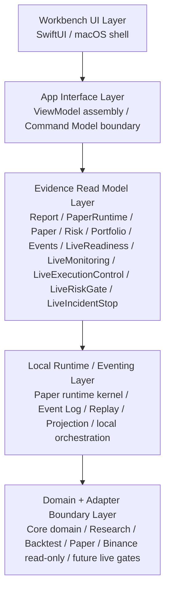

# docs/architecture.md

## 工程模块地图定位

本文档是 MTPRO 的 Engineering Module Map / 工程模块地图。它是 `BLUEPRINT.md` 的二级权重承接文档，负责把完整蓝图翻译成系统模块、模块边界、数据流、接口关系、依赖方向和架构不变量。

本文档不能推翻 `BLUEPRINT.md`，不重新定义产品目标，不作为 Stage Code Audit、validation 或 PR evidence 流水账。已完成 Project 的事实证据进入 `docs/audit/`、`docs/validation/` 和 `verification.md`。

MTPRO 是 SwiftPM-first、Swift-only、local-first 的 macOS 交易研究工作台。架构借鉴 NautilusTrader 的 Kernel、MessageBus、Cache、DataEngine、StrategyEngine、RiskEngine、ExecutionEngine、Portfolio 和 Adapter 职责拆分，但不引入 NautilusTrader 作为运行依赖。

## Architecture Responsibility / 架构职责

`docs/architecture.md` 只回答五个问题：

1. 当前有哪些模块。
2. 模块之间允许怎么依赖。
3. 数据和事件如何流动。
4. 哪些接口边界不能被绕过。
5. Future Live 能力如何被隔离在当前 scope 之外。

它不复制完整产品蓝图，不维护 Project 进度条，也不记录每个 PR 的审计流水账。

## Package Dependency Direction / SwiftPM 依赖方向

```text
Core
Adapters -> Core
Persistence -> Core, CSQLite, DuckDB(macOS)
Runtime -> Core, Adapters, Persistence
App -> Core, Persistence
Dashboard -> App
```

依赖规则：

- `Core` 不能依赖 Adapter、Persistence、Runtime、App 或 Dashboard。
- `Adapters` 只能表达外部 market data 边界，并通过 Core 类型输出事件或证据。
- `Persistence` 只能保存 facts / projections，不能成为 UI contract。
- `Runtime` 可以编排 Core、Adapters、Persistence，但不能直接变成 UI。
- `App` 只能生成 Read Model / ViewModel / Command Model，不能直接调用 Binance adapter 或真实 broker。
- `Dashboard` 只能装载 App 层模型，不读取 SQLite / DuckDB schema、adapter request 或 runtime object。

## Engineering Layer Map / 工程分层地图

Target System Architecture 的工程分层压缩为五层。依赖方向从 Workbench 往下读取稳定边界；事实流从输入源进入 Core / Runtime 后写入 Event Log，再通过 replay / projection / read model 反向供 Workbench 展示。



| Layer | 负责什么 | 禁止什么 | 依赖谁 | 被谁依赖 | 状态 |
| --- | --- | --- | --- | --- | --- |
| Workbench UI Layer | SwiftUI / macOS shell、页面布局、只读展示、本地 Paper session-level control | 禁止 UI trading button、live command、DB schema、adapter / runtime direct access | App Interface | Human 用户 | Current |
| App Interface Layer | ViewModel assembly、Command Model boundary、Report / Dashboard / Event Timeline app contract | 禁止领域规则、broker action、Binance direct call、持久化事实 | Evidence Read Model | Workbench UI | Current |
| Evidence Read Model Layer | Report / PaperRuntime / Paper / Risk / Portfolio / Events / LiveReadiness / LiveMonitoring / LiveExecutionControl / LiveRiskGate / LiveIncidentStop read models | 禁止保存事实源、执行命令、暴露 SQLite / DuckDB schema、读取 API key、signed endpoint、account endpoint、listenKey、broker state、真实订单状态机、真实风控状态机或 production operations state | Local Runtime / Eventing | App Interface | Current；`L1 Paper Runtime` 已完成 Report / Dashboard / Event Timeline read-model-only evidence chain；`L1.5 Data Catalog / Scenario Replay` 已完成 Workbench / Report / Events scenario replay read-model evidence；`L2 Simulated Exchange / Backtest Parity` 已完成 Report / Dashboard / Events parity read-model-only evidence surface；`LiveMonitoring` 已完成 read-model-only evidence surface；`LiveExecutionControl` 已完成 contract + blocked evidence surface；`LiveRiskGate` 已完成 contract + blocked evidence surface；`LiveIncidentStop` 已完成 contract + blocked evidence surface |
| Local Runtime / Eventing Layer | paper runtime kernel、paper-only routing、append-only Event Log、Replay、Projection、local orchestration | 禁止成为 UI state、broker gateway、cloud OMS、生产调度平台 | Domain + Adapter Boundary | Evidence Read Model | Current；`L1 Paper Runtime` 已完成 TradingClock、CommandBus / EventBus / MessageBus、paper risk、local lifecycle、simulated fill 和 paper portfolio projection evidence chain；`L2 Simulated Exchange / Backtest Parity` 已完成 deterministic simulated exchange parity evidence，但不升级为 production matching runtime |
| Domain + Adapter Boundary Layer | Core domain semantics、Research、Backtest、Paper workflow、Paper runtime foundation、Risk / Portfolio evidence、Binance public read-only adapter、future live adapter gates | 禁止 signed / account endpoint 当前接入、broker adapter、`LiveExecutionAdapter`、real order lifecycle、OMS 或 live risk execution path | 无下层业务依赖；外部只接 public read-only data | Runtime / Eventing | Current；`L2 Simulated Exchange / Backtest Parity` 已完成 shared order semantics、deterministic matching、simulated execution、cost parity 和 portfolio parity evidence；future live adapter 是 Future Gated / Forbidden now |

`L1 Paper Runtime` 已完成 local-first、paper-only、deterministic evidence chain，不代表 production trading engine。`L1.5 Data Catalog / Scenario Replay` 已完成 local deterministic scenario input 和 report reproducibility evidence，不代表 production data platform 或 large-scale ingestion pipeline。`L2 Simulated Exchange / Backtest Parity` 已完成 deterministic simulated exchange / backtest parity evidence chain，不代表真实 exchange runtime、production backtest engine、broker connection、OMS、execution report、broker fill 或 reconciliation。Real live runtime source、signed / account stream、broker / exchange stream 仍是 Future Gated / Forbidden now。当前 `LiveMonitoring` 只能消费被允许的 read-model-only evidence source，不代表真实 broker connection、listenKey user data stream 或 real order stream。当前 `LiveExecutionControl` 只能表达 execution-control contract、future gates、forbidden capability tests、blocked evidence 和 read-model-only evidence surface，不代表真实 execution runtime、真实订单命令、execution report、broker fill 或 reconciliation。当前 `LiveRiskGate` 只能表达 risk gate contract、future gates、forbidden capability tests、paper / live risk isolation、blocked evidence 和 read-model-only evidence surface，不代表真实 live risk engine、真实账户风控、real pre-trade allow / reject runtime、circuit breaker command、stop trading command 或 production runtime。当前 `LiveIncidentStop` 只能表达 audit / incident / stop contract、future gates、forbidden capability tests、blocked evidence 和 read-model-only evidence surface，不代表真实 audit trail runtime、incident replay runtime、emergency stop、shutdown、restore、production operations、Live PRO Console、live command 或 trading button。

## Module Boundary Contracts / 模块边界合同

| 模块 | 职责 |
| --- | --- |
| `Core` | 领域模型、事件、命令、策略契约、MessageBus、Kernel / Engine 边界；当前包含 L1 paper runtime 的 TradingClock / kernel boundary、paper-only routing、Paper Pre-trade RiskEngine、local lifecycle、simulated fill / fee / slippage、paper account / portfolio projection、paper-only execution facts、本地 Paper session-level control command / event boundary、L1.5 Data Catalog / Scenario Replay 的 local deterministic scenario evidence、L2 Simulated Exchange / Backtest Parity 的 shared order semantics / deterministic matching / simulated execution / fee slippage parity / portfolio parity evidence、Live trading foundation taxonomy、real order lifecycle future gates、`LiveReadiness` / `LiveBlockedEvidence` blocked read model、Live execution control contract / blocked evidence、Live risk gate contract / blocked evidence 和 Live audit incident stop contract / blocked evidence |
| `Adapters` | Binance public read-only market data adapter 边界；当前包含本地 batch / replay contract、metadata、retention / freshness、fixture parity evidence，以及 public read-only adapter 与 future live / broker / exchange execution adapter 的 capability isolation |
| `Persistence` | Event Log、SQLite runtime projection、DuckDB analytical projection 边界 |
| `Runtime` | Binance public read-only ingest、Core event log、replay 与 projection snapshot 的本地编排边界；当前包含 market data replay event log / projection consistency evidence |
| `App` | Trader Workstation Dashboard 产品面和 ViewModel 边界；当前包含 L1 Paper Runtime Report / Dashboard / Event Timeline read model、L1.5 Scenario Replay evidence surface、L2 Simulated Exchange / Backtest Parity Report / Dashboard / Events read-model-only evidence surface、Paper workflow observability、Event Timeline / Evidence Explorer read model、Market Data Replay Operations read model、Live blocked evidence read model、Live monitoring read-model-only evidence、Live execution control blocked evidence、Live risk gate blocked evidence、Live incident stop blocked evidence 和 Dashboard / Workbench shell snapshot |
| `Dashboard` | SwiftPM 可构建 / smoke-run 的 macOS shell，只装载 App 层 ViewModel snapshot；当前展示 read-model-only Workbench、`start` / `pause` / `close` / `reset` session-level local controls、L1 Paper Runtime evidence、L1.5 Scenario Replay evidence、L2 Simulated Exchange / Backtest Parity evidence preview、paper workflow evidence preview、market data replay operations evidence、Live blocked gates 只读证据、Live monitoring 只读证据、Live execution control blocked evidence、Live risk gate blocked evidence 和 Live incident stop blocked evidence |

## Core Engine Architecture Reference / Core Engine 架构参考

Engine 级架构地图由 `docs/product/mtpro-core-engine-architecture-module-maturity-map-v1.md` 维护。该文档把当前 SwiftPM target 之上的职责层归并为 Domain Model Foundation、System Kernel、Connectivity / Adapter Engine、Data Engine、Strategy Engine、Analysis / Research Engine、Simulation / Backtest Engine、Risk Engine、Execution Engine、Portfolio Engine、State & Persistence Engine、Workbench Interface 和 Future Live PRO Console。

本文档继续维护当前工程模块、依赖方向、数据流和架构不变量；Engine map 用于指导后续 Project Planning 如何说明目标 Engine / Layer、maturity level、当前 evidence 和 forbidden capabilities。Engine map 不改变当前 `Core`、`Adapters`、`Persistence`、`Runtime`、`App`、`Dashboard` 的 SwiftPM 依赖方向，也不授权超出已完成 L1 paper-only runtime scope 的新 Paper runtime、signed endpoint、broker adapter、OMS、real order lifecycle、Live PRO Console 或业务代码开发。

## Capability Flow Map / 能力流地图

### Market Data Replay / 行情回放

```text
Binance public read-only boundary
-> local batch / replay contract
-> replay operations metadata
-> fixture parity / replay consistency
-> event log / projection snapshot consistency
-> Report / Dashboard / Event Timeline read model
```

该流只处理 public market data 和本地 deterministic replay evidence，不绑定真实历史下载规模，也不进入 production operations。

### Research / Backtest / Report / 研究回测报告

```text
Market events
-> Strategy signal evidence
-> Backtest / Paper parity evidence
-> execution cost assumptions
-> risk blocker evidence
-> report artifact / read model
```

该流用于解释策略证据和报告来源，不产生真实交易授权。

### Paper Workflow / 模拟交易工作流

```text
Strategy signal
-> Paper action proposal
-> Risk decision
-> Paper order intent
-> Simulated fill evidence
-> Paper portfolio projection
-> Event log / replay
-> Workbench read model
```

`MTPRO Event-Driven Paper Trading Runtime v1` 已把该流深化为 L1 Paper Runtime：deterministic `TradingClock`、paper-only routing、Paper Pre-trade RiskEngine、local lifecycle、simulated fill / fee / slippage、paper account / portfolio / position projection、Event Log / Replay / Report / Dashboard / Event Timeline evidence。该流全部是 paper-only evidence，不代表真实订单、broker fill、account update、OMS、Live fallback 或 production trading engine。

`MTPRO Data Catalog / Scenario Replay v1` 已把 Data Engine / State & Persistence Engine / Workbench Interface 的 L1.5 数据地基接入该 evidence chain：local scenario manifest、stable scenario id / dataset version / fixture version、deterministic single-symbol / single-timeframe fixture、replay window / cursor、checksum / freshness evidence、quality gates、report input versioning 和 Workbench / Report / Events read-model evidence。该流只消费 local deterministic fixture 和 ReadModel / ViewModel，不代表 production data platform、large-scale ingestion pipeline、Runtime replay job、Simulated Exchange / Backtest Parity runtime、broker/account reconciliation、signed endpoint、account endpoint / listenKey、Live PRO Console、live command 或交易按钮。

`MTPRO Simulated Exchange / Backtest Parity v1` 已把 L1 Paper Runtime 和 L1.5 Scenario Replay 连接为 L2 deterministic parity evidence chain：shared backtest-paper order semantics、scenario replay deterministic matching、market / limit simulated execution、partial fill / latency / fee / slippage parity、simulated exchange event -> portfolio projection parity 和 Report / Dashboard / Events read-model-only evidence surface。该流只表达 deterministic simulated exchange / backtest parity evidence，不代表 production matching runtime、真实 exchange runtime、broker / exchange execution adapter、`LiveExecutionAdapter`、OMS、real order lifecycle、real submit / cancel / replace、execution report、broker fill、reconciliation、Live PRO Console、live command 或交易按钮。

### Workbench / macOS 工作台

```text
Read Models
-> ViewModels / Command Models
-> Dashboard shell
-> read-only evidence presentation
-> session-level local controls only
```

Workbench 可以表达 `start` / `pause` / `close` / `reset` 本地 paper session control，但不得新增 order-level command。

### Live Trading Boundary / 实盘边界

```text
Live trading foundation taxonomy
-> credential endpoint boundary
-> public read-only adapter / future live adapter isolation
-> real order lifecycle future gates
-> LiveReadiness / LiveBlockedEvidence
-> Report / Dashboard / Event Timeline read model
```

该流只表达实盘能力的 future gates、forbidden capabilities、blocked evidence 和只读展示面。它不读取 API key、secret、account endpoint、listenKey、broker state 或真实账户，不提交、撤销、替换真实订单，不实现 `LiveExecutionAdapter`、OMS、reconciliation、broker fill 或 real order state machine。

### Live Monitoring / 实盘监控只读证据

```text
read-model-only live health / connection / stream / latency / error evidence
-> LiveMonitoring read model
-> ViewModel
-> Dashboard / Report / Event Timeline
```

该流已完成 read-model-only evidence surface，只允许 health、connection、market stream、订单事件流、latency、error 的 evidence。订单流 / 订单事件流只表达 blocked / simulated / future evidence，不表示真实订单状态机，不提供 live command，不新增交易按钮。真实 live runtime source、signed / account stream、broker / exchange stream 仍是 Future Gated / Forbidden now。

### Live Execution Control / 实盘执行控制阻断证据

```text
execution-control terminology / taxonomy
-> submit / cancel / replace future gates
-> execution report / broker fill / reconciliation future gates
-> paper / real command isolation
-> LiveExecutionControlBlockedEvidence
-> Dashboard / Report / Event Timeline read model
```

该流已完成 contract + blocked evidence surface，只允许表达 future gates、forbidden capability tests、blocked reason、source anchor 和 deterministic snapshot。它不实现真实 execution runtime、API key、secret storage、signed endpoint、account endpoint、listenKey、broker / exchange execution adapter、`LiveExecutionAdapter`、real order state machine、OMS、真实 submit / cancel / replace、execution report ingestion、broker fill event fact、reconciliation runtime、incident fallback automation、live command、order form、order-level command UI 或交易按钮。

### Live Risk Gate / 实盘风险控制阻断证据

```text
live risk terminology / future risk decision taxonomy
-> exposure / order notional future gates
-> frequency / loss / drawdown future gates
-> circuit breaker / no-trade future gates
-> paper / live risk isolation
-> LiveRiskGateBlockedEvidence
-> Dashboard / Report / Event Timeline read model
```

该流已完成 contract + blocked evidence surface，只允许表达 live risk future gates、forbidden capability tests、paper / live risk isolation、blocked reason、source anchor 和 deterministic snapshot。它不实现真实 live risk engine、真实账户余额读取、broker position sync、margin、leverage、PnL、equity、real pre-trade allow / reject runtime、circuit breaker runtime、no-trade state runtime、circuit breaker command、stop trading command、emergency stop、risk command surface、position management command、order form、live command 或交易按钮。

## Evidence Data Flow / 证据数据流

所有可展示证据必须能沿同一条标准数据流追溯：

```text
Input source
-> Domain interpretation
-> Event fact
-> Append-only Event Log
-> Replay
-> Projection
-> Read Model
-> ViewModel
-> Workbench evidence surface
```

这条流的含义是：输入先被领域语义解释为事件事实，事件事实进入 append-only Event Log，Replay 从事实重建 Projection，UI 只消费 Read Model / ViewModel。Dashboard / App 不直接读取 Runtime、Adapter、SQLite / DuckDB schema。

典型实例：

```text
Binance public read-only fixture / batch
-> market data contract interpretation
-> market event fact
-> Event Log
-> Replay
-> Market replay / freshness / projection consistency projection
-> Market / Events / Report read model
-> ViewModel
-> Workbench evidence surface
```

```text
Strategy signal
-> paper action proposal / risk decision / paper order intent / simulated fill interpretation
-> paper / risk / portfolio event fact
-> Event Log
-> Replay
-> runtime projection
-> Paper / Risk / Portfolio / Report read model
-> ViewModel
-> Workbench evidence surface
```

## Architecture Invariants / 架构不变量

- Binance 默认只读 public market data。
- Market data replay operations 自动验证只使用本地 fixture / batch replay evidence，不依赖真实 Binance 网络。
- Event Log 是 append-only facts source。
- SQLite / DuckDB 是 projection，不是 UI 展示模型。
- ViewModel 只能来自稳定 Read Model。
- Paper workflow controls 只能表达本地 session-level paper intent 或 read-only presentation，不得升级为 order-level command。
- Live boundary evidence 只能以 `LiveReadiness` / `LiveBlockedEvidence` 的 blocked read model 进入 Report / Dashboard / Event Timeline，不得变成 command surface。
- Live monitoring evidence 当前只能以 `LiveMonitoring` read-model-only 形态进入 Dashboard / Report / Event Timeline；real live runtime source、signed / account stream 和 broker / exchange stream 仍是 Future Gated / Forbidden now。
- Live execution control evidence 当前只能以 `LiveExecutionControlBlockedEvidence` read-model-only 形态进入 Dashboard / Report / Event Timeline；真实 execution runtime、真实订单命令、execution report、broker fill、reconciliation 和 incident fallback automation 仍是 Future Gated / Forbidden now。
- Live risk gate evidence 当前只能以 `LiveRiskGateBlockedEvidence` read-model-only 形态进入 Dashboard / Report / Event Timeline；真实 live risk engine、真实账户风控、real pre-trade allow / reject runtime、circuit breaker runtime、no-trade state runtime、risk command、stop trading command 和 emergency stop 仍是 Future Gated / Forbidden now。
- Live incident / stop evidence 当前只能以 `LiveIncidentStopBlockedEvidence` read-model-only 形态进入 Dashboard / Report / Event Timeline；真实 audit trail runtime、incident replay runtime、broker replay runtime、account replay runtime、production recovery runtime、stop control runtime、emergency stop command、shutdown command、restore command、production operations、Live PRO Console、live command 和 trading button 仍是 Future Gated / Forbidden now。
- Paper intent、paper order intent 和 simulated fill 不能升级为 real order lifecycle、broker fill、account update 或 `LiveExecutionAdapter` 输入。
- Live trading、signed endpoint、account endpoint 和真实 broker action 在当前 scope 禁止。
- `macos-trader` 只提供产品语义参考。
- `nautilus_trader` 只提供架构分层参考。
- MTPRO 不复制参考项目整仓代码。

## Future Live Isolation / 未来实盘隔离

Future Live 能力可以在 `BLUEPRINT.md` 中定义为最终产品目标，但在当前架构中必须保持隔离。当前已完成的是 Live trading foundation boundary、blocked evidence、只读展示面、Live monitoring read-model-only evidence surface、Live execution control contract + blocked evidence surface 和 Live risk gate contract + blocked evidence surface。真实 live runtime source、signed / account stream、broker / exchange stream、真实 execution runtime、真实 live risk engine、audit / incident replay 和 stop controls 仍是 future gated 能力：

- future signed endpoint / account endpoint 需要独立 adapter capability。
- future broker integration 需要独立 Project Definition、risk gate、operations gate 和 audit gate。
- future real order lifecycle 不得复用 paper order intent 作为真实订单授权。
- future real Live risk runtime 不能由当前 paper-only risk blocker、paper exposure 或 `LiveRiskGateBlockedEvidence` 直接替代。
- future incident replay / stop controls 进入当前 scope 前，必须先更新 `BLUEPRINT.md`、`docs/architecture.md` 和 `docs/roadmap.md`，再由 Human + `@001 / PLN` 形成 Project plan。

## Architecture Update Gate / 架构更新门槛

以下变更必须同步检查本文档：

- 新增 SwiftPM target、模块或跨模块依赖。
- 改变 Event Log、Replay、Projection、Read Model 或 ViewModel 数据流。
- 新增外部系统能力、adapter capability 或 secret 使用。
- 任何从 paper-only 走向 future Live 的能力。
- UI 从 read model / ViewModel 边界外读取数据。

若只是某个 PR 的验证结果、Stage Audit input 或 Project closure evidence，应写入 `docs/audit/`、`docs/validation/` 或 `verification.md`，不写入本文档。
