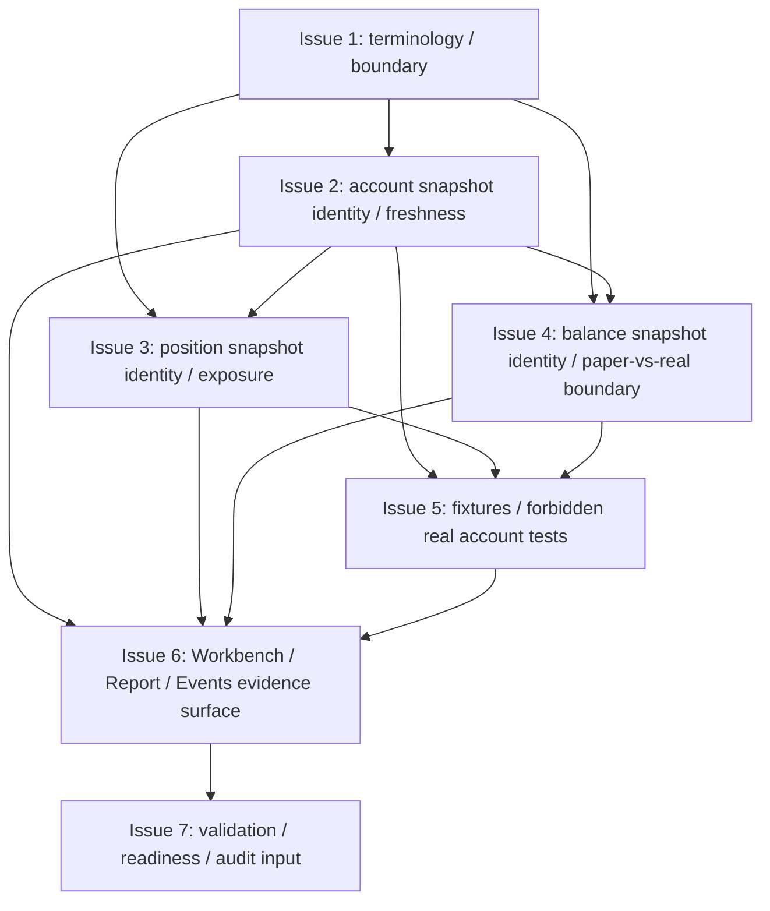

# MTPRO Account / Position / Balance Read-model-only v1

日期：2026-05-28

执行者：Codex

本文档是 `MTPRO Account / Position / Balance Read-model-only v1` 写入 Linear 前的 Project Planning Record，只保存 Project 级计划摘要、issue order、dependencies、validation、evidence、first executable issue candidate、WIP=1 和边界。

本文档承接 `docs/product/mtpro-live-readiness-roadmap-v1.md` 的 `L3.1 Account / Position / Balance Read-model-only` 切片。本文档不授权执行，不创建 Linear Project，不创建 Linear Issues，不修改 Linear status，不推进 Todo，不启动 `@002 / PAR`，不启动 Symphony，不运行 Graphify update，不写业务代码，不修改 Figma，不实现 Account / Position / Balance runtime，也不实现 Live read-only runtime。

完整 issue execution contract 以后以 Linear issue body 为准。仓库 planning record 不复制维护完整 Linear issue body，也不复制维护完整 candidate issue 正文。

## Project name

`MTPRO Account / Position / Balance Read-model-only v1`

## Project goal

在 `L3.0 Live Read-only Readiness Boundary complete` 之后，建立 account / position / balance 的 read-model-only 语义、身份、freshness、fixture evidence、forbidden real account tests 和 Workbench / Report / Events 只读展示边界。

该 Project 只定义本地 / fixture / simulated / read-model-only 账户证据，不读取真实账户，不连接 broker，不调用 account endpoint，不创建 listenKey，不实现 Live read-only runtime。

## Target Engines / Layers

- Portfolio Engine。
- Evidence Read Model Layer。
- Workbench Interface。
- State & Persistence boundary。
- Connectivity / Adapter future gate。

## Target maturity

`L3.1 Account / Position / Balance Read-model-only`

当前基线：

- `L1 Paper Runtime complete`。
- `L1.5 Data Catalog / Scenario Replay complete`。
- `L2 Simulated Exchange / Backtest Parity complete`。
- `L2+ Workbench Beta Readiness complete`。
- `L3.0 Live Read-only Readiness Boundary complete`。
- 旧 `Engine Maturity Roadmap Progress: 4 / 4 (100%)` 已闭合；本 planning record 不扩分母、不更新进度条。

## Source inputs

- `GOAL.md`
- `BLUEPRINT.md`
- `docs/roadmap.md`
- `docs/architecture.md`
- `docs/product/mtpro-live-readiness-roadmap-v1.md`
- `docs/product/mtpro-core-engine-architecture-module-maturity-map-v1.md`
- `docs/product/mtpro-paper-trading-runtime-foundation-blueprint-v1.md`
- `docs/validation/latest-verification-summary.md`
- `verification.md`
- Human 确认的 `MTPRO Account / Position / Balance Read-model-only v1` Project Draft

## Scope

- 定义 account / position / balance read-model-only canonical terminology。
- 定义 account snapshot identity、source identity、freshness evidence 和 evidence identity。
- 定义 position snapshot identity、exposure evidence、stale / fixture / simulated source boundary。
- 定义 balance snapshot identity、paper-vs-real interpretation boundary。
- 定义 account / position / balance fixture contract。
- 定义 forbidden real account tests，防止 fixture / paper / simulated evidence 被解释为真实 account data。
- 定义 Workbench / Report / Events 只读 evidence surface。
- 保持 UI 只消费 Read Model / ViewModel，不读取 Runtime object、Adapter request、SQLite / DuckDB schema、account payload 或 broker state。
- 收口 validation matrix、automation readiness anchor 和 stage audit input material。

## Non-goals

- 不接 signed endpoint。
- 不接 account endpoint / listenKey。
- 不连接 broker / exchange execution adapter。
- 不实现 `LiveExecutionAdapter`。
- 不实现 OMS / real order lifecycle。
- 不实现真实 submit / cancel / replace。
- 不实现 execution report / broker fill / reconciliation。
- 不读取 real account / broker position / margin / leverage。
- 不实现 real PnL runtime。
- 不实现 private WebSocket runtime。
- 不实现 account snapshot runtime。
- 不实现 Live PRO Console。
- 不新增 trading button / live command / order form。
- 不运行 Graphify。
- 不修改 Figma。
- 不把 read-model-only evidence 写成 live readiness implementation。
- 不把 fixture / paper / simulated evidence 写成真实账户、真实持仓、真实余额或真实 PnL。
- 不把 planning record 当执行授权。

## Issue order

| 顺序 | Issue 标题 | 目标摘要 | 依赖摘要 |
| --- | --- | --- | --- |
| 1 | Define account / position / balance read-model-only terminology and boundary | 定义 L3.1 术语、目标层、read-model-only 边界和 forbidden baseline。 | 无 |
| 2 | Define account snapshot identity and source / freshness evidence | 定义 account snapshot identity、source identity、freshness evidence 和 stale boundary。 | 依赖 Issue 1 |
| 3 | Define position snapshot identity and exposure evidence | 定义 position snapshot identity、paper / simulated exposure evidence 和 source boundary。 | 依赖 Issue 1、Issue 2 |
| 4 | Define balance snapshot identity and paper-vs-real interpretation boundary | 定义 balance snapshot identity、paper balance / simulated balance / future real balance 的解释边界。 | 依赖 Issue 1、Issue 2 |
| 5 | Define account / position / balance fixture and forbidden real account tests | 建立 deterministic fixture contract 和 forbidden real account tests。 | 依赖 Issue 2、Issue 3、Issue 4 |
| 6 | Add Workbench / Report / Events read-model-only evidence surface | 将 account / position / balance evidence 接入 Workbench / Report / Events 只读展示面。 | 依赖 Issue 2、Issue 3、Issue 4、Issue 5 |
| 7 | Close validation matrix / automation readiness / stage audit input | 收口 validation matrix、automation readiness anchors、forbidden capability evidence 和 stage audit input material。 | 依赖 Issue 6 |

仓库不复制维护 7 个 issue 的完整正文。后续 issue scope、Codex instructions、validation、boundary、PR requirements 以 Linear issue body 为准。

## Dependencies

- Issue 2 依赖 Issue 1。
- Issue 3 依赖 Issue 1、Issue 2。
- Issue 4 依赖 Issue 1、Issue 2。
- Issue 5 依赖 Issue 2、Issue 3、Issue 4。
- Issue 6 依赖 Issue 2、Issue 3、Issue 4、Issue 5。
- Issue 7 依赖 Issue 6。



## Candidate issue summaries

| Issue | Scope 摘要 | Non-goals / Boundary 摘要 | Validation 摘要 |
| --- | --- | --- | --- |
| Issue 1 | account / position / balance read-model-only terminology、fixture / paper / simulated / future real source 分界、L3.1 到 L3.2 handoff。 | 只定义 terminology / contract / validation anchors；不实现真实账户读取、broker sync、account snapshot runtime 或 UI command。 | `bash checks/run.sh`；验证 terminology 不把 fixture / paper / simulated 账户证据写成真实账户。 |
| Issue 2 | account snapshot id、account evidence id、source identity、freshness timestamp、stale / missing / blocked evidence。 | 不调用 account endpoint，不创建 listenKey，不读取 secret、真实余额、margin、leverage 或 real PnL。 | `bash checks/run.sh`；验证 source label、freshness evidence 和 no account endpoint / listenKey / broker。 |
| Issue 3 | position snapshot id、position evidence id、symbol / side / quantity / exposure / scenario version、paper exposure 与 future real position 隔离。 | 不同步 broker position，不读取 real position、margin、leverage、broker portfolio 或 private stream。 | `bash checks/run.sh`；验证 position evidence 不能表示 broker position。 |
| Issue 4 | balance snapshot id、paper cash、paper equity、simulated balance、future-gated real balance、paper-vs-real interpretation boundary。 | 不读取真实账户余额，不实现 real PnL、margin、leverage、buying power 或 broker cash statement。 | `bash checks/run.sh`；验证 balance evidence 不包含真实资金语义。 |
| Issue 5 | account / position / balance fixture shape、fixture version、checksum、freshness、source identity、forbidden real account tests。 | 不实现真实账户 fixture importer，不导入 broker payload，不调用 signed endpoint / account endpoint / listenKey。 | `bash checks/run.sh`；验证 fixture parity / checksum / freshness 和 forbidden real account tests。 |
| Issue 6 | App Read Model / ViewModel、Report evidence summary、Dashboard / Workbench 只读 evidence surface、Event Timeline evidence item。 | 不新增 API key input、secret storage、broker connect、account connect、Live PRO Console、trading button、live command 或 order form。 | `bash checks/run.sh`；验证 Workbench / Dashboard 只消费 Read Model / ViewModel。 |
| Issue 7 | validation matrix anchors、automation readiness anchors、Project evidence chain、forbidden capability evidence、stage audit input。 | 不输出最终 Stage Code Audit Report，不创建下一 Project / Issue，不推进下一阶段。 | `bash checks/run.sh`；验证 readiness anchors、stage audit input、no `.codex/*` / `graphify-out/*`。 |

## Validation requirements

每个 issue 都必须运行：

```bash
bash checks/run.sh
```

L3.1 相关验证必须满足：

- 必须验证 no signed endpoint。
- 必须验证 no account endpoint / listenKey。
- 必须验证 no broker / exchange execution adapter。
- 必须验证 no `LiveExecutionAdapter`。
- 必须验证 no OMS / real order lifecycle。
- 必须验证 no real submit / cancel / replace。
- 必须验证 no execution report / broker fill / reconciliation。
- 必须验证 no real account / broker position / margin / leverage。
- 必须验证 no real PnL runtime。
- 必须验证 no private WebSocket runtime。
- 必须验证 no account snapshot runtime。
- 必须验证 no Live PRO Console / trading button / live command / order form。
- 必须验证 Workbench / Dashboard 只消费 Read Model / ViewModel。
- 必须验证 fixture / paper / simulated evidence 不能升级为真实 account / position / balance data。
- 必须验证 read-model-only evidence 不暴露 Runtime object、Adapter request、SQLite / DuckDB schema、account payload 或 broker state。

## Evidence requirements

每个 PR 必须包含：

- Linked Linear Issue。
- Scope / Non-goals 确认。
- validation output。
- boundary evidence。
- Pre-PR Codex Code Review。
- GitHub PR Automation evidence。
- MTPRO-native PR evidence fields：`Feedback Loop Evidence`、`Tracer Bullet / Fixture Evidence`、`Diagnose Evidence`、`Architecture Deepening Candidate`。
- `.codex/*` 未进入 PR。
- `graphify-out/*` 未进入 PR。
- 如由 symphony-issue 执行，需 handoff marker evidence。
- 涉及 production code 的 PR 必须补充详细中文注释，说明 read-model-only 边界、fixture / simulated 来源和禁止真实账户解释的原因。

Issue 7 只准备 stage audit input material，不输出最终 Stage Code Audit Report。

Project 全部 Done 后，Stage Code Audit Report 必须由 Parent Codex 单独输出。

## First executable issue candidate

第一个可执行候选 issue：

```text
Define account / position / balance read-model-only terminology and boundary
```

该 issue 只是 first executable issue candidate，初始状态仍必须是 `Backlog / non-executable`，不授权执行，不推进 Todo。

Project 经 Human 确认并写入 Linear 后，由 Parent Codex queue preflight 在 WIP=1、依赖满足、无 active conflict、execution contract 格式完整时自动判断唯一 eligible issue，并推进 Todo。

## WIP=1 / queue preflight rule

- Project 执行必须保持 WIP=1。
- 所有 issue 初始状态必须是 `Backlog / non-executable`。
- `@001 / PLN` 不操作 `Backlog -> Todo`。
- Project 写入 Linear 后，由 Parent Codex queue preflight 判断唯一 eligible issue。
- Parent Codex queue preflight 必须确认 WIP=1、依赖满足、无 active conflict、execution contract 格式完整，才可推进唯一 eligible issue 到 Todo。

## Linear write boundary

- 本 planning record 不创建 Linear Project。
- 本 planning record 不创建 Linear Issues。
- 本 planning record 不修改 Linear status。
- 本 planning record 不推进 Todo。
- 本 planning record 不启动 `@002 / PAR`。
- 本 planning record 不启动 Symphony / symphony-issue。
- Human review / merge 后，才允许进入 Linear 写入。
- Project 写入 Linear 后，所有 issue 初始必须保持 `Backlog / non-executable`。
- 后续完整 execution contract 以 Linear issue body 为准。

## Repository record boundary

- 仓库 planning record 只保存 Project 级计划摘要和格式门槛。
- 仓库不复制维护完整 Linear issue body。
- 仓库不复制维护完整 candidate issue 正文。
- Planning record 不授权执行。
- 后续 issue scope、Codex instructions、validation、boundary、PR requirements 以 Linear issue body 为准。

## Parent Codex queue preflight rule

- `@001 / PLN` 只负责 Project planning draft，不操作 `Backlog -> Todo`。
- Project 写入 Linear 后，由 Parent Codex queue preflight 判断唯一 eligible issue。
- Queue preflight 必须确认 WIP=1、依赖满足、previous issue Done、execution contract 格式完整、当前 Project 没有 `Todo` / `In Progress` / `In Review` active conflict。
- 只有 queue preflight 通过后，Parent Codex 才能推进唯一 eligible issue 到 Todo。
- symphony-issue 只能调度唯一 Todo issue。
