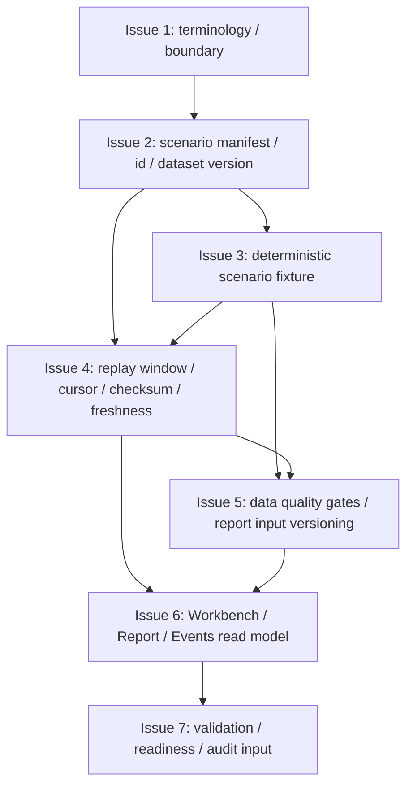

# MTPRO Data Catalog / Scenario Replay v1

日期：2026-05-26

执行者：Codex

本文档是 `MTPRO Data Catalog / Scenario Replay v1` 写入 Linear 前的 Project Planning Record，只保存 Project 级计划摘要、issue order、dependencies、validation、evidence、first executable issue candidate、WIP=1 和边界。

本文档不授权执行，不创建 Linear Project，不创建 Linear Issues，不修改 Linear status，不推进 Todo，不启动 `@002 / PAR`，不启动 Symphony，不运行 Graphify update，不写业务代码，不修改 Figma，不实现 Data Catalog，不实现 Scenario Replay。

完整 issue execution contract 以后以 Linear issue body 为准。仓库 planning record 不复制维护完整 Linear issue body，也不复制维护完整 candidate issue 正文。

## Project name

`MTPRO Data Catalog / Scenario Replay v1`

## Target Engines

- Data Engine。
- State & Persistence Engine。
- Workbench Interface。

## Target maturity

`L1.5 -> L2 prerequisite`

该 maturity 只表示为后续 `Simulated Exchange / Backtest Parity v1` 建立 local-first scenario replay 数据地基，不表示 MTPRO 已进入 L2 simulated exchange parity，也不授权 Live / broker / signed endpoint 能力。

## Project goal

建立 local-first、deterministic、versioned scenario replay 数据地基，为后续 `Simulated Exchange / Backtest Parity v1`、Workbench beta demo path 和 report reproducibility 提供稳定输入。

## Source inputs

- `GOAL.md`
- `BLUEPRINT.md`
- `docs/roadmap.md`
- `docs/architecture.md`
- `docs/product/mtpro-core-engine-architecture-module-maturity-map-v1.md`
- `docs/product/mtpro-paper-trading-runtime-foundation-blueprint-v1.md`
- `docs/validation/latest-verification-summary.md`
- `verification.md`

## Scope

- 定义 local data catalog terminology / contract。
- 定义 scenario manifest、scenario id、dataset version。
- 建立 single-symbol / single-timeframe first scenario。
- 定义 historical replay window 和 replay cursor。
- 定义 fixture versioning、checksum、freshness evidence。
- 定义 data quality gates。
- 定义 report input versioning。
- 将 scenario replay evidence 接入 Workbench / Report / Events read-model surface。
- 收口 validation matrix、automation readiness、stage audit input。

## Non-goals

- 不接 signed endpoint。
- 不接 account endpoint / listenKey。
- 不连接 broker / exchange execution adapter。
- 不实现 `LiveExecutionAdapter`。
- 不实现 OMS / real order lifecycle。
- 不实现真实 submit / cancel / replace。
- 不实现 execution report / broker fill / reconciliation。
- 不读取 real account / broker position。
- 不实现 Live PRO Console。
- 不新增 trading button / live command。
- 不做 production data platform。
- 不做 large-scale ingestion pipeline。
- 不运行 Graphify update。
- 不修改 Figma。
- 不把 planning draft 当执行授权。

## Issue 4 / Issue 5 split decision

Issue 4 和 Issue 5 建议拆分，不建议合并。

当前代码形态已经把 replay metadata / freshness / checksum / parity 放在 `Adapters`，event-log / projection consistency 放在 `Runtime`，Workbench read-model evidence 放在 `App`。Issue 4 更像 catalog source evidence：replay window、cursor、checksum、freshness；Issue 5 更像 validation/report contract：data quality gates、report input versioning。两者依赖强，但职责和验证口径不同，拆分更适合 WIP=1 和后续 review。

如果强行压成 6 个 issue，可以合并为 “replay evidence quality and report input versioning”，但风险是 PR 过大，容易同时触碰 Data Engine、Persistence 和 Report surface。

## Issue order

| 顺序 | Issue 标题 | 目标摘要 | 依赖摘要 |
| --- | --- | --- | --- |
| 1 | Define Data Catalog / Scenario Replay terminology and boundary | 定义 local data catalog / scenario replay 的术语、边界、目标引擎和禁止能力，为 manifest、fixture、replay evidence、report input versioning 建立共同语言。 | 无 |
| 2 | Add scenario manifest / scenario id / dataset version contract | 建立 scenario manifest、scenario id、dataset version 的最小合同，使每次 scenario replay 都有稳定、可追溯、可版本化的输入身份。 | 依赖 Issue 1 |
| 3 | Add single-symbol / single-timeframe deterministic scenario fixture | 新增第一个 deterministic scenario fixture，限定为 single-symbol / single-timeframe，提供后续 replay、quality gates、report reproducibility 和 demo path 输入。 | 依赖 Issue 2 |
| 4 | Add replay window / cursor / checksum / freshness evidence | 为 deterministic scenario replay 增加 replay window、replay cursor、checksum 和 freshness evidence，使同一 scenario 的回放位置、完整性和新鲜度可追踪。 | 依赖 Issue 2、Issue 3 |
| 5 | Add data quality gates and report input versioning | 定义 scenario replay 的 data quality gates 和 report input versioning，使 Report / Backtest / future Simulated Exchange 能明确使用哪个 scenario、dataset version、fixture version 和 quality verdict。 | 依赖 Issue 3、Issue 4 |
| 6 | Add Workbench / Report / Events read-model evidence surface | 将 scenario replay、quality gates 和 report input versioning 汇总到 Workbench / Report / Events 的 read-model-only evidence surface。 | 依赖 Issue 4、Issue 5 |
| 7 | Close validation matrix / automation readiness / stage audit input | 收口 validation matrix、automation readiness anchors 和 stage audit input material，准备 Parent Codex 后续输出 Stage Code Audit Report。 | 依赖 Issue 6 |

仓库不复制维护 7 个 issue 的完整正文。后续 issue scope、Codex instructions、validation、boundary、PR requirements 以 Linear issue body 为准。

## Candidate issue summaries

| Issue | Scope 摘要 | Non-goals / Boundary 摘要 | Validation 摘要 |
| --- | --- | --- | --- |
| Issue 1 | Data Catalog / Scenario Replay terminology；Data Engine、State & Persistence Engine、Workbench Interface 职责分工；local-first、deterministic、versioned scenario replay boundary；forbidden capability baseline；validation anchors 和 source docs anchors。 | 不实现 manifest 解析、不新增 fixture、不做 replay cursor、不做 report input versioning、不接 signed/account/listenKey/broker/live runtime、不运行 Graphify、不修改 Figma。 | `bash checks/run.sh`；验证术语和 boundary anchors 存在，forbidden baseline 覆盖 signed/account/broker/`LiveExecutionAdapter`/OMS/live command，且没有新增生产数据平台或大规模 ingestion pipeline。 |
| Issue 2 | scenario manifest 最小字段；scenario id / dataset version / symbol / timeframe / source anchor；single-symbol / single-timeframe first scenario manifest 约束；deterministic serialization / equality evidence。 | 不实现多 symbol / 多 timeframe catalog，不做大型数据索引、production dataset registry、真实历史下载规模、signed/account/broker/live runtime 或 report UI。 | `bash checks/run.sh`；验证 manifest / scenario id / dataset version deterministic，manifest 不包含 secret、signed endpoint、account endpoint、listenKey、broker 或 order command，并可作为后续 fixture / replay / report input 的稳定 source。 |
| Issue 3 | 基于 Issue 2 manifest 建立 first scenario fixture；限定 single symbol、single timeframe、fixed window、fixed record order；定义 fixture version 和 source anchor；建立 checksum / deterministic summary 前置结构。 | 不做多市场、多资产、多 timeframe、真实 Binance 网络下载、production ingestion pipeline、cloud data lake、broker / execution adapter、真实交易或 Live PRO Console。 | `bash checks/run.sh`；验证 fixture record order deterministic，fixture version / scenario id / dataset version 一致，不依赖真实 Binance 网络，且无 signed/account/listenKey/broker/live command。 |
| Issue 4 | historical replay window、replay cursor / cursor summary、checksum / parity evidence、fixture freshness evidence；复用或对齐现有 replay metadata / freshness / parity 模式；输出可被 Issue 5 消费的稳定 evidence。 | 不做 production retention engine、大规模 ingestion pipeline、真实历史下载器、signed/account/listenKey/broker、live runtime、OMS、real order lifecycle 或 report input versioning 最终消费面。 | `bash checks/run.sh`；验证 replay window deterministic，cursor 可复现 / 可编码 / 可比较，checksum / freshness evidence 稳定，且无 production data platform、network dependency、broker/live capability。 |
| Issue 5 | data quality gate taxonomy；record order、window coverage、checksum match、freshness status、missing data、duplicate data 等最小 gate；report input versioning contract；关联 scenario id、dataset version、fixture version、replay window、checksum。 | 不做完整数据质量平台、production data observability、自动下载 / 自动修复、真实 broker/account reconciliation、Simulated Exchange / Backtest Parity 实现、live command 或交易按钮。 | `bash checks/run.sh`；验证 data quality gates deterministic，report input versioning 可从 scenario evidence 追溯，bad fixture / checksum mismatch / stale evidence 能被拒绝或标记，且无 live trading、broker action、real account、production data platform。 |
| Issue 6 | scenario replay read model；Report 展示 scenario id、dataset version、fixture version、quality verdict、report input version；Workbench 展示 replay summary 和 drill-down entry；Events 展示 replay window / cursor / checksum / freshness / quality gate timeline。 | 不做完整 UI redesign、不修改 Figma、不新增 trading button / live command、不暴露 SQLite / DuckDB schema、不读取 Runtime object、Adapter request 或 broker object、不实现 production data console。 | `bash checks/run.sh`；验证 Workbench / Report / Events 只消费 Read Model / ViewModel，scenario replay evidence 可稳定编码，Dashboard smoke 或等价 App tests 覆盖 scenario evidence，且无 command surface、query language、trading button、live command、broker action。 |
| Issue 7 | validation matrix、automation readiness anchors、stage audit input material、Project evidence chain、Issue 1-6 forbidden capability evidence、no Graphify / no Figma / no unauthorized Linear mutation confirmation。 | 不输出最终 Stage Code Audit Report，不创建下一 Project / Issue，不推进下一阶段，不启动下一阶段 `symphony-issue`，不实现 Simulated Exchange / Backtest Parity，不写 Future Live PRO Console scope。 | `bash checks/run.sh`；验证 readiness anchors 覆盖 Project 边界，validation matrix 覆盖 manifest、fixture、replay evidence、quality gates、report input versioning、read-model evidence，stage audit input material 存在且不冒充最终 Stage Code Audit Report，并验证 `.codex/*` 和 `graphify-out/*` 不进入 PR。 |

## Dependencies

- Issue 2 依赖 Issue 1。
- Issue 3 依赖 Issue 2。
- Issue 4 依赖 Issue 2、Issue 3。
- Issue 5 依赖 Issue 3、Issue 4。
- Issue 6 依赖 Issue 4、Issue 5。
- Issue 7 依赖 Issue 6。



## Validation requirements

每个 issue 都必须运行：

```bash
bash checks/run.sh
```

Data Catalog / Scenario Replay 相关验证必须满足：

- 必须使用 deterministic fixture / replay evidence。
- 必须验证 scenario id / dataset version / checksum / freshness evidence 稳定。
- 必须验证 report input versioning 可追溯。
- 必须验证 Workbench / Report / Events 只消费 Read Model / ViewModel。
- 必须验证 no signed endpoint / account endpoint / listenKey。
- 必须验证 no broker / exchange execution adapter。
- 必须验证 no `LiveExecutionAdapter`。
- 必须验证 no OMS / real order lifecycle。
- 必须验证 no real submit / cancel / replace。
- 必须验证 no execution report / broker fill / reconciliation。
- 必须验证 no real account / broker position。
- 必须验证 no Live PRO Console / trading button / live command。
- PR 必须包含 MTPRO-native PR evidence fields：`Feedback Loop Evidence`、`Tracer Bullet / Fixture Evidence`、`Diagnose Evidence`、`Architecture Deepening Candidate`。
- 新增或修改生产代码必须包含详细中文注释。

## Evidence requirements

每个 PR 必须包含：

- Linked Linear Issue。
- Scope / Non-goals 确认。
- validation output。
- boundary evidence。
- Pre-PR Codex Code Review。
- GitHub PR Automation evidence。
- MTPRO-native PR evidence fields。
- `.codex/*` 未进入 PR。
- `graphify-out/*` 未进入 PR。
- 如由 symphony-issue 执行，需 handoff marker evidence。

Issue 7 只准备 stage audit input material，不输出最终 Stage Code Audit Report。

Project 全部 Done 后，Stage Code Audit Report 必须由 Parent Codex 单独输出。

## First executable issue candidate

第一个可执行候选 issue：

```text
Define Data Catalog / Scenario Replay terminology and boundary
```

该 issue 只是 first executable issue candidate，初始状态仍必须是 `Backlog / non-executable`，不授权执行，不推进 Todo。

Project 经 Human 确认并写入 Linear 后，由 Parent Codex queue preflight 在 WIP=1、依赖满足、无 active conflict、execution contract 格式完整时自动判断唯一 eligible issue，并推进 Todo。

## WIP=1 / Linear write boundary

- Project 执行必须保持 WIP=1。
- 所有 issue 初始状态必须是 `Backlog / non-executable`。
- 本 draft 不创建 Linear Project。
- 本 draft 不创建 Linear Issues。
- 本 draft 不修改 Linear status。
- 本 draft 不推进 Todo。
- Human review / merge 后，才允许进入 Linear 写入。
- Project 写入 Linear 后，所有 issue 初始必须保持 `Backlog / non-executable`。
- 后续完整 execution contract 以 Linear issue body 为准。
- Project 写入 Linear 后，由 Parent Codex queue preflight 判断唯一 eligible issue。

## Repository record boundary

- 仓库 planning record 只保存 Project 级计划摘要和格式门槛。
- 仓库不复制维护完整 Linear issue body。
- 仓库不复制维护完整 candidate issue 正文。
- 后续 issue scope、Codex instructions、validation、boundary、PR requirements 以 Linear issue body 为准。
- Planning record 不授权执行。

## Parent Codex queue preflight rule

- `@001 / PLN` 只负责 Project-level planning record 和 Linear 写入前草案。
- `@001 / PLN` 不操作 `Backlog -> Todo`。
- Project 写入 Linear 后，由 Parent Codex queue preflight 判断唯一 eligible issue，并推进 Todo。
- Parent Codex queue preflight 必须确认 WIP=1、依赖满足、previous issue Done、execution contract 格式完整，并且当前 Project 没有 `Todo` / `In Progress` / `In Review` active conflict。
- 本 planning record 不启动 `@002 / PAR`。
- symphony-issue 只能在唯一 `Todo` issue 存在后调度。
