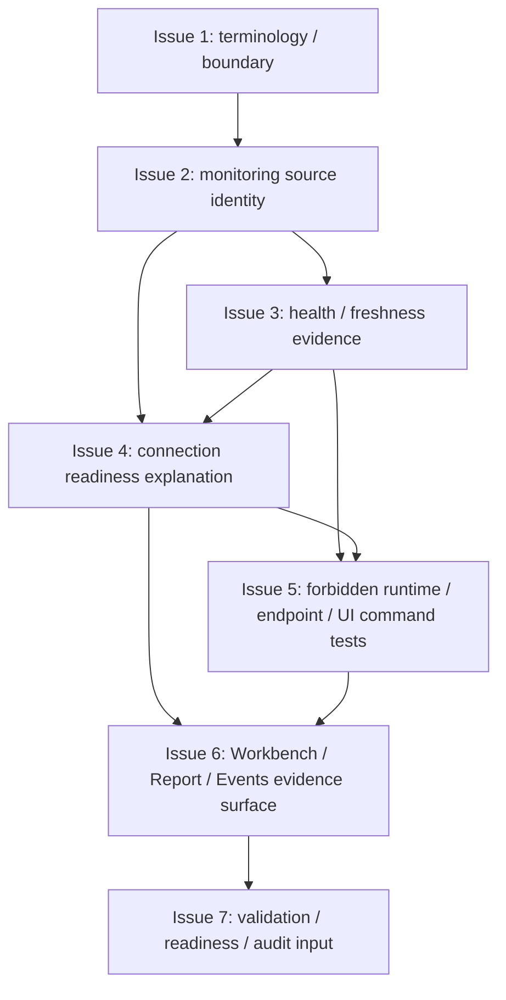

# MTPRO Live Monitoring Read-only Console v2

日期：2026-05-30

执行者：Codex

本文档是 `MTPRO Live Monitoring Read-only Console v2` 写入 Linear 前的 Project Planning Record，只保存 Project 级计划摘要、issue order、dependencies、validation、evidence、first executable issue candidate、WIP=1 和边界。

本文档承接 `docs/product/mtpro-live-readiness-roadmap-v1.md` 的 `L3.3 Live Monitoring Read-only Console v2` 切片。本文档不授权执行，不创建 Linear Project，不创建 Linear Issues，不修改 Linear status，不推进 Todo，不启动 `@002 / PAR`，不启动 Symphony，不运行 Graphify update，不写业务代码，不修改 Figma，不实现 Live Monitoring runtime，不实现 Live readiness runtime，也不实现 Live PRO Console。

完整 issue execution contract 以后以 Linear issue body 为准。仓库 planning record 不复制维护完整 Linear issue body，也不复制维护完整 candidate issue 正文。

## Project name

`MTPRO Live Monitoring Read-only Console v2`

## Project goal

在 L3.0 / L3.1 / L3.2 已完成的 Live readiness boundary、account / position / balance read-model-only evidence、private stream / account snapshot simulation gate 基础上，升级 Workbench / Report / Events 的只读 monitoring evidence surface。

该 Project 只提供 read-model-only monitoring evidence，不实现 live readiness runtime、真实账户读取、private stream runtime、broker adapter、Live PRO Console 或任何 live command。

## Target Engines / Layers

- Evidence Read Model Layer。
- Workbench Interface。
- Report / Events evidence surface。
- Connectivity / Adapter future gate。
- State & Persistence boundary。
- Validation / Automation readiness layer。

## Target maturity

`L3.3 Live Monitoring Read-only Console v2`

当前基线：

- `L1 Paper Runtime complete`。
- `L1.5 Data Catalog / Scenario Replay complete`。
- `L2 Simulated Exchange / Backtest Parity complete`。
- `L2+ Workbench Beta Readiness complete`。
- `L3.0 Live Read-only Readiness Boundary complete`。
- `L3.1 Account / Position / Balance Read-model-only complete`。
- `L3.2 Private Stream / Account Snapshot Simulation Gate complete`。
- 旧 `Engine Maturity Roadmap Progress: 4 / 4 (100%)` 已闭合；本 planning record 不扩分母、不更新进度条。

## Source inputs

- `GOAL.md`
- `BLUEPRINT.md`
- `docs/roadmap.md`
- `architecture.md`
- `docs/product/mtpro-live-readiness-roadmap-v1.md`
- `docs/product/mtpro-core-engine-architecture-module-maturity-map-v1.md`
- `docs/product/mtpro-paper-trading-runtime-foundation-blueprint-v1.md`
- `docs/validation/latest-verification-summary.md`
- `verification.md`
- Human 确认的 `MTPRO Live Monitoring Read-only Console v2` Project Draft

## Scope

- 定义 Live Monitoring Read-only Console v2 术语和边界。
- 定义 L3.0 / L3.1 / L3.2 evidence 的 monitoring source identity。
- 定义 account snapshot / private stream simulation gate 的 health、freshness、stale、blocked、missing evidence。
- 定义 connection readiness explanation，但不建立 runtime connection。
- 定义 forbidden Live Monitoring runtime / endpoint / UI command tests。
- 将 Live Monitoring v2 evidence 以 read-model-only 方式接入 Workbench / Report / Events。
- 收口 validation matrix、automation readiness anchor 和 stage audit input material。

## Non-goals

- 不新增 Live PRO Console。
- 不新增 trading button / live command / order form。
- 不实现 signed endpoint、account endpoint / listenKey。
- 不实现 private WebSocket runtime、account snapshot runtime。
- 不连接 broker / exchange execution adapter。
- 不实现 `LiveExecutionAdapter`。
- 不实现 OMS / real order lifecycle。
- 不实现 real submit / cancel / replace。
- 不实现 execution report / broker fill / reconciliation。
- 不读取 real account / broker position / margin / leverage。
- 不实现 real PnL。
- 不实现 emergency stop、shutdown 或 restore。
- 不运行 Graphify。
- 不修改 Figma。
- 不把 monitoring evidence 写成 live readiness runtime。
- 不把 planning record 当执行授权。

## Issue order

| 顺序 | Issue 标题 | 目标摘要 | 依赖摘要 |
| --- | --- | --- | --- |
| 1 | Define Live Monitoring Read-only Console v2 terminology and boundary | 定义 L3.3 terminology、边界、证据来源和只读展示原则。 | 无 |
| 2 | Define monitoring source identity from L3.0 / L3.1 / L3.2 evidence | 定义 L3.0 readiness boundary、L3.1 APB read model、L3.2 simulation gate evidence 的 monitoring source identity。 | 依赖 Issue 1 |
| 3 | Define account snapshot / private stream simulation gate health and freshness evidence | 定义 simulation gate health、freshness、stale、blocked、missing evidence 语义。 | 依赖 Issue 2 |
| 4 | Define connection readiness / stale / blocked / missing explanation without runtime connection | 定义 connection readiness explanation 和 stale / blocked / missing 展示语义，但不建立 runtime connection。 | 依赖 Issue 2、Issue 3 |
| 5 | Define forbidden Live Monitoring runtime / endpoint / UI command tests | 定义 forbidden endpoint、runtime、broker、Live PRO Console、trading button、live command 和 order form tests。 | 依赖 Issue 3、Issue 4 |
| 6 | Add Workbench / Report / Events Live Monitoring v2 read-model-only evidence surface | 将 Live Monitoring v2 evidence 接入 Workbench / Report / Events 只读 evidence surface。 | 依赖 Issue 4、Issue 5 |
| 7 | Close validation matrix / automation readiness / stage audit input | 收口 validation matrix、automation readiness anchors、forbidden capability evidence 和 stage audit input material。 | 依赖 Issue 6 |

仓库不复制维护 7 个 issue 的完整正文。后续 issue scope、Codex instructions、validation、boundary、PR requirements 以 Linear issue body 为准。

## Dependencies

- Issue 2 依赖 Issue 1。
- Issue 3 依赖 Issue 2。
- Issue 4 依赖 Issue 2、Issue 3。
- Issue 5 依赖 Issue 3、Issue 4。
- Issue 6 依赖 Issue 4、Issue 5。
- Issue 7 依赖 Issue 6。



## Candidate issue summaries

| Issue | Scope 摘要 | Non-goals / Boundary 摘要 | Validation 摘要 |
| --- | --- | --- | --- |
| Issue 1 | Live Monitoring Read-only Console v2 canonical terms、monitoring evidence source、Read Model / ViewModel boundary、validation anchor 入口。 | 只定义 terminology / boundary；不实现 monitoring surface、live readiness runtime、endpoint、broker、Live PRO Console 或 live command。 | `bash checks/run.sh`；验证 terminology 不授权 live runtime。 |
| Issue 2 | monitoring source identity、boundary / fixture / simulated / read-model-only source 标记、source freshness / status / unavailable 语义。 | 不实现真实 source adapter，不读取真实 account / position / balance，不接 private stream、listenKey 或 account endpoint。 | `bash checks/run.sh`；验证 source identity 不包含 API key、secret、listenKey、account endpoint、broker state 或 account payload。 |
| Issue 3 | simulation gate health evidence、freshness / stale / missing 解释规则、blocked evidence 展示语义。 | 不实现 private WebSocket runtime、account snapshot runtime、real account read、broker fill、execution report、reconciliation 或 live connection status。 | `bash checks/run.sh`；验证 simulated health evidence 不能升级为真实 account data。 |
| Issue 4 | connection readiness explanation、stale / blocked / missing UI / report 语义、no-runtime-connection boundary。 | 不实现 connection manager、adapter、private stream、account endpoint、broker connection、Live PRO Console 或 live command。 | `bash checks/run.sh`；验证 connection readiness explanation 不产生 runtime connection path。 |
| Issue 5 | forbidden signed endpoint、account endpoint、listenKey、private WebSocket runtime、account snapshot runtime、broker、Live PRO Console、trading button、live command 和 order form tests。 | 不实现 endpoint、adapter、UI command、stop / shutdown / restore 或完整实盘监控台重设计。 | `bash checks/run.sh`；验证 forbidden tests 覆盖 endpoint、listenKey、private stream、broker 和 UI command。 |
| Issue 6 | Workbench read-model-only monitoring surface、Report / Events evidence、source identity、freshness、blocked / stale / missing explanation。 | 不新增 Live PRO Console、trading button、live command、order form、real account view、broker position sync 或 real PnL runtime。 | `bash checks/run.sh`；验证 Workbench / Report / Events 只消费 Read Model / ViewModel 且不触发 real connection。 |
| Issue 7 | validation matrix anchors、automation readiness anchors、issue evidence summary、boundary evidence、stage audit input material。 | 不输出最终 Stage Code Audit Report，不启动下一阶段，不推进下一 Project / Issue，不运行 Graphify，不修改 Figma。 | `bash checks/run.sh`；验证 L3.3 planning / validation / readiness anchors、forbidden capabilities 和 no `.codex/*` / `graphify-out/*`。 |

## Validation requirements

每个 issue 都必须运行：

```bash
bash checks/run.sh
```

L3.3 相关验证必须满足：

- 必须验证 no signed endpoint。
- 必须验证 no account endpoint / listenKey。
- 必须验证 no private WebSocket runtime。
- 必须验证 no account snapshot runtime。
- 必须验证 no broker / exchange execution adapter。
- 必须验证 no `LiveExecutionAdapter`。
- 必须验证 no OMS / real order lifecycle。
- 必须验证 no real submit / cancel / replace。
- 必须验证 no execution report / broker fill / reconciliation。
- 必须验证 no real account / broker position / margin / leverage。
- 必须验证 no real PnL。
- 必须验证 no Live PRO Console / trading button / live command / order form。
- 必须验证 no emergency stop / shutdown / restore。
- 必须验证 Workbench / Report / Events 只消费 Read Model / ViewModel。
- 必须验证 monitoring evidence 不能升级为 live readiness runtime。
- 必须验证 read-model-only surface 不暴露 Runtime object、Adapter request、SQLite / DuckDB schema、account payload 或 broker state。

## Evidence requirements

每个 PR 必须包含：

- Linked Linear Issue。
- Scope / Non-goals 确认。
- validation output。
- boundary evidence。
- Pre-PR Codex Code Review。
- GitHub PR Automation evidence。
- MTPRO-native PR evidence fields：`Feedback Loop Evidence`、`Tracer Bullet / Fixture Evidence`、`Diagnose Evidence`、`Architecture Deepening Candidate`。
- `.codex/*` 未进入 PR。
- `graphify-out/*` 未进入 PR。
- 如由 symphony-issue 执行，需 handoff marker evidence。
- 涉及 production code 的 PR 必须补充详细中文注释，说明 read-model-only、simulated / fixture evidence 和禁止真实账户 / 真实连接解释的原因。

Issue 7 只准备 stage audit input material，不输出最终 Stage Code Audit Report。

Project 全部 Done 后，Stage Code Audit Report 必须由 Parent Codex 单独输出。

## First executable issue candidate

第一个可执行候选 issue：

```text
Define Live Monitoring Read-only Console v2 terminology and boundary
```

该 issue 只是 first executable issue candidate，初始状态仍必须是 `Backlog / non-executable`，不授权执行，不推进 Todo。

Project 经 Human 确认并写入 Linear 后，由 Parent Codex queue preflight 在 WIP=1、依赖满足、无 active conflict、execution contract 格式完整时自动判断唯一 eligible issue，并推进 Todo。

## WIP=1 / queue preflight rule

- Project 执行必须保持 WIP=1。
- 所有 issue 初始状态必须是 `Backlog / non-executable`。
- `@001 / PLN` 不操作 `Backlog -> Todo`。
- Project 写入 Linear 后，由 Parent Codex queue preflight 判断唯一 eligible issue。
- Parent Codex queue preflight 必须确认 WIP=1、依赖满足、无 active conflict、execution contract 格式完整，才可推进唯一 eligible issue 到 Todo。

## Linear write boundary

- 本 planning record 不创建 Linear Project。
- 本 planning record 不创建 Linear Issues。
- 本 planning record 不修改 Linear status。
- 本 planning record 不推进 Todo。
- 本 planning record 不启动 `@002 / PAR`。
- 本 planning record 不启动 Symphony / symphony-issue。
- Human review / merge 后，才允许进入 Linear 写入。
- Project 写入 Linear 后，所有 issue 初始必须保持 `Backlog / non-executable`。
- 后续完整 execution contract 以 Linear issue body 为准。

## Repository record boundary

- 仓库 planning record 只保存 Project 级计划摘要和格式门槛。
- 仓库不复制维护完整 Linear issue body。
- 仓库不复制维护完整 candidate issue 正文。
- Planning record 不授权执行。
- 后续 issue scope、Codex instructions、validation、boundary、PR requirements 以 Linear issue body 为准。

## Parent Codex queue preflight rule

- `@001 / PLN` 只负责 Project planning draft，不操作 `Backlog -> Todo`。
- Project 写入 Linear 后，由 Parent Codex queue preflight 判断唯一 eligible issue。
- Queue preflight 必须确认 WIP=1、依赖满足、previous issue Done、execution contract 格式完整、当前 Project 没有 `Todo` / `In Progress` / `In Review` active conflict。
- 只有 queue preflight 通过后，Parent Codex 才能推进唯一 eligible issue 到 Todo。
- symphony-issue 只能调度唯一 Todo issue。
