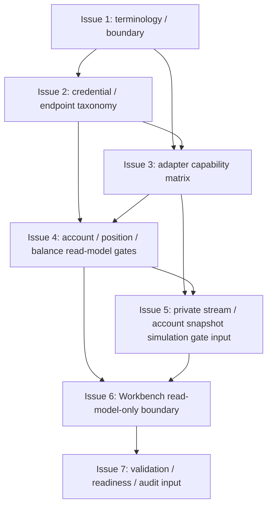

# MTPRO Live Read-only Readiness Boundary v1

日期：2026-05-27

执行者：Codex

本文档是 `MTPRO Live Read-only Readiness Boundary v1` 写入 Linear 前的 Project Planning Record，只保存 Project 级计划摘要、issue order、dependencies、validation、evidence、first executable issue candidate、WIP=1 和边界。

本文档承接 `docs/product/mtpro-live-readiness-roadmap-v1.md` 的 `L3.0 Live Read-only Readiness Boundary` 切片。本文档不授权执行，不创建 Linear Project，不创建 Linear Issues，不修改 Linear status，不推进 Todo，不启动 `@002 / PAR`，不启动 Symphony，不运行 Graphify update，不写业务代码，不修改 Figma，不实现 Live read-only runtime。

完整 issue execution contract 以后以 Linear issue body 为准。仓库 planning record 不复制维护完整 Linear issue body，也不复制维护完整 candidate issue 正文。

## Project name

`MTPRO Live Read-only Readiness Boundary v1`

## Project goal

定义进入 L3 Live Read-only Readiness 前的第一层边界：credential / secret policy、endpoint 分类、adapter capability matrix、account endpoint / listenKey / private stream future gates、forbidden write capability baseline、Workbench read-model-only 边界和后续 L3.1 / L3.2 / L3.3 validation anchors。

该 Project 只建立 boundary / contract / forbidden capability tests / readiness anchors，不实现真实账户读取、不连接 broker、不启动 private stream、不提供 Live PRO Console 或交易命令。

## Target Engines / Layers

- Connectivity / Adapter Engine。
- Data Engine / future private stream boundary。
- Evidence Read Model Layer。
- Workbench Interface / Live Readiness surface。
- Docs / Validation / Automation readiness layer。

## Target maturity

`L3.0 Live Read-only Readiness Boundary`

当前基线：

- `L1 Paper Runtime complete`。
- `L1.5 Data Catalog / Scenario Replay complete`。
- `L2 Simulated Exchange / Backtest Parity complete`。
- `L2+ Workbench Beta Readiness complete`。
- `Engine Maturity Roadmap Progress: 4 / 4 (100%)`，该旧路线不再扩分母。

## Scope

- 定义 Live Read-only Readiness terminology / boundary。
- 定义 credential / secret policy 的 future gate 与 forbidden baseline。
- 定义 endpoint capability taxonomy：public read-only、signed forbidden、account endpoint forbidden、listenKey forbidden、broker action forbidden。
- 定义 adapter capability matrix：public market data allowed、private account read future gated、order write forbidden。
- 定义 account / position / balance read-model-only 的 future gate，不实现 runtime。
- 定义 private stream / account snapshot simulation gate 的 future input material，不实现 listenKey 或 private WebSocket。
- 定义 Workbench / Dashboard 只读 Live readiness evidence boundary。
- 收口 validation matrix、automation readiness 和 stage audit input material。

## Non-goals

- 不实现 API key / secret storage。
- 不读取本地 secret。
- 不实现 signed endpoint。
- 不实现 account endpoint / listenKey。
- 不连接 broker / exchange execution adapter。
- 不实现 `LiveExecutionAdapter`。
- 不实现 OMS / real order lifecycle。
- 不实现 real submit / cancel / replace。
- 不实现 execution report / broker fill / reconciliation。
- 不读取 real account / broker position / margin / leverage。
- 不实现 account / position / balance runtime。
- 不实现 private stream runtime。
- 不实现 Live Monitoring Console v2。
- 不实现 Live PRO Console。
- 不新增 trading button / live command。
- 不实现 emergency stop / shutdown / restore。
- 不运行 Graphify。
- 不修改 Figma。
- 不把 L3.0 boundary 写成 L3.1 / L3.2 / L3.3 implementation。
- 不把 planning record 当执行授权。

## Issue order

| 顺序 | Issue 标题 | 目标摘要 | 依赖摘要 |
| --- | --- | --- | --- |
| 1 | Define Live read-only readiness terminology and boundary | 定义 L3.0 的术语、目标引擎、future gates 和 forbidden baseline。 | 无 |
| 2 | Define credential / secret policy and endpoint capability taxonomy | 定义 credential / secret future gate、public / signed / account / listenKey endpoint 分类和禁止边界。 | 依赖 Issue 1 |
| 3 | Define adapter capability matrix for read-only readiness | 定义 adapter capability matrix，隔离 public read-only、future private read-only 和 forbidden write capability。 | 依赖 Issue 1、Issue 2 |
| 4 | Define account / position / balance read-model-only future gates | 定义 L3.1 所需的 read-model-only account / position / balance gates，不实现 runtime。 | 依赖 Issue 2、Issue 3 |
| 5 | Define private stream / account snapshot simulation gate input material | 定义 L3.2 所需的 private stream / account snapshot simulation gate input，不实现 listenKey 或 private stream。 | 依赖 Issue 3、Issue 4 |
| 6 | Define Workbench Live readiness read-model-only boundary | 定义 Workbench / Dashboard 只能展示 Live readiness boundary evidence，不暴露 command / secret / broker surface。 | 依赖 Issue 4、Issue 5 |
| 7 | Close validation matrix / automation readiness / stage audit input | 收口 L3.0 validation matrix、automation readiness anchors 和 stage audit input material。 | 依赖 Issue 6 |

仓库不复制维护 7 个 issue 的完整正文。后续 issue scope、Codex instructions、validation、boundary、PR requirements 以 Linear issue body 为准。

## Dependencies

- Issue 2 依赖 Issue 1。
- Issue 3 依赖 Issue 1、Issue 2。
- Issue 4 依赖 Issue 2、Issue 3。
- Issue 5 依赖 Issue 3、Issue 4。
- Issue 6 依赖 Issue 4、Issue 5。
- Issue 7 依赖 Issue 6。



## Candidate issue summaries

| Issue | Scope 摘要 | Non-goals / Boundary 摘要 | Validation 摘要 |
| --- | --- | --- | --- |
| Issue 1 | L3.0 terminology、target engines、future gates、forbidden baseline、L3.1 / L3.2 / L3.3 handoff boundary。 | 只定义 boundary；不实现 endpoint、secret、adapter、account read model、UI 或 live runtime。 | `bash checks/run.sh`；验证 terminology / boundary anchors 和 forbidden live capability baseline。 |
| Issue 2 | credential / secret policy future gate、endpoint taxonomy、signed / account / listenKey forbidden baseline。 | 不读取 secret，不新增 env / keychain / config，不实现 signed request 或 account endpoint。 | `bash checks/run.sh`；验证 no secret read、no signed endpoint、no account endpoint / listenKey。 |
| Issue 3 | adapter capability matrix：public market data allowed、future private read-only gated、order write forbidden。 | 不创建 broker adapter，不实现 `LiveExecutionAdapter`，不把 public adapter 升级为 execution adapter。 | `bash checks/run.sh`；验证 adapter matrix 不包含 write capability。 |
| Issue 4 | account / position / balance read-model-only future gates、source identity、ViewModel boundary。 | 不读取 real account，不同步 broker position，不实现 margin / leverage / real PnL。 | `bash checks/run.sh`；验证 read-model-only future gate 不变成 runtime。 |
| Issue 5 | private stream / account snapshot simulation gate input material、future fixture requirements、listenKey forbidden tests。 | 不创建 listenKey，不连接 private WebSocket，不运行 account snapshot runtime。 | `bash checks/run.sh`；验证 simulation gate input 与 live stream implementation 隔离。 |
| Issue 6 | Workbench / Dashboard Live readiness evidence boundary、forbidden UI surface、detail / audit routing。 | 不新增 API key 输入、broker connect、Live PRO Console、trading button、live command 或 order form。 | `bash checks/run.sh`；验证 UI 只消费 Read Model / ViewModel。 |
| Issue 7 | validation matrix、automation readiness、stage audit input、forbidden capability evidence chain。 | 不输出最终 Stage Code Audit Report，不创建下一 Project，不启动下一阶段。 | `bash checks/run.sh`；验证 readiness anchors、stage audit input 和 no `.codex/*` / `graphify-out/*`。 |

## Validation requirements

每个 issue 都必须运行：

```bash
bash checks/run.sh
```

L3.0 相关验证必须满足：

- 必须验证 no API key / secret storage implementation。
- 必须验证 no local secret read。
- 必须验证 no signed endpoint。
- 必须验证 no account endpoint / listenKey implementation。
- 必须验证 no broker / exchange execution adapter。
- 必须验证 no `LiveExecutionAdapter`。
- 必须验证 no OMS / real order lifecycle。
- 必须验证 no real submit / cancel / replace。
- 必须验证 no execution report / broker fill / reconciliation。
- 必须验证 no real account / broker position / margin / leverage runtime。
- 必须验证 no private stream runtime。
- 必须验证 no Live Monitoring Console v2 implementation。
- 必须验证 no Live PRO Console / trading button / live command。
- 必须验证 no emergency stop / shutdown / restore executable action。
- 必须验证 Workbench / Dashboard 只消费 Read Model / ViewModel。
- 必须验证 no Graphify update / no Figma modification。

## Evidence requirements

每个 PR 必须包含：

- Linked Linear Issue。
- Scope / Non-goals 确认。
- validation output。
- boundary evidence。
- Pre-PR Codex Code Review。
- GitHub PR Automation evidence。
- MTPRO-native PR evidence fields：`Feedback Loop Evidence`、`Tracer Bullet / Fixture Evidence`、`Diagnose Evidence`、`Architecture Deepening Candidate`。
- `.codex/*` 未进入 PR。
- `graphify-out/*` 未进入 PR。
- 如由 symphony-issue 执行，需 handoff marker evidence。

Issue 7 只准备 stage audit input material，不输出最终 Stage Code Audit Report。

Project 全部 Done 后，Stage Code Audit Report 必须由 Parent Codex 单独输出。

## First executable issue candidate

第一个可执行候选 issue：

```text
Define Live read-only readiness terminology and boundary
```

该 issue 只是 first executable issue candidate，初始状态仍必须是 `Backlog / non-executable`，不授权执行，不推进 Todo。

Project 经 Human 确认并写入 Linear 后，由 Parent Codex queue preflight 在 WIP=1、依赖满足、无 active conflict、execution contract 格式完整时自动判断唯一 eligible issue，并推进 Todo。

## WIP=1 / queue preflight rule

- Project 执行必须保持 WIP=1。
- 所有 issue 初始状态必须是 `Backlog / non-executable`。
- `@001 / PLN` 不操作 `Backlog -> Todo`。
- Project 写入 Linear 后，由 Parent Codex queue preflight 判断唯一 eligible issue。
- Parent Codex 必须确认 WIP=1、依赖满足、无 active conflict、execution contract 格式完整后，才可推进唯一 eligible issue 到 Todo。

## Linear write boundary

- 本 planning record 不创建 Linear Project。
- 本 planning record 不创建 Linear Issues。
- 本 planning record 不修改 Linear status。
- 本 planning record 不推进 Todo。
- 本 planning record 不启动 `@002 / PAR`。
- 本 planning record 不启动 Symphony / symphony-issue。
- Human review / merge 后，才允许进入 Linear 写入。
- Project 写入 Linear 后，所有 issue 初始必须保持 `Backlog / non-executable`。
- 后续完整 execution contract 以 Linear issue body 为准。

## Repository record boundary

- 仓库 planning record 只保存 Project 级计划摘要和格式门槛。
- 仓库不复制维护完整 Linear issue body。
- 仓库不复制维护完整 candidate issue 正文。
- Planning record 不授权执行。
- 后续 issue scope、Codex instructions、validation、boundary、PR requirements 以 Linear issue body 为准。

## Parent Codex queue preflight rule

- `@001 / PLN` 只负责 Project planning draft，不操作 `Backlog -> Todo`。
- Project 写入 Linear 后，由 Parent Codex queue preflight 判断唯一 eligible issue。
- Queue preflight 必须确认 WIP=1、依赖满足、previous issue Done、execution contract 格式完整、当前 Project 没有 `Todo` / `In Progress` / `In Review` active conflict。
- 只有 queue preflight 通过后，Parent Codex 才能推进唯一 eligible issue 到 Todo。
- symphony-issue 只能调度唯一 Todo issue。
