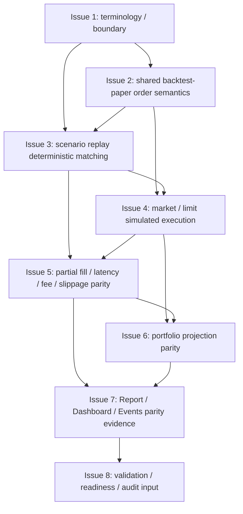

# MTPRO Simulated Exchange / Backtest Parity v1

日期：2026-05-26

执行者：Codex

本文档是 `MTPRO Simulated Exchange / Backtest Parity v1` 写入 Linear 前的 Project Planning Record，只保存 Project 级计划摘要、issue order、dependencies、validation、evidence、first executable issue candidate、WIP=1 和边界。

本文档不授权执行，不创建 Linear Project，不创建 Linear Issues，不修改 Linear status，不推进 Todo，不启动 `@002 / PAR`，不启动 Symphony，不运行 Graphify update，不写业务代码，不修改 Figma，不实现 Simulated Exchange，不实现 Backtest Parity。

完整 issue execution contract 以后以 Linear issue body 为准。仓库 planning record 不复制维护完整 Linear issue body，也不复制维护完整 candidate issue 正文。

## Project name

`MTPRO Simulated Exchange / Backtest Parity v1`

## Target Engines

- Simulation / Backtest Engine。
- Execution Engine（paper-only / simulated）。
- Portfolio Engine。
- Data Engine。
- State & Persistence Engine。
- Workbench Interface。

## Target maturity

`L2 Backtest / Simulation Parity`

该 maturity 只表示在已完成的 L1 Paper Runtime 和 L1.5 Data Catalog / Scenario Replay 之上，建立 backtest 与 paper runtime 共享的 deterministic simulated exchange 语义。它不表示 MTPRO 进入 Live readiness，不授权真实交易、broker、signed endpoint、OMS、Live PRO Console 或 trading command。

本 planning record 不更新 `Final Product Goal Progress`，也不更新 `Engine Maturity Roadmap Progress`。只有该 Project 完整 closure 并完成 Root Docs Refresh Gate 后，才允许把 Engine Maturity Roadmap Progress 从 `2 / 4 (50%)` 更新为 `3 / 4 (75%)`。

## Project goal

把已完成的 L1 Paper Runtime 和 L1.5 Data Catalog / Scenario Replay 串成 L2：让 backtest 与 paper runtime 共享 deterministic simulated exchange 语义，包括订单语义、撮合、成交、费用 / 滑点、组合投影和证据输出。

## Source inputs

- `GOAL.md`
- `BLUEPRINT.md`
- `docs/roadmap.md`
- `docs/architecture.md`
- `docs/product/mtpro-core-engine-architecture-module-maturity-map-v1.md`
- `docs/product/mtpro-paper-trading-runtime-foundation-blueprint-v1.md`
- `docs/planning/projects/mtpro-data-catalog-scenario-replay-v1-plan.md`
- `docs/validation/latest-verification-summary.md`
- `verification.md`
- `MTPRO Data Catalog / Scenario Replay v1` closure evidence
- NautilusTrader conceptual references:
  - `https://nautilustrader.io/docs/latest/concepts/backtesting/`
  - `https://nautilustrader.io/docs/latest/api_reference/backtest/`
  - `https://nautilustrader.io/docs/latest/concepts/`

NautilusTrader 只作为 simulated exchange、matching engine、FillModel、LatencyModel、Portfolio / Reports 等概念参考。MTPRO 不复制其实现，不引入其运行依赖，不把参考项目能力升级为当前 Live readiness。

## Scope

- 定义 simulated exchange / backtest parity 术语、边界和只模拟语义。
- 建立 backtest 与 paper 共享 order semantics contract。
- 基于 scenario replay 建立 deterministic matching model。
- 定义 market / limit order 最小模拟执行语义。
- 定义 partial fill / full fill / reject / expire、latency、fee / slippage parity。
- 建立 simulated exchange event 到 portfolio projection 的 parity contract。
- 接入 Report / Dashboard / Events 的 read-model evidence。
- 收口 validation matrix、automation readiness 和 stage audit input material。

## Non-goals

- 不接 signed endpoint。
- 不接 account endpoint / listenKey。
- 不连接 broker / exchange execution adapter。
- 不实现 `LiveExecutionAdapter`。
- 不实现真实 OMS / real order lifecycle。
- 不实现真实 submit / cancel / replace。
- 不实现 execution report / broker fill / reconciliation。
- 不读取 real account / broker position / margin / leverage。
- 不实现 Live PRO Console。
- 不新增 trading button / live command。
- 不实现 emergency stop / shutdown / restore。
- 不运行 Graphify。
- 不修改 Figma。
- 不把 simulated exchange 写成真实 exchange。
- 不把 backtest parity 写成 live readiness。
- 不把本 planning record 当执行授权。

## Issue order

| 顺序 | Issue 标题 | 目标摘要 | 依赖摘要 |
| --- | --- | --- | --- |
| 1 | Define simulated exchange / backtest parity terminology and boundary | 定义 L2 simulated exchange / backtest parity 的术语、工程边界和 forbidden capability baseline。 | 无 |
| 2 | Add shared backtest-paper order semantics contract | 定义 backtest 与 paper runtime 共享的 order intent / order state / simulated event 语义。 | 依赖 Issue 1 |
| 3 | Add scenario replay deterministic matching model | 基于 scenario replay 定义 deterministic matching model 的最小闭环。 | 依赖 Issue 1、Issue 2 |
| 4 | Add market / limit order simulated execution semantics | 定义 market / limit order 的最小 simulated execution 语义。 | 依赖 Issue 2、Issue 3 |
| 5 | Add partial fill / latency / fee / slippage parity | 定义 partial fill、latency、fee、slippage 在 backtest 与 paper runtime 间的一致语义。 | 依赖 Issue 3、Issue 4 |
| 6 | Add simulated exchange events to portfolio projection parity | 建立 simulated exchange event 到 paper / backtest portfolio projection 的 parity contract。 | 依赖 Issue 4、Issue 5 |
| 7 | Add Report / Dashboard / Events parity evidence surface | 将 L2 parity evidence 接入 Report / Dashboard / Events 的只读证据面。 | 依赖 Issue 5、Issue 6 |
| 8 | Close validation matrix / automation readiness / stage audit input | 收口 L2 parity validation matrix、automation readiness anchor 和 stage audit input material。 | 依赖 Issue 7 |

仓库不复制维护 8 个 issue 的完整正文。后续 issue scope、Codex instructions、validation、boundary、PR requirements 以 Linear issue body 为准。

## Candidate issue summaries

| Issue | Scope 摘要 | Non-goals / Boundary 摘要 | Validation 摘要 |
| --- | --- | --- | --- |
| Issue 1 | simulated exchange、matching model、fill model、latency、fee / slippage、portfolio parity、scenario replay integration 的 terminology、target engine boundary 和 forbidden capability baseline。 | 不实现撮合、订单执行、portfolio 投影或 UI；不接 live / broker / signed / account 能力；simulated exchange 只能表示 deterministic simulation，不表示真实交易所。 | `bash checks/run.sh`；验证文档不授权 live、broker、signed endpoint、真实订单或 Live PRO Console。 |
| Issue 2 | backtest 与 paper runtime 共享的 paper order intent、simulated order accepted / rejected / expired、paper lifecycle 与 backtest replay 对齐规则。 | 不实现真实 OMS、real order lifecycle、真实 submit / cancel / replace、execution report 或 broker reconciliation；paper order intent 不能升级为 real order command。 | `bash checks/run.sh`；验证 shared order semantics 只服务 simulation / backtest，不引入 live command。 |
| Issue 3 | scenario replay window、cursor、dataset version、market state 输入和 deterministic matching 输出事件的最小闭环。 | 不做真实撮合引擎、多市场大规模撮合、broker / exchange adapter 或外部网络依赖；matching model 只消费本地 deterministic scenario。 | `bash checks/run.sh`；验证相同 scenario id / dataset version / replay window 输出稳定一致。 |
| Issue 4 | market order、limit order、full fill、reject、expire 的最小 simulated execution 语义和 fixture 验证。 | 不做 stop / OCO / advanced order types；不做真实订单提交、撤销、替换；order execution semantics 不是 live order state machine。 | `bash checks/run.sh`；验证 market / limit fixture 输出可重放且不引入 live command。 |
| Issue 5 | partial fill / full fill 差异、latency model、fee / slippage deterministic assumptions 和 fixture parity。 | 不做完整交易所费率表、动态滑点模型、真实流动性消耗、执行成本优化、live fee schedule 或真实成交质量。 | `bash checks/run.sh`；验证相同输入下 fee / slippage / latency evidence 稳定一致。 |
| Issue 6 | simulated fill event、position、cash、realized / unrealized summary、report input parity 和 portfolio projection parity。 | 不读取 real account、broker position、margin、leverage；不做 broker reconciliation；portfolio parity 只代表模拟组合投影。 | `bash checks/run.sh`；验证 backtest 与 paper 对同一 simulated exchange event 生成一致 portfolio projection。 |
| Issue 7 | Report / Dashboard / Events 展示 scenario id、dataset version、matching result、fill summary、fee / slippage、portfolio parity、replay consistency。 | 不新增 Live PRO Console、trading button、live command、order-level command UI、Runtime command 或 schema inspector。 | `bash checks/run.sh`；验证 Report / Dashboard / Events 只消费 ViewModel / Read Model，只读展示 parity evidence。 |
| Issue 8 | validation matrix、automation readiness anchors、deterministic fixture evidence、forbidden capability audit、Report / Dashboard / Events evidence 和 stage audit input material。 | 不输出最终 Stage Code Audit Report，不启动下一阶段，不推进下一 Project / Issue，不创建 Linear，不修改状态。 | `bash checks/run.sh`；验证 readiness anchor 覆盖 L2 parity、forbidden live capability 和 evidence completeness。 |

## Dependencies

- Issue 2 依赖 Issue 1。
- Issue 3 依赖 Issue 1、Issue 2。
- Issue 4 依赖 Issue 2、Issue 3。
- Issue 5 依赖 Issue 3、Issue 4。
- Issue 6 依赖 Issue 4、Issue 5。
- Issue 7 依赖 Issue 5、Issue 6。
- Issue 8 依赖 Issue 7。



## Validation requirements

每个 issue 都必须运行：

```bash
bash checks/run.sh
```

Simulated Exchange / Backtest Parity 相关验证必须满足：

- 必须验证 no signed endpoint / account endpoint / listenKey。
- 必须验证 no broker / exchange execution adapter。
- 必须验证 no `LiveExecutionAdapter`。
- 必须验证 no real OMS / real order lifecycle。
- 必须验证 no real submit / cancel / replace。
- 必须验证 no execution report / broker fill / reconciliation。
- 必须验证 no real account / broker position / margin / leverage。
- 必须验证 no Live PRO Console / trading button / live command。
- deterministic matching、fee / slippage、portfolio projection parity 必须通过 fixture / scenario replay 证据验证。
- Report / Dashboard / Events 只能消费 ViewModel / Read Model evidence。
- PR 必须包含 MTPRO-native PR evidence fields：`Feedback Loop Evidence`、`Tracer Bullet / Fixture Evidence`、`Diagnose Evidence`、`Architecture Deepening Candidate`。
- 新增或修改生产代码必须包含详细中文注释。

## Evidence requirements

每个 PR 必须包含：

- Linked Linear Issue。
- Scope / Non-goals 确认。
- validation output。
- boundary evidence。
- Pre-PR Codex Code Review。
- GitHub PR Automation evidence。
- MTPRO-native PR evidence fields。
- `.codex/*` 未进入 PR。
- `graphify-out/*` 未进入 PR。
- 如由 symphony-issue 执行，需 handoff marker evidence。

Issue 8 只准备 stage audit input material，不输出最终 Stage Code Audit Report。

Project 全部 Done 后，Stage Code Audit Report 必须由 Parent Codex 单独输出。

## First executable issue candidate

第一个可执行候选 issue：

```text
Define simulated exchange / backtest parity terminology and boundary
```

该 issue 只是 first executable issue candidate，初始状态仍必须是 `Backlog / non-executable`，不授权执行，不推进 Todo。

Project 经 Human 确认并写入 Linear 后，由 Parent Codex queue preflight 在 WIP=1、依赖满足、无 active conflict、execution contract 格式完整时自动判断唯一 eligible issue，并推进 Todo。

## WIP=1 / Linear write boundary

- Project 执行必须保持 WIP=1。
- 所有 issue 初始状态必须是 `Backlog / non-executable`。
- 本 draft 不创建 Linear Project。
- 本 draft 不创建 Linear Issues。
- 本 draft 不修改 Linear status。
- 本 draft 不推进 Todo。
- Human review / merge 后，才允许进入 Linear 写入。
- Project 写入 Linear 后，所有 issue 初始必须保持 `Backlog / non-executable`。
- 后续完整 execution contract 以 Linear issue body 为准。
- Project 写入 Linear 后，由 Parent Codex queue preflight 判断唯一 eligible issue。

## Repository record boundary

- 仓库 planning record 只保存 Project 级计划摘要和格式门槛。
- 仓库不复制维护完整 Linear issue body。
- 仓库不复制维护完整 candidate issue 正文。
- 后续 issue scope、Codex instructions、validation、boundary、PR requirements 以 Linear issue body 为准。
- Planning record 不授权执行。

## Parent Codex queue preflight rule

- `@001 / PLN` 只负责 Project-level planning record 和 Linear 写入前草案。
- `@001 / PLN` 不操作 `Backlog -> Todo`。
- Project 写入 Linear 后，由 Parent Codex queue preflight 判断唯一 eligible issue，并推进 Todo。
- Parent Codex queue preflight 必须确认 WIP=1、依赖满足、previous issue Done、execution contract 格式完整，并且当前 Project 没有 `Todo` / `In Progress` / `In Review` active conflict。
- 本 planning record 不启动 `@002 / PAR`。
- symphony-issue 只能在唯一 `Todo` issue 存在后调度。
