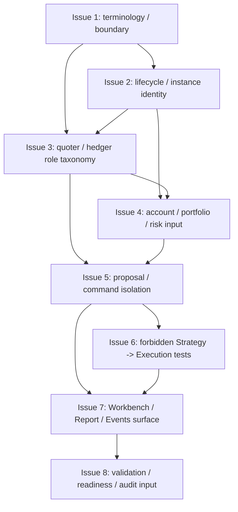

# MTPRO Strategy / Trader Instance Readiness v1

日期：2026-05-31

执行者：Codex

本文档是 `MTPRO Strategy / Trader Instance Readiness v1` 写入 Linear 前的 Project Planning Record，只保存 Project 级计划摘要、issue order、dependencies、validation、evidence、first executable issue candidate、WIP=1 和边界。

本文档承接 `docs/product/mtpro-live-readiness-roadmap-v1.md` 的 `L3.4 Strategy / Trader Instance Readiness v1` 切片。本文档不授权执行，不创建 Linear Project，不创建 Linear Issues，不修改 Linear status，不推进 Todo，不启动 `@002 / PAR`，不启动 Symphony，不运行 Graphify update，不写业务代码，不修改 Figma，不实现 Strategy runtime，不实现 Trader runtime，不实现 execution runtime，也不实现 Live PRO Console。

完整 issue execution contract 以后以 Linear issue body 为准。仓库 planning record 不复制维护完整 Linear issue body，也不复制维护完整 candidate issue 正文。

## Project name

`MTPRO Strategy / Trader Instance Readiness v1`

## Project goal

定义 L4 之前 Strategy Instance / Trader Instance 的只读结构边界：strategy / trader lifecycle、quoter / hedger role taxonomy、account / portfolio / risk read-model 输入、paper/live-neutral proposal contract，以及 strategy proposal 与 execution command 的隔离规则。

该 Project 只建立 readiness contract、forbidden capability tests 和 read-model-only evidence，不实现真实 execution、broker command、OMS、Live PRO Console 或 live command。

## Target Engines / Layers

- Strategy Engine future gate。
- Portfolio Engine read-model input boundary。
- Risk Engine read-model input boundary。
- Evidence Read Model Layer。
- Workbench Interface。
- Execution Engine future gate。
- State & Persistence boundary。
- Validation / Automation readiness layer。

## Target maturity

`L3.4 Strategy / Trader Instance Readiness v1`

当前基线：

- `L1 Paper Runtime complete`。
- `L1.5 Data Catalog / Scenario Replay complete`。
- `L2 Simulated Exchange / Backtest Parity complete`。
- `L2+ Workbench Beta Readiness complete`。
- `L3.0 Live Read-only Readiness Boundary complete`。
- `L3.1 Account / Position / Balance Read-model-only complete`。
- `L3.2 Private Stream / Account Snapshot Simulation Gate complete`。
- `L3.3 Live Monitoring Read-only Console v2 complete`。
- 旧 `Engine Maturity Roadmap Progress: 4 / 4 (100%)` 已闭合；本 planning record 不扩分母、不更新进度条。

## Source inputs

- `GOAL.md`
- `BLUEPRINT.md`
- `docs/roadmap.md`
- `architecture.md`
- `docs/product/mtpro-live-readiness-roadmap-v1.md`
- `docs/validation/latest-verification-summary.md`
- `docs/audit/mtpro-live-monitoring-read-only-console-v2-stage-code-audit.md`
- Human 确认的 `MTPRO Strategy / Trader Instance Readiness v1` Project Draft

## Scope

- 定义 Strategy / Trader Instance terminology 和 readiness boundary。
- 定义 Strategy / trader lifecycle 和 instance identity contract。
- 定义 Quoter / hedger role taxonomy。
- 定义 Account / portfolio / risk read-model input contract。
- 定义 Paper/live-neutral proposal contract。
- 定义 Strategy proposal 与 execution command isolation。
- 定义 Forbidden Strategy -> Execution / broker / UI command tests。
- 将 Strategy / Trader readiness evidence 以 read-model-only 方式接入 Workbench / Report / Events。
- 收口 validation matrix、automation readiness anchor 和 stage audit input material。

## Non-goals

- 不允许 strategy 直连 Execution Client。
- 不输出 broker command。
- 不实现 OMS。
- 不实现 signed endpoint、account endpoint / listenKey。
- 不连接 broker / exchange execution adapter。
- 不实现 `LiveExecutionAdapter`。
- 不实现 real order lifecycle。
- 不实现真实 submit / cancel / replace。
- 不实现 execution report、broker fill、reconciliation。
- 不读取真实账户、真实持仓、margin、leverage 或 real PnL。
- 不新增 Live PRO Console。
- 不新增 trading button、live command、order form。
- 不实现 emergency stop、shutdown、restore。
- 不运行 Graphify。
- 不修改 Figma。
- 不把 L3.4 写成 L4 live production scope。
- 不把 strategy proposal 写成 executable order command。
- 不把 planning record 当执行授权。

## Issue order

| 顺序 | Issue 标题 | 目标摘要 | 依赖摘要 |
| --- | --- | --- | --- |
| 1 | Define Strategy / Trader Instance readiness terminology and boundary | 定义 L3.4 Strategy / Trader Instance readiness 的核心术语、只读边界和 non-execution baseline。 | 无 |
| 2 | Define strategy / trader lifecycle and instance identity contract | 定义 Strategy Instance / Trader Instance 的 lifecycle、identity 和只读状态语义。 | 依赖 Issue 1 |
| 3 | Define quoter / hedger role taxonomy and responsibility boundary | 定义 quoter / hedger role taxonomy、责任边界和 forbidden execution boundary。 | 依赖 Issue 1、Issue 2 |
| 4 | Define account / portfolio / risk read-model input contract | 定义 Strategy / Trader Instance 可消费的 account / portfolio / risk read-model 输入合同。 | 依赖 Issue 2、Issue 3 |
| 5 | Define paper/live-neutral proposal contract and execution command isolation | 定义 paper/live-neutral proposal contract，以及 proposal 与 executable order command / Execution Client / broker command 的隔离规则。 | 依赖 Issue 3、Issue 4 |
| 6 | Define forbidden Strategy -> Execution / broker / UI command tests | 定义 forbidden capability tests，阻止 Strategy / Trader readiness 越界进入 execution、broker、OMS、UI command 或 Live PRO Console。 | 依赖 Issue 5 |
| 7 | Add Workbench / Report / Events strategy readiness read-model-only evidence surface | 将 Strategy / Trader readiness evidence 以 read-model-only 方式接入 Workbench / Report / Events。 | 依赖 Issue 5、Issue 6 |
| 8 | Close validation matrix / automation readiness / stage audit input | 收口 L3.4 validation matrix、automation readiness anchors、boundary evidence 和 stage audit input material。 | 依赖 Issue 7 |

仓库不复制维护 8 个 issue 的完整正文。后续 issue scope、Codex instructions、validation、boundary、PR requirements 以 Linear issue body 为准。

## Dependencies

- Issue 2 依赖 Issue 1。
- Issue 3 依赖 Issue 1、Issue 2。
- Issue 4 依赖 Issue 2、Issue 3。
- Issue 5 依赖 Issue 3、Issue 4。
- Issue 6 依赖 Issue 5。
- Issue 7 依赖 Issue 5、Issue 6。
- Issue 8 依赖 Issue 7。



## Candidate issue summaries

| Issue | Scope 摘要 | Non-goals / Boundary 摘要 | Validation 摘要 |
| --- | --- | --- | --- |
| Issue 1 | Strategy / Trader Instance terminology、readiness boundary、non-execution baseline 和 forbidden capability baseline。 | 只定义 terminology / boundary；不实现 Strategy runtime、Trader runtime、Execution Client、broker command、OMS、Live PRO Console 或 live command。 | `bash checks/run.sh`；验证 terminology 不授权 broker command 或 executable order command。 |
| Issue 2 | Strategy / Trader instance identity、lifecycle terminology、configured / ready / blocked / inactive / simulation-only 状态语义。 | 不实现 lifecycle runtime、strategy scheduler、trader process manager、真实账户会话或 executable command。 | `bash checks/run.sh`；验证 lifecycle 不触发 runtime execution，不包含 credential、secret、listenKey 或 broker account。 |
| Issue 3 | Quoter / hedger role taxonomy、responsibility boundary、role 与 proposal / read-model input / blocked evidence 的关系。 | 不实现 quoter runtime、hedger runtime、order generation engine、broker connection 或 signed endpoint。 | `bash checks/run.sh`；验证 role 不能直连 Execution Client，不能输出 broker command。 |
| Issue 4 | Account / portfolio / risk read-model input、freshness / blocked / simulated / future-gated input semantics、input provenance 和 evidence trace。 | 不读取 real account，不同步 broker position，不读取 margin / leverage / real PnL，不实现 live risk engine 或 account endpoint。 | `bash checks/run.sh`；验证 input contract 不能绕过 Read Model / ViewModel，不暴露 broker state 或 account payload。 |
| Issue 5 | Strategy proposal、trader proposal、paper/live-neutral proposal attributes、proposal status 和 command isolation evidence。 | 不实现 order command、submit / cancel / replace、broker command、Execution Client、OMS 或 real order lifecycle。 | `bash checks/run.sh`；验证 proposal 不能升级为 executable order command。 |
| Issue 6 | Forbidden Strategy -> Execution Client、broker command、OMS、real order lifecycle、Live PRO Console、trading button、live command、order form tests。 | 不实现 execution、broker adapter、UI command、Live PRO Console、emergency stop、shutdown 或 restore。 | `bash checks/run.sh`；验证 forbidden tests deterministic、本地可运行、不依赖真实网络或真实账户。 |
| Issue 7 | Workbench / Report / Events read-model-only strategy readiness surface、instance identity、role、read-model input、proposal isolation 和 blocked evidence。 | 不新增 Strategy Console、Live PRO Console、trading button、live command、order form、strategy runtime、execution runtime 或完整 UI redesign。 | `bash checks/run.sh`；验证 Workbench / Report / Events 只消费 Read Model / ViewModel 且不触发 execution path。 |
| Issue 8 | Validation matrix、automation readiness anchors、issue evidence summary、boundary evidence、stage audit input material。 | 不输出最终 Stage Code Audit Report，不启动下一阶段，不推进下一 Project / Issue，不运行 Graphify，不修改 Figma。 | `bash checks/run.sh`；验证 L3.4 planning / validation / readiness anchors、forbidden capabilities 和 no `.codex/*` / `graphify-out/*`。 |

## Validation requirements

每个 issue 都必须运行：

```bash
bash checks/run.sh
```

L3.4 相关验证必须满足：

- 必须验证 no signed endpoint / account endpoint / listenKey。
- 必须验证 no broker / exchange execution adapter。
- 必须验证 no `LiveExecutionAdapter`。
- 必须验证 no OMS / real order lifecycle。
- 必须验证 no real submit / cancel / replace。
- 必须验证 no execution report / broker fill / reconciliation。
- 必须验证 no real account / broker position / margin / leverage / real PnL。
- 必须验证 no Live PRO Console / trading button / live command / order form。
- 必须验证 no direct Strategy Instance -> Execution Client / broker command path。
- 必须验证 strategy proposal 不能升级为 executable order command。
- 必须验证 Workbench / Report / Events 只消费 Read Model / ViewModel。
- 必须验证 read-model-only surface 不暴露 Runtime object、Adapter request、SQLite / DuckDB schema、account payload 或 broker state。

## Evidence requirements

每个 PR 必须包含：

- Linked Linear Issue。
- Scope / Non-goals 确认。
- validation output。
- boundary evidence。
- Pre-PR Codex Code Review。
- GitHub PR Automation evidence。
- MTPRO-native PR evidence fields：`Feedback Loop Evidence`、`Tracer Bullet / Fixture Evidence`、`Diagnose Evidence`、`Architecture Deepening Candidate`。
- `.codex/*` 未进入 PR。
- `graphify-out/*` 未进入 PR。
- 如由 symphony-issue 执行，需 handoff marker evidence。
- 涉及 production code 的 PR 必须补充详细中文注释，说明 readiness、read-model-only、proposal non-execution 和禁止真实 broker command 解释的原因。

Issue 8 只准备 stage audit input material，不输出最终 Stage Code Audit Report。

Project 全部 Done 后，Stage Code Audit Report 必须由 Parent Codex 单独输出。

## First executable issue candidate

第一个可执行候选 issue：

```text
Define Strategy / Trader Instance readiness terminology and boundary
```

该 issue 只是 first executable issue candidate，初始状态仍必须是 `Backlog / non-executable`，不授权执行，不推进 Todo。

Project 经 Human 确认并写入 Linear 后，由 Parent Codex queue preflight 在 WIP=1、依赖满足、无 active conflict、execution contract 格式完整时自动判断唯一 eligible issue，并推进 Todo。

## WIP=1 / queue preflight rule

- Project 执行必须保持 WIP=1。
- 所有 issue 初始状态必须是 `Backlog / non-executable`。
- `@001 / PLN` 不操作 `Backlog -> Todo`。
- Project 写入 Linear 后，由 Parent Codex queue preflight 判断唯一 eligible issue。
- Parent Codex queue preflight 必须确认 WIP=1、依赖满足、无 active conflict、execution contract 格式完整，才可推进唯一 eligible issue 到 Todo。

## Linear write boundary

- 本 planning record 不创建 Linear Project。
- 本 planning record 不创建 Linear Issues。
- 本 planning record 不修改 Linear status。
- 本 planning record 不推进 Todo。
- 本 planning record 不启动 `@002 / PAR`。
- 本 planning record 不启动 Symphony / symphony-issue。
- Human review / merge 后，才允许进入 Linear 写入。
- Project 写入 Linear 后，所有 issue 初始必须保持 `Backlog / non-executable`。
- 后续完整 execution contract 以 Linear issue body 为准。

## Repository record boundary

- 仓库 planning record 只保存 Project 级计划摘要和格式门槛。
- 仓库不复制维护完整 Linear issue body。
- 仓库不复制维护完整 candidate issue 正文。
- Planning record 不授权执行。
- 后续 issue scope、Codex instructions、validation、boundary、PR requirements 以 Linear issue body 为准。

## Parent Codex queue preflight rule

- `@001 / PLN` 只负责 Project planning draft，不操作 `Backlog -> Todo`。
- Project 写入 Linear 后，由 Parent Codex queue preflight 判断唯一 eligible issue。
- Queue preflight 必须确认 WIP=1、依赖满足、previous issue Done、execution contract 格式完整、当前 Project 没有 `Todo` / `In Progress` / `In Review` active conflict。
- 只有 queue preflight 通过后，Parent Codex 才能推进唯一 eligible issue 到 Todo。
- symphony-issue 只能调度唯一 Todo issue。
