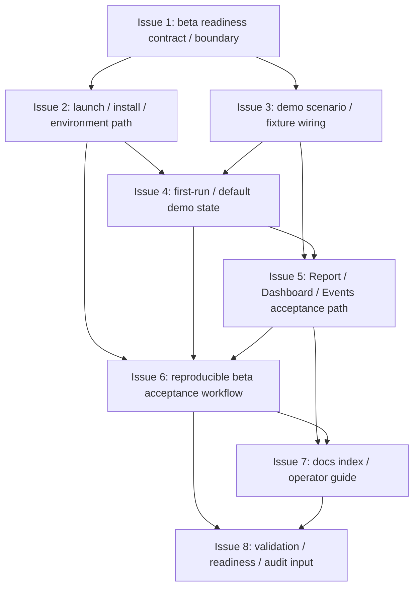

# MTPRO Workbench Beta Readiness v1

日期：2026-05-27

执行者：Codex

本文档是 `MTPRO Workbench Beta Readiness v1` 写入 Linear 前的 Project Planning Record，只保存 Project 级计划摘要、issue order、dependencies、validation、evidence、first executable issue candidate、WIP=1 和边界。

本文档不授权执行，不创建 Linear Project，不创建 Linear Issues，不修改 Linear status，不推进 Todo，不启动 `@002 / PAR`，不启动 Symphony，不运行 Graphify update，不写业务代码，不修改 Figma，不实现 Workbench Beta Readiness，不新增 engine core capability。

完整 issue execution contract 以后以 Linear issue body 为准。仓库 planning record 不复制维护完整 Linear issue body，也不复制维护完整 candidate issue 正文。

## Project name

`MTPRO Workbench Beta Readiness v1`

## Project goal

把已完成的 Research / Backtest / Report / Paper Runtime / Scenario Replay / Simulated Exchange Parity 能力组织成一个可安装、可启动、可演示、可验收的 macOS native Workbench beta path。

该 Project 承接 `L2 Simulated Exchange / Backtest Parity complete`，目标是进入 `L2+ Workbench Beta Readiness`。它不新增 engine core capability，不把 beta readiness 写成 live readiness，也不授权 production release、Live PRO Console 或真实交易能力。

## Target Engines / Layers

- Workbench Interface / Dashboard shell。
- Evidence Read Model Layer。
- Report / Dashboard / Events read-model surface。
- Data Engine / Scenario Replay input。
- Simulation / Backtest Engine evidence consumer。
- State & Persistence Engine evidence consumer。
- Docs / Validation / Automation readiness layer。

## Target maturity

`L2+ Workbench Beta Readiness`

当前基线保持：

- `L1 Paper Runtime complete`。
- `L1.5 Data Catalog / Scenario Replay complete`。
- `L2 Simulated Exchange / Backtest Parity complete`。
- `Engine Maturity Roadmap Progress: 3 / 4 (75%)`。

本 planning record 不更新 `Final Product Goal Progress`，也不更新 `Engine Maturity Roadmap Progress`。只有该 Project 完整 closure 并完成 Root Docs Refresh Gate 后，才允许把 Engine Maturity Roadmap Progress 从 `3 / 4 (75%)` 更新为 `4 / 4 (100%)`。

## Source inputs

- `GOAL.md`
- `BLUEPRINT.md`
- `docs/roadmap.md`
- `architecture.md`
- `docs/product/mtpro-core-engine-architecture-module-maturity-map-v1.md`
- `docs/design/mtpro-workbench-user-facing-dashboard-high-fidelity-v3.md`
- `docs/product/mtpro-paper-trading-runtime-foundation-blueprint-v1.md`
- `docs/planning/projects/mtpro-data-catalog-scenario-replay-v1-plan.md`
- `docs/planning/projects/mtpro-simulated-exchange-backtest-parity-v1-plan.md`
- `docs/validation/latest-verification-summary.md`
- `verification.md`
- `MTPRO Simulated Exchange / Backtest Parity v1` closure evidence

## Scope

- 定义 Workbench beta readiness contract、验收路径和边界。
- 建立本地 launch / install / run path。
- 建立 local environment verification。
- 选择并固定 demo scenario / fixture wiring。
- 定义 Workbench first-run / default demo state。
- 串联 Report / Dashboard / Events acceptance path。
- 增加 smoke / validation checklist。
- 增加 docs index / operator guide。
- 增加 beta acceptance script 或等价可复现 workflow。
- 收口 automation readiness 和 stage audit input material。

## Non-goals

- 不新增 engine core capability。
- 不实现 Live PRO Console。
- 不接 signed endpoint。
- 不接 account endpoint / listenKey。
- 不连接 broker / exchange execution adapter。
- 不实现 `LiveExecutionAdapter`。
- 不实现 OMS / real order lifecycle。
- 不实现 real submit / cancel / replace。
- 不实现 execution report / broker fill / reconciliation。
- 不读取 real account / broker position / margin / leverage。
- 不实现 trading button / live command。
- 不实现 emergency stop / shutdown / restore。
- 不实现 production release、notarization、App Store distribution、auto-update 或 production operations。
- 不修改 Figma。
- 不运行 Graphify。
- 不创建 Linear Project / Issue。
- 不推进 Todo。
- 不把 beta readiness 写成 live readiness。
- 不把本 planning record 当执行授权。

## Issue order

| 顺序 | Issue 标题 | 目标摘要 | 依赖摘要 |
| --- | --- | --- | --- |
| 1 | Define Workbench beta readiness contract and acceptance boundary | 定义 Workbench beta readiness 的验收合同、用户路径、可演示范围和禁止边界。 | 无 |
| 2 | Add local launch / install / environment verification path | 建立本地可启动、可运行、可验证的 Workbench beta 启动路径。 | 依赖 Issue 1 |
| 3 | Add demo scenario selection and fixture wiring | 固定 beta demo scenario，使 Workbench first-run 和 acceptance path 有稳定输入。 | 依赖 Issue 1 |
| 4 | Add Workbench first-run / default demo state | 让 Workbench 启动后进入可理解的默认 demo state。 | 依赖 Issue 2、Issue 3 |
| 5 | Add Report / Dashboard / Events beta acceptance path | 串联 Report / Dashboard / Events 的 beta acceptance path。 | 依赖 Issue 3、Issue 4 |
| 6 | Add reproducible beta acceptance checklist / script | 提供可复现的 beta acceptance workflow。 | 依赖 Issue 2、Issue 4、Issue 5 |
| 7 | Add docs index and operator guide | 让 Human / operator 能按文档完成安装、启动、demo、验收和边界理解。 | 依赖 Issue 5、Issue 6 |
| 8 | Close automation readiness / validation evidence / stage audit input | 收口 Workbench Beta Readiness 的 validation evidence、automation readiness 和 stage audit input material。 | 依赖 Issue 6、Issue 7 |

仓库不复制维护 8 个 issue 的完整正文。后续 issue scope、Codex instructions、validation、boundary、PR requirements 以 Linear issue body 为准。

## Candidate issue summaries

| Issue | Scope 摘要 | Non-goals / Boundary 摘要 | Validation 摘要 |
| --- | --- | --- | --- |
| Issue 1 | beta path terminology、acceptance boundary、demo workflow、local-only beta definition、forbidden capability baseline。 | 不改 engine core，不实现 install / run 逻辑，不创建发布包，不进入 Live PRO Console 或 live readiness；beta readiness 是 local macOS Workbench demo / acceptance path，不是 production release。 | `bash checks/run.sh`；验证 no live / broker / signed / account / OMS / trading button scope。 |
| Issue 2 | local environment verification、launch command / runbook、Dashboard smoke expectation、install / run notes。 | 不做 notarization、App Store、auto-update、production deployment 或 cloud operations；只服务 local beta readiness，不代表生产安装分发。 | `bash checks/run.sh`；验证本地启动 / smoke path 可复现。 |
| Issue 3 | demo scenario id、dataset version、fixture version、scenario replay wiring、checksum / freshness evidence。 | 不新增大规模 ingestion，不自动下载真实历史数据，不接 signed / account endpoint；demo scenario 是 beta fixture，不是 production data catalog。 | `bash checks/run.sh`；验证 demo scenario deterministic、可重放、可追踪。 |
| Issue 4 | default selected scenario、read-model-only dashboard state、empty / error / loading fallback、first-run evidence summary。 | 不重设计 UI，不新增 Live PRO Console，不新增 trading button / live command；first-run state 只展示 beta evidence，不形成执行入口。 | `bash checks/run.sh`；验证 Dashboard smoke 和 default demo state evidence。 |
| Issue 5 | report summary、dashboard evidence panels、event timeline evidence、scenario / simulated parity / portfolio evidence trace。 | 不新增 engine capability，不暴露 persistence schema，不做 live monitoring console 或 Live PRO Console；acceptance path 是 read-model evidence surface，不是 runtime command surface。 | `bash checks/run.sh`；验证 Report / Dashboard / Events 能展示同一 demo scenario 的验收证据。 |
| Issue 6 | smoke / validation checklist、local commands、expected outputs、failure triage hints、operator reproducibility evidence。 | 不替代 CI，不新增 production ops，不运行 Graphify，不修改 Figma；acceptance script 只验证 local beta readiness，不授权 execution 或 live trading。 | `bash checks/run.sh`；验证 checklist / script 与实际输出一致。 |
| Issue 7 | docs index、operator guide、demo workflow guide、known limitations、forbidden capabilities、troubleshooting pointers。 | 不写 marketing landing page，不写 Live PRO Console docs，不写 production deployment guide；operator guide 只服务 local Workbench beta，不授权下一阶段执行。 | `bash checks/run.sh`；验证 docs anchor、boundary text 和 acceptance workflow 引用完整。 |
| Issue 8 | validation matrix anchors、automation readiness anchors、Project evidence chain、forbidden capability audit、stage audit input。 | 不输出最终 Stage Code Audit Report，不推进下一 Project，不启动 `@002 / PAR`，不启动 Symphony；closeout 不是执行授权，不创建 Linear，不修改 status。 | `bash checks/run.sh`；验证 beta readiness evidence complete，且 no live / broker / signed / account / OMS / trading command。 |

## Dependencies

- Issue 2 依赖 Issue 1。
- Issue 3 依赖 Issue 1。
- Issue 4 依赖 Issue 2、Issue 3。
- Issue 5 依赖 Issue 3、Issue 4。
- Issue 6 依赖 Issue 2、Issue 4、Issue 5。
- Issue 7 依赖 Issue 5、Issue 6。
- Issue 8 依赖 Issue 6、Issue 7。



## Validation requirements

每个 issue 都必须运行：

```bash
bash checks/run.sh
```

Workbench Beta Readiness 相关验证必须满足：

- 必须验证 Workbench 可本地启动或 smoke-run。
- 必须验证 demo scenario / fixture path deterministic。
- 必须验证 Report / Dashboard / Events acceptance path 可复现。
- 必须验证 UI 只消费 ViewModel / Read Model，不暴露 database schema。
- 必须验证 no signed endpoint / account endpoint / listenKey。
- 必须验证 no broker / exchange execution adapter。
- 必须验证 no `LiveExecutionAdapter`。
- 必须验证 no OMS / real order lifecycle / real submit / cancel / replace。
- 必须验证 no execution report / broker fill / reconciliation。
- 必须验证 no real account / broker position / margin / leverage。
- 必须验证 no Live PRO Console / trading button / live command。
- 必须验证 no emergency stop / shutdown / restore。
- 必须验证 no Graphify update / no Figma modification。
- PR 必须包含 MTPRO-native PR evidence fields：`Feedback Loop Evidence`、`Tracer Bullet / Fixture Evidence`、`Diagnose Evidence`、`Architecture Deepening Candidate`。
- 新增或修改生产代码必须包含详细中文注释。

## Evidence requirements

每个 PR 必须包含：

- Linked Linear Issue。
- Scope / Non-goals 确认。
- validation output。
- boundary evidence。
- Pre-PR Codex Code Review。
- GitHub PR Automation evidence。
- MTPRO-native PR evidence fields。
- `.codex/*` 未进入 PR。
- `graphify-out/*` 未进入 PR。
- 如由 symphony-issue 执行，需 handoff marker evidence。

Issue 8 只准备 stage audit input material，不输出最终 Stage Code Audit Report。

Project 全部 Done 后，Stage Code Audit Report 必须由 Parent Codex 单独输出。

## First executable issue candidate

第一个可执行候选 issue：

```text
Define Workbench beta readiness contract and acceptance boundary
```

该 issue 只是 first executable issue candidate，初始状态仍必须是 `Backlog / non-executable`，不授权执行，不推进 Todo。

Project 经 Human 确认并写入 Linear 后，由 Parent Codex queue preflight 在 WIP=1、依赖满足、无 active conflict、execution contract 格式完整时自动判断唯一 eligible issue，并推进 Todo。

## WIP=1 / queue preflight rule

- Project 执行必须保持 WIP=1。
- 所有 issue 初始状态必须是 `Backlog / non-executable`。
- `@001 / PLN` 不操作 `Backlog -> Todo`。
- Project 写入 Linear 后，由 Parent Codex queue preflight 判断唯一 eligible issue。
- Parent Codex 必须确认 WIP=1、依赖满足、无 active conflict、execution contract 格式完整后，才可推进唯一 eligible issue 到 Todo。

## Linear write boundary

- 本 draft 不创建 Linear Project。
- 本 draft 不创建 Linear Issues。
- 本 draft 不修改 Linear status。
- 本 draft 不推进 Todo。
- 本 draft 不启动 `@002 / PAR`。
- 本 draft 不启动 Symphony / symphony-issue。
- Human review / merge 后，才允许进入 Linear 写入。
- Project 写入 Linear 后，所有 issue 初始必须保持 `Backlog / non-executable`。
- 后续完整 execution contract 以 Linear issue body 为准。

## Repository record boundary

- 仓库 planning record 只保存 Project 级计划摘要和格式门槛。
- 仓库不复制维护完整 Linear issue body。
- 仓库不复制维护完整 candidate issue 正文。
- 后续 issue scope、Codex instructions、validation、boundary、PR requirements 以 Linear issue body 为准。
- Planning record 不授权执行。

## Parent Codex queue preflight rule

- `@001 / PLN` 只负责 Project-level planning record 和 Linear 写入前草案。
- `@001 / PLN` 不操作 `Backlog -> Todo`。
- Project 写入 Linear 后，由 Parent Codex queue preflight 判断唯一 eligible issue，并推进 Todo。
- Parent Codex queue preflight 必须确认 WIP=1、依赖满足、previous issue Done、execution contract 格式完整，并且当前 Project 没有 `Todo` / `In Progress` / `In Review` active conflict。
- 本 planning record 不启动 `@002 / PAR`。
- symphony-issue 只能在唯一 `Todo` issue 存在后调度。
