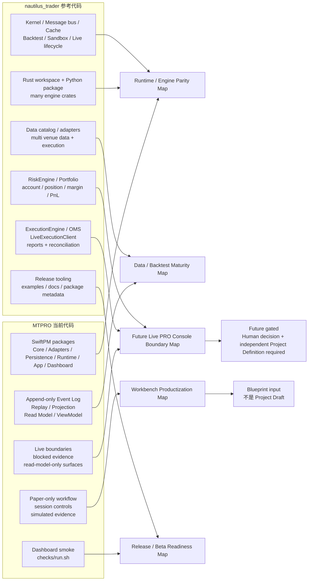

# MTPRO Codebase Reference Gap Map v1

日期：2026-05-25

执行者：Codex

## 1. 文档定位

本文是 `MTPRO Codebase Reference Gap Map v1`，用于在已经完成 `MTPRO Reference Alignment & Product Gap Map v1` 后，补充一层代码级对比证据：分别阅读 MTPRO 和参考项目 `atxinbao/nautilus_trader` 的代码，说明 MTPRO 当前代码能力与成熟交易系统参考之间的差距。

本文不是下一阶段 Project Draft，不是 Linear execution 授权，不创建 Linear Project / Issue，不推进 `Todo`，不启动 Symphony，不运行 Graphify，不修改 Figma，不写业务代码。

本文只做地图补充：

- 说明 MTPRO 当前代码实际已经具备什么。
- 说明 `nautilus_trader` 作为参考项目在代码层有哪些成熟能力。
- 说明哪些差距属于 Workbench productization / data-backtest maturity / release readiness。
- 说明哪些差距仍必须留在 Future Construction Zones，不能从 9 / 9 完成状态推导为当前可实现能力。

## 2. 读取快照

| 项目 | 路径 / 快照 | 说明 |
| --- | --- | --- |
| MTPRO | `/Users/mac/Documents/MTPRO`，branch `codex/reference-alignment-gap-map` | 当前 PR #187 的 MTPRO 主仓，Final Product Goal Progress 已为 `9 / 9 (100%)`。 |
| Reference | `/tmp/mtpro-reference-nautilus`，branch `develop`，commit `6e059dc Improve Blockchain snapshot fail-closed path` | `atxinbao/nautilus_trader` 本地只读 clone，用作代码结构和成熟度参考。 |

## 3. 代码读取范围

### MTPRO

| 文件 | 读取重点 |
| --- | --- |
| `Package.swift` | SwiftPM target / product 边界：`Core`、`Adapters`、`Persistence`、`Runtime`、`App`、`Dashboard`。 |
| `checks/run.sh` | 当前验证入口：diff check、automation readiness、Dashboard build / smoke、Swift tests。 |
| `Sources/Core/TradingKernel.swift` | 本地市场事件 ingest、MessageBus、MarketDataCache、replay / rebuild 边界。 |
| `Sources/MessageBus/EventLog.swift` | append-only local fact log、sequence invariant、stream replay。 |
| `Sources/MessageBus/CommandsAndQueries.swift` | 当前 command/query registry；只包含 backtest、paper session、research、replay，不包含 live order command。 |
| `Sources/Core/PaperOrderIntent.swift` | paper-only order intent，不是 OMS、order router、broker adapter 或真实订单授权。 |
| `Sources/Adapters/Adapters.swift` | Binance public read-only adapter boundary 和 forbidden live capability list。 |
| `Sources/Persistence/Persistence.swift` | Event Log -> Replay -> SQLite / DuckDB projection -> Read Model 边界。 |
| `Sources/Runtime/Runtime.swift` | 薄 Runtime 编排：public adapter、kernel、persistence projection；不接 signed/account/live command。 |
| `Sources/App/DashboardShell.swift` | Workbench read model / ViewModel 汇总、paper session local controls、live blocked evidence surface。 |
| `Sources/App/LiveIncidentStopBlockedEvidence.swift` | read-model-only incident / stop blocked evidence；不提供 stop / restore command。 |
| `Sources/Dashboard/DashboardApplication.swift` | Dashboard smoke / local demo entry；不接 secrets、外部系统或 real trading。 |

### nautilus_trader

| 文件 | 读取重点 |
| --- | --- |
| `Cargo.toml` | Rust workspace crates：data、backtest、execution、risk、portfolio、live、persistence、adapters 等。 |
| `pyproject.toml` | Python package / wheel / optional adapter dependencies / dev-test-docs tooling。 |
| `crates/backtest/src/engine.rs` | `BacktestEngine`、simulated exchange、execution client、run / reset / result lifecycle。 |
| `nautilus_trader/backtest/node.py` | Backtest node orchestration、venues、instruments、catalog、config parsing。 |
| `nautilus_trader/system/kernel.py` | Backtest / sandbox / live 共用 kernel、data / risk / execution / portfolio / trader lifecycle。 |
| `nautilus_trader/live/node.py` | Live trading node、client factories、async run lifecycle。 |
| `crates/live/src/builder.rs` | Live node builder、data / execution factories、event store injection。 |
| `nautilus_trader/live/execution_client.py` | Live execution client base：submit / modify / cancel / query account / query order。 |
| `nautilus_trader/execution/engine.pxd`、`nautilus_trader/execution/engine.pyx` | ExecutionEngine、OMS、client routing、commands、events、reports、order / fill / position handling。 |
| `nautilus_trader/live/execution_engine.py` | Async live execution engine、startup reconciliation、execution reports、fill / order / position reconciliation。 |
| `nautilus_trader/risk/engine.pxd`、`nautilus_trader/risk/engine.pyx` | RiskEngine、pre-trade checks、notional limits、throttlers、trading state、account / position checks。 |
| `nautilus_trader/portfolio/portfolio.pyx` | Account manager、balances、PnL、positions、margin updates。 |
| `nautilus_trader/persistence/catalog/parquet.py` | ParquetDataCatalog、local / cloud data catalog、queryable historical data。 |
| `crates/persistence/src/config.rs` | Streaming / data catalog persistence config。 |
| `nautilus_trader/trading/strategy.pxd`、`nautilus_trader/trading/strategy.pyx` | Strategy command surface：submit / modify / cancel / close / query / market exit。 |

## 4. 总结判断

MTPRO 当前代码是一个 **local-first SwiftPM macOS Workbench / evidence shell**：

- 有清晰的 `Core -> Runtime -> Persistence -> App -> Dashboard` 分层。
- 有 append-only Event Log、Replay、Projection、Read Model、ViewModel。
- 有 Research / Backtest / Report / Paper / Portfolio / Risk / Events / Live readiness / Live monitoring / Live execution / Live risk / Live incident stop 的 evidence surface。
- Paper 只允许本地 session-level `start / pause / close / reset`。
- Live 相关内容全部以 taxonomy、future gate、forbidden capability、blocked evidence 和 read-model-only surface 存在。

`nautilus_trader` 参考项目代码是一个 **production-grade event-driven trading engine**：

- Rust / Python 混合架构，覆盖 data、backtest、execution、risk、portfolio、live、persistence、adapters、examples、release tooling。
- Backtest / sandbox / live 共用 kernel 和 engine lifecycle。
- 多 venue data / execution adapters。
- Strategy 可以发出 submit / modify / cancel / close / query 等交易命令。
- ExecutionEngine / LiveExecutionClient / LiveExecutionEngine 处理 OMS、order lifecycle、execution reports、broker fills、position reports 和 reconciliation。
- RiskEngine 进入 pre-trade command path，执行 notional、account、position、throttle、trading state 等检查。
- Portfolio 维护 account、balance、PnL、position、margin。
- Data catalog / streaming / examples / release packaging 更成熟。

因此 MTPRO 的代码差距不是单纯“还缺文档”，而是以下五类地图差距：

1. **Workbench Productization Map**：已有设计和 read models，但真实 macOS app 的用户路径、fixture-backed daily workflow、inspector / table / navigation 仍需要产品化。
2. **Data / Backtest Maturity Map**：已有 deterministic replay 和 report evidence，但距离 reference 的 data catalog、backtest node、multi-venue / multi-instrument / fee / latency / margin simulation 仍有距离。
3. **Runtime / Engine Parity Map**：MTPRO 当前 Runtime 很薄；reference 有完整 kernel、data engine、risk engine、execution engine、portfolio、trader lifecycle。
4. **Release / Beta Readiness Map**：MTPRO 有 checks 和 Dashboard smoke，但缺少安装、启动、demo dataset、release checklist 和用户验收路径。
5. **Future Live PRO Console Boundary Map**：reference 的 live execution、OMS、risk runtime、reconciliation、incident / stop operations 都是 MTPRO 的 Future Construction Zones，不是当前 Workbench scope。

## 5. 代码级对照图

## 6. 代码级差距矩阵

| 领域 | MTPRO 当前代码事实 | nautilus_trader 参考事实 | 差距判断 | 地图归属 |
| --- | --- | --- | --- | --- |
| Build / package surface | SwiftPM 6 个主 targets + `Dashboard` executable；依赖很少；`checks/run.sh` 是主验证入口 | Rust workspace + Python package；大量 crates / adapters / optional deps / dev-test-docs tooling | MTPRO 结构清晰但仍是 dev checkout 形态，缺 release / install / demo package 地图 | Release / Beta Readiness Map |
| Runtime kernel | `TradingKernel` 只串联 MessageBus、MarketDataCache、DataEngine；Runtime 只做 public adapter -> kernel -> persistence projection | `NautilusKernel` 贯穿 backtest / sandbox / live，管理 data / risk / execution / portfolio / trader / emulator lifecycle | MTPRO Runtime 是本地证据编排，不是 trading engine kernel | Runtime / Engine Parity Map |
| Event log / event bus | `AppendOnlyEventLog` 保证 local fact append-only 和 replay；Dashboard 只消费 read models | Message bus、streaming writer、event store injection、run lifecycle、command / report / event capture | MTPRO 有审计底座，但没有 production event sourcing / recovery runtime | Data / Backtest Maturity Map；Future Live Boundary Map |
| Data adapters / catalog | Binance public read-only adapter；forbidden capability 明确禁止 API key、signed endpoint、account endpoint、listenKey、broker action | 多 venue data / execution adapters；ParquetDataCatalog；data clients；streaming / cloud / local catalog | MTPRO 可补 data catalog / replay UX；live adapters 仍是 future gated | Data / Backtest Maturity Map；Future Boundary Map |
| Backtest | deterministic replay、strategy evidence、report evidence、cost / parity / risk anchors | `BacktestEngine` / `BacktestNode`、simulated exchanges、venues、fill / fee / latency / margin / leverage、results stats | MTPRO 回测可信证据已完成，但配置深度和 simulation maturity 不足 | Data / Backtest Maturity Map |
| Strategy command surface | `CommandsAndQueries` 没有 live order command；Paper order intent 固定不能执行为真实订单 | Strategy 可以 submit / modify / cancel / close / query / market exit，并路由到 risk / execution / emulator | 这是 intentional gap；不能从参考项目迁移到当前 Workbench | Future Live PRO Console Boundary Map |
| Execution / OMS | `LiveExecutionControlBlockedEvidence` / paper-only intent / false flags；无 submit / cancel / replace、OMS、real order lifecycle | ExecutionEngine / LiveExecutionClient / LiveExecutionEngine 处理 order lifecycle、client routing、reports、fills、reconciliation | MTPRO 已有边界合同，但没有也不应当前实现 execution runtime | Future Live PRO Console Boundary Map |
| Risk | paper risk blocker / portfolio projection / Live Risk Gate blocked evidence | RiskEngine 进入 submit / modify path，包含 notional、throttlers、trading state、account / position checks | MTPRO 可增强 paper risk usability；真实 live risk runtime 仍 forbidden | Workbench Productization Map；Future Boundary Map |
| Portfolio / accounting | Paper portfolio projection、paper exposure、read-model-only dashboard summary | Account manager、balances、realized / unrealized PnL、positions、margin updates | MTPRO 可以补 simulated / paper analytics；不能展示 real account / broker position | Workbench Productization Map；Future Boundary Map |
| Live reconciliation | 只有 execution / risk / incident stop contracts 和 blocked evidence | LiveExecutionEngine startup reconciliation、mass status、order / fill / position reports、external order handling | 差距巨大但属于 Future Live PRO Console，不能作为 Workbench implementation scope | Future Live PRO Console Boundary Map |
| UI / dashboard | Figma `91:*` 和 docs 已定义 macOS native Workbench dashboard；Dashboard executable 仍是 smoke / text entry | Nautilus 明确更偏 engine / library / CLI / examples，不提供同类 macOS dashboard | 这是 MTPRO 自有产品优势，下一步应补 productization map，而不是模仿 Nautilus UI | Workbench Productization Map |
| Release / examples | 有 root docs、stage audits、automation readiness、Dashboard smoke | Release notes、package metadata、examples、docs site、Docker / ecosystem tooling | MTPRO 若要可验收，需要 release / beta readiness 地图 | Release / Beta Readiness Map |

## 7. 差距归因

### 7.1 不是缺少“更多 Live 实现”

MTPRO 与 `nautilus_trader` 最大代码差距确实是 Live execution、OMS、risk runtime、reconciliation、broker adapters、account / position / margin、incident / stop operations。

但这些在 MTPRO 当前 root docs 中都属于已明确禁止的 Future Construction Zones。它们只能进入 future boundary map，不能被转写为当前 Workbench task、SwiftUI implementation task 或 Linear executable issue。

### 7.2 当前真正缺的是“地图对齐后的产品化路径”

MTPRO 已经完成 9 / 9 的 contract / evidence / boundary baseline。下一步在进入任何 Project planning 前，应先把代码级差距补成更清晰的地图：

- 哪些能力是 Workbench 当前产品面应该补的。
- 哪些能力只是 data / backtest maturity 的参考。
- 哪些能力只属于 release / beta readiness。
- 哪些能力必须留在 Future Live PRO Console。

### 7.3 MTPRO 不应变成 nautilus_trader 的 Swift 复刻

`nautilus_trader` 的参考价值是架构成熟度、engine domain naming、workflow completeness 和 release discipline。

MTPRO 的产品差异化是 local-first macOS native Workbench、业务判断 dashboard、read-model evidence、paper-only controls 和 Future Live boundaries。后续地图应服务这个产品面，而不是把 MTPRO 改成另一个 trading engine framework。

## 8. 蓝图补图输入

本文建议补充以下蓝图地图。它们只是地图输入，不是 Project Draft。

| 地图 | 目的 | 可进入当前讨论的范围 | 仍禁止 |
| --- | --- | --- | --- |
| Workbench Productization Blueprint | 把 `91:*` 设计和现有 read models 对齐为每天可用的 macOS native Workbench 路径 | App navigation、fixture-backed user workflow、inspector / table / detail routes、demo scenario | trading button、order form、Live PRO Console |
| Data / Backtest Maturity Blueprint | 对齐 reference 的 data catalog / backtest engine maturity，补 MTPRO 非 live 的研究能力地图 | data catalog UX、scenario config、strategy examples、report metrics、large fixture replay | broker adapter、real execution、OMS |
| Release / Beta Readiness Blueprint | 把当前成果变成可验收版本的地图 | install / launch / demo dataset / release checklist / docs index / validation matrix | 新业务能力、live runtime、broker |
| Future Live PRO Console Boundary Blueprint | 只画未来产品面的边界和前置 gates | Human decision、独立 Project Definition、signed/account/broker/risk/ops gates、产品面分离 | 当前实现、SwiftUI live console、real order command |

## 9. 建议阅读顺序

1. `docs/product/mtpro-product-surface-split-v1.md`
2. `docs/product/mtpro-reference-alignment-gap-map-v1.md`
3. 本文：`docs/product/mtpro-codebase-reference-gap-map-v1.md`
4. `docs/design/mtpro-workbench-user-facing-dashboard-high-fidelity-v3.md`

这个顺序能先固定产品面分离，再看参考项目差距，最后回到 Workbench dashboard v3，避免直接从参考项目的 Live engine 能力跳到当前实现授权。
