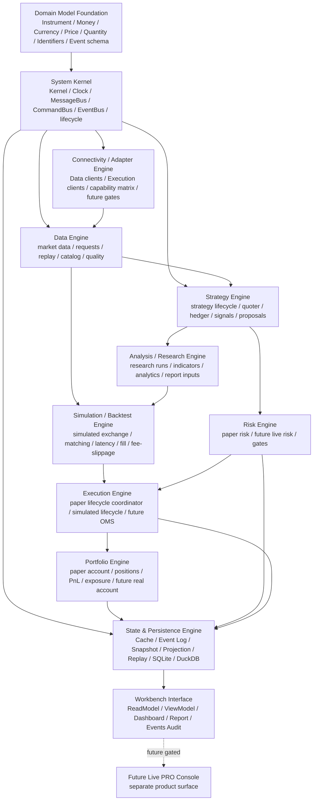
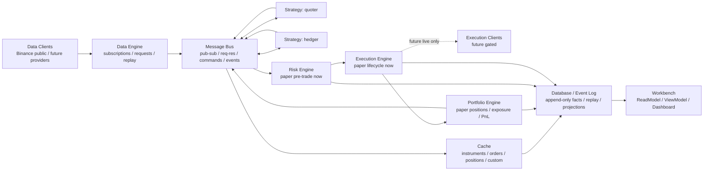

# MTPRO Core Engine Architecture & Module Maturity Map v1

日期：2026-05-25
执行者：Codex
状态：产品 / 架构层蓝图；不授权 Linear execution / Paper runtime implementation / Live trading

## 1. 文档定位

本文是 `MTPRO Core Engine Architecture & Module Maturity Map v1`，用于把 MTPRO 与参考项目 `atxinbao/nautilus_trader` 的模块成熟度差距，重新整理为 Engine 级架构地图。

本文不是 Linear Project Draft，不是 SwiftUI 实现稿，不是 `MTPRO Live PRO Console` 规划稿，不创建 Linear Project / Issue，不推进 `Todo`，不启动 `@002 / PAR`、Symphony 或 `symphony-issue`，不运行 Graphify，不修改 Figma，不写业务代码。

本文不授权真实交易、signed endpoint、account endpoint / listenKey、broker adapter、`LiveExecutionAdapter`、OMS、real order lifecycle、real submit / cancel / replace、execution report、broker fill、reconciliation runtime、live risk engine、Live PRO Console、trading button 或 live command。

## 2. 输入依据

- `README.md`
- `GOAL.md`
- `BLUEPRINT.md`
- `docs/architecture.md`
- `docs/roadmap.md`
- `docs/domain/context.md`
- `docs/product/mtpro-reference-alignment-gap-map-v1.md`
- `docs/product/mtpro-codebase-reference-gap-map-v1.md`
- `docs/product/mtpro-paper-trading-runtime-foundation-blueprint-v1.md`
- `docs/planning/projects/mtpro-event-driven-paper-trading-runtime-v1-plan.md`
- `Package.swift`
- `Sources/Core/*`
- `Sources/Adapters/*`
- `Sources/Persistence/*`
- `Sources/Runtime/*`
- `Sources/App/*`
- `Sources/Dashboard/*`
- 参考项目 `atxinbao/nautilus_trader` `develop` snapshot：`6e059dc Improve Blockchain snapshot fail-closed path`
- Human 提供的 reference core engine data-flow 截图：Data Clients、Data Engine、Message Bus、Cache、Portfolio、Strategy quoter / hedger、Risk Engine、Execution Engine、Execution Clients、Database

## 3. 参考项目 Core Engine 读法

参考项目的核心价值不是某个单独 crate，而是“backtest 和 live 共享同一套事件驱动核心系统”的 Engine 组织方式。Human 提供的 core engine 图可以压缩为：

```text
Data Clients
-> Data Engine
-> Message Bus
-> Strategy instances
-> Risk Engine
-> Execution Engine
-> Execution Clients
-> Portfolio
-> Cache
-> Database
```

对应 `nautilus_trader` 代码侧，相关模块不是孤立存在：

| 参考模块 | Engine 角色 |
| --- | --- |
| `core` / `common` / `system` | Kernel、clock、message bus、component lifecycle、system runner |
| `model` | Instrument、Money、Currency、Price、Quantity、Identifiers、Account / Order / Position / Event schema |
| `data` | DataEngine、market data subscriptions / requests、historical replay、data handlers |
| `adapters/*` / `network` | data clients、execution clients、HTTP / WebSocket、venue adapters |
| `trading` / `indicators` / `analysis` | strategy lifecycle、strategy instances、indicators、statistics、performance analytics |
| `backtest` | simulated exchange、matching path、backtest node / engine、data iterator |
| `risk` | pre-trade risk checks、sizing、risk rules、trading state gates |
| `execution` | order manager、matching engine、order emulator、fee / fill / latency models、reconciliation |
| `portfolio` | account manager、cash / margin accounts、positions、PnL、exposure |
| `event_store` / `persistence` / `serialization` | event store、database persistence、Arrow / SBE / Cap'n Proto / schema boundaries |
| `testkit` | deterministic test fixtures、scenario files、parser / file helpers |
| `cli` / `infrastructure` / `plugin` | operations surface、storage / Redis / SQL infra、extension boundaries |

MTPRO 不复制这些模块，不引入参考项目作为运行依赖。MTPRO 只吸收 Engine 职责分解、事件流方向和成熟度门槛。

## 4. MTPRO Core Engine 架构图

MTPRO 的 Engine 架构应分为 12 个当前 / 规划 Engine 或支撑层，加 1 个 Future product surface：



该图是 MTPRO 的 Core Engine 架构地图，不是当前代码实现完成度声明。当前 `Package.swift` 仍是 `Core`、`Adapters`、`Persistence`、`Runtime`、`App`、`Dashboard` 六个 SwiftPM target；Engine map 是更高层职责地图，用来指导后续 Project 如何拆分和验收。

## 5. 交易数据流

MTPRO 的 paper-only / future-live 同构方向应遵守以下数据流：



当前阶段只允许 paper / local / simulated 路径。`Execution Clients`、signed endpoint、account endpoint / listenKey、broker adapter、`LiveExecutionAdapter`、OMS 和真实订单命令仍是 Future Gated。

## 6. Engine 归属表

| Engine / Layer | 包含模块 | MTPRO 当前状态 | 下一步成熟方向 |
| --- | --- | --- | --- |
| Domain Model Foundation | Instrument、Money、Currency、Price、Quantity、Identifiers、Order / Account / Position / Event schema | 有 `MarketPrimitives`、market data models、paper intent / fill evidence，但还没有完整 trading domain model foundation | 补 paper-first instrument / money / identifier / event schema；不引入真实 broker account |
| System Kernel | Kernel、TradingClock、MessageBus、CommandBus、EventBus、runtime lifecycle、component registry | `TradingKernel`、Event Log、MTP-96 `TradingClock` / `PaperRuntimeKernelBoundary` 已有基础；MessageBus / CommandBus 仍不完整 | 完成 deterministic routing、component lifecycle 和 replay invariant |
| Connectivity / Adapter Engine | Data clients、Execution clients、adapter capability matrix、public data、future private read-only / live gates | Binance public read-only boundary 已有；execution client / private stream 禁止 | 先补 capability matrix / sandbox-read-only boundary；live execution client 继续 gated |
| Data Engine | Market data normalization、subscription / request、batch replay、data catalog、data quality | public read-only market data、batch / freshness / parity / replay consistency 已有 | 补 local data catalog、scenario replay、data quality gates |
| Strategy Engine | Strategy lifecycle、strategy instances、quoter、hedger、signals、intent / proposal generation | EMA / order book signal evidence、Research event flows 已有；缺 strategy lifecycle 和 instance model | 补 quoter / hedger 作为 Strategy instance，输出 paper proposal，不直连 Execution Client |
| Analysis / Research Engine | research runs、parameter sets、indicator analytics、performance metrics、report verdict input | 有 Research / Backtest / Report evidence，但 analytics / indicators 不成体系 | 补 indicators、performance analytics 和 report verdict input |
| Simulation / Backtest Engine | simulated exchange、matching engine、latency model、fill model、fee / slippage、backtest-paper parity | 有 replay、execution cost assumptions 和 backtest / paper parity evidence；缺 simulated exchange / matching engine | 补 deterministic simulated exchange 和 order semantics parity |
| Risk Engine | paper pre-trade risk、risk rules、future live risk gates、no-trade / circuit breaker boundary | paper blocker / risk evidence 和 live risk blocked contract 已有；runtime 风控不完整 | 先补 Paper Pre-trade RiskEngine runtime；live risk 继续 gated |
| Execution Engine | paper lifecycle coordinator、local / simulated lifecycle、simulated fill、future OMS / execution client routing | paper order intent、execution decision、simulated fill evidence 和 live execution blocked contract 已有；缺 lifecycle coordinator | 补 paper-only lifecycle coordinator；不得命名为 OMS 或 broker router |
| Portfolio Engine | paper account、cash / equity、position、PnL、exposure、future real account / broker position | paper portfolio projection evidence 已有；缺 paper account / ledger / PnL model | 补 paper account / position / PnL projection v2；real account 继续 gated |
| State & Persistence Engine | Cache、Event Log、Snapshot、Projection、Replay、SQLite、DuckDB、schema / version | Event Log、SQLite runtime projection、DuckDB analytical projection 已有；schema/version/testkit 不完整 | 补 event schema/version、snapshot contract、testkit scenario harness |
| Workbench Interface | App ReadModel、ViewModel、Dashboard、Report、Events / Audit | 当前最成熟，v3 business dashboard 已有；只能消费 ReadModel / ViewModel | 后续 beta readiness，不得读取 Runtime / Adapter / DB schema |
| Future Live PRO Console | 独立实盘操作台 product surface | 明确 Future Gated；不是 Workbench | 必须另经 Human decision、Project Definition、signed/account/broker/risk/ops gates |

## 7. Strategy quoter / hedger 归属

`Strategy quoter` 和 `Strategy hedger` 都属于 Strategy Engine 的 Strategy Instance。

| Strategy instance | 消费 | 输出 | 禁止 |
| --- | --- | --- | --- |
| `quoter` | market data、cache、portfolio summary、risk state | quote intent、strategy signal、paper action proposal | 不输出真实 submit / cancel / replace，不直连 broker |
| `hedger` | position / exposure、portfolio summary、risk state、market data | hedge intent、strategy signal、paper action proposal | 不输出真实 hedge order，不绕过 Risk Engine |

正确路径是：

```text
Data Engine
-> Message Bus
-> Strategy Engine / quoter / hedger
-> paper intent / proposal
-> Message Bus
-> Risk Engine
-> Execution Engine
```

Strategy instance 不能直接调用 Execution Client，也不能直接写 broker command。当前阶段只能输出 paper / local / simulated 语义的 proposal 或 evidence。

## 8. Engine 成熟度等级

| 等级 | 含义 | 当前授权边界 |
| --- | --- | --- |
| `L0 Contract / Boundary` | 只有术语、合同、future gates、blocked evidence 或 read-model-only surface | 可在 docs / contract / tests 中定义，不等于 runtime |
| `L1 Paper Runtime` | 本地 paper / sandbox runtime 可 deterministic replay | 不接 broker，不接 signed endpoint，不实现真实订单 |
| `L2 Backtest / Simulation Parity` | backtest 与 paper 共用交易语义、fill / fee / slippage / portfolio parity | 仍然不进入真实账户或 broker |
| `L3 Live Read-only Readiness` | 可规划真实账户只读、private stream read-only、adapter capability split | 仍然不 submit / cancel / replace |
| `L4 Live Production` | 真实 execution、risk、reconciliation、ops、Live PRO Console | 必须另经 Human decision 和独立 live gates |

### L3 Live Readiness 细分路线

`L2+ Workbench Beta Readiness` 完成后，旧 Engine Maturity Roadmap Progress 保持 `4 / 4 (100%)`，不继续扩分母。Live Readiness 作为新路线单独记录在 `docs/product/mtpro-live-readiness-roadmap-v1.md`，当前细分为：

| 阶段 | Engine / Layer 重点 | 状态 | 当前边界 |
| --- | --- | --- | --- |
| `L3.0 Live Read-only Readiness Boundary` | Connectivity / Adapter Engine、Evidence Read Model Layer、Workbench Interface、Docs / Validation | Done / not counted in old denominator | 已完成 credential、endpoint、adapter capability、account / private stream future gates 和 forbidden baseline；不实现 endpoint、listenKey、broker 或 account runtime |
| `L3.1 Account / Position / Balance Read-model-only` | Evidence Read Model Layer、Portfolio Engine、Workbench Interface | Future Gated | 只允许后续规划 read-model-only evidence；不读取真实账户或 broker position |
| `L3.2 Private Stream / Account Snapshot Simulation Gate` | Data Engine、Connectivity / Adapter Engine、State & Persistence boundary | Future Gated | 只允许后续规划 simulation gate；不创建 listenKey，不连接 private stream |
| `L3.3 Live Monitoring Read-only Console v2` | Workbench Interface、Live Monitoring read-model-only surface | Future Gated | 只允许后续规划只读 evidence surface；不提供 Live PRO Console、交易按钮或 live command |
| `L3.4 Strategy / Trader Instance Readiness v1` | Strategy Engine、Portfolio Engine、Risk Engine、Evidence Read Model Layer | Future Gated / Planning Candidate | 只允许后续规划 Strategy Instance / Trader Instance lifecycle、quoter / hedger role、account / portfolio / risk read-model input 和 paper/live-neutral proposal contract；不允许 strategy 直连 Execution Client 或 broker command |
| `L4 Live Production / Trading Commands` | Live、Execution、Risk、Portfolio、System / Ops | Future Gated | 必须另经独立 Human decision、Project Definition、signed/account/broker/risk/ops gates |

## 9. 当前 Engine 成熟度矩阵

| Engine / Layer | 当前成熟度 | 当前证据 | 下一步目标 |
| --- | --- | --- | --- |
| Domain Model Foundation | `L0-L1 partial` | `MarketPrimitives`、paper intent / simulated fill evidence | 建立 paper-first trading domain model foundation |
| System Kernel | `L1 partial` | `TradingKernel`、Event Log、MTP-96 `TradingClock` / kernel boundary | MTP-97 deterministic routing |
| Connectivity / Adapter Engine | `L1 public-read-only` | Binance public read-only boundary、adapter isolation gates | adapter capability matrix / sandbox-read-only boundary |
| Data Engine | `L1 partial` | batch replay、freshness、fixture parity、projection consistency | local data catalog / scenario replay |
| Strategy Engine | `L1 partial` | EMA、order book signal、Research event flows | L3.4 Strategy / Trader Instance readiness：strategy lifecycle、quoter / hedger role、account / portfolio / risk read-model inputs 和 paper/live-neutral proposal contract |
| Analysis / Research Engine | `L1 partial` | report / backtest / research evidence | indicators、analytics、performance metrics |
| Simulation / Backtest Engine | `L0-L1 partial` | replay、execution cost assumptions、parity evidence | simulated exchange / matching / latency |
| Risk Engine | `L0-L1 partial` | paper risk blocker、Live Risk Gate blocked evidence | Paper Pre-trade RiskEngine runtime |
| Execution Engine | `L0-L1 partial` | paper order intent、execution decision、simulated fill evidence | paper lifecycle coordinator |
| Portfolio Engine | `L0-L1 partial` | paper portfolio projection update | paper account / position / PnL projection v2 |
| State & Persistence Engine | `L1 partial` | append-only Event Log、SQLite、DuckDB、Replay | event schema/version、snapshot contract、testkit |
| Workbench Interface | `L2 interface-ready partial` | Dashboard / Report / Events read-model-only surface、v3 business dashboard | beta readiness and workflow polish |
| Future Live PRO Console | `L0 Future gated` | Product Surface Split / Future Gated docs | no execution before independent live Project |

## 10. 对现有 Roadmap 的修正

现有 `Module Maturity Development Plan` 的七阶段方向保持有效，但应由本文的 Engine map 约束：

1. 任何新 Project Draft 必须说明它补哪个 Engine / Layer、补到哪个 maturity level。
2. `MTPRO Event-Driven Paper Trading Runtime v1` 不等于完整交易系统；它只是 System Kernel、Risk Engine、Execution Engine、Portfolio Engine、State & Persistence Engine 的 paper-only L1 闭环起点。
3. Domain Model Foundation、Strategy Engine、Analysis / Research Engine、Simulation / Backtest Engine、Connectivity / Adapter Engine 和 State / Persistence schema 不能继续隐含在其他阶段中，后续 planning 必须显式引用。
4. Live PRO Console 不是 Workbench 的自然延伸，而是 Future product surface。进入前必须先完成 L1 / L2 / L3 的关键 Engine maturity gates。

## 11. Non-authorization Boundary

本文不授权：

- Linear Project / Issue 创建。
- Linear status 修改。
- `Todo` 推进。
- `@002 / PAR` startup。
- Symphony / `symphony-issue` 启动。
- Graphify update。
- Figma 修改。
- SwiftUI implementation。
- 业务代码开发。
- Paper runtime implementation。
- NautilusTrader runtime dependency 或整仓代码复制。
- signed endpoint、account endpoint / listenKey。
- broker / exchange execution adapter。
- `LiveExecutionAdapter`。
- OMS / real order lifecycle。
- real submit / cancel / replace。
- execution report、broker fill、reconciliation runtime。
- real account balance、broker position、margin、leverage。
- live risk engine。
- Live PRO Console。
- trading button、order form、live command。
- emergency stop、shutdown、restore 当前可执行动作。

## 12. 给后续 Planning 的要求

后续 `@001 / PLN` 输出 Project Draft 时，必须增加 Engine mapping 字段：

```text
Engine / Layer:
Target maturity level:
Current evidence:
Allowed construction scope:
Forbidden capabilities:
Validation anchors:
```

示例：

```text
Project: MTPRO Event-Driven Paper Trading Runtime v1
Engine / Layer: System Kernel + Risk Engine + Execution Engine + Portfolio Engine + State & Persistence Engine
Target maturity level: L1 Paper Runtime
Allowed construction scope: paper-only deterministic runtime path
Forbidden capabilities: signed endpoint, broker adapter, OMS, real order lifecycle, live command
```

这样每个后续 Project 都能追溯到 Engine maturity map，而不是只按页面、证据面或单个模块名推进。
