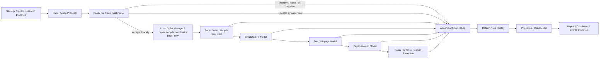

# MTPRO Paper Trading Runtime Foundation Blueprint v1

日期：2026-05-25

执行者：Codex / @000 AIE（落仓）；输入来自 `@003 / PRD` 草案与 `@005 / ARC` 审查意见

## 1. 文档定位

本文是 `MTPRO Paper Trading Runtime Foundation Blueprint v1`，用于把 MTPRO 与 NautilusTrader 的代码级“交易运行时差距”收敛为 MTPRO 自己的 paper-only runtime foundation 地图。

本文不是 Linear Project Draft，不是 SwiftUI 实现稿，不是 `MTPRO Live PRO Console`，不创建 Linear Project / Issue，不推进 `Todo`，不启动 Symphony，不运行 Graphify。

本文不授权真实交易、broker、signed endpoint、account endpoint / listenKey、`LiveExecutionAdapter`、live command、trading button 或真实 submit / cancel / replace。

本文已吸收 `@005 / ARC` 审查后的 `@003 / PRD` 小修意见：`Local Order Manager` 必须明确为 `paper lifecycle coordinator`，`cancelled locally` 不能被理解为真实 cancel command，paper event 命名必须带 `Local` / `Simulated` 口径。

## 2. 为什么需要这张图

MTPRO 已完成 Workbench / evidence / read-model baseline：

- Research -> Backtest -> Report -> Paper evidence chain 已建立。
- Event Log / Replay / Projection / Read Model / ViewModel 分层已建立。
- Workbench business dashboard v3 已把用户面推进为业务判断工作台。
- Live readiness、Live monitoring、Live execution、Live risk、incident / stop 均已完成 boundary / blocked evidence / read-model-only surface。

但与 NautilusTrader 类 production trading engine 相比，MTPRO 仍缺少一张清晰的 **Paper Trading Runtime Foundation** 图：如何在不进入真实 live trading 的前提下，把 paper order、local order manager、simulated fill、fee / slippage、paper account、portfolio projection、paper pre-trade risk、deterministic replay 和 dashboard evidence 串成同构基础。

下一步如果要补 runtime gap，应先补 paper / sandbox 同构基础，而不是直接进入 live trading。

## 3. Paper Runtime 目标边界

Paper runtime 只做 paper / sandbox：

- 所有行为写入 append-only Event Log。
- 所有结果可 replay。
- 所有 projection 可生成 Report / Dashboard / Events evidence。
- 所有状态必须明确标记为 paper、local、simulated。
- 所有 Workbench 展示都只消费 Read Model / ViewModel。
- Paper local controls 仅限 `start` / `pause` / `close` / `reset` session-level controls。

Paper runtime 不触碰：

- 真实账户。
- 真实订单。
- broker。
- signed endpoint。
- account endpoint / listenKey。
- live command。
- `LiveExecutionAdapter`。
- OMS for real orders。

## 4. Paper Runtime Foundation Map



该图描述的是 MTPRO paper-only runtime foundation，不是 live execution path。

`Local Order Manager / paper lifecycle coordinator` 只协调本地 paper lifecycle，并在进入本地 submitted / accepted / cancelled / expired / failed 状态时产生 deterministic event fact；它不是 OMS、broker router 或真实订单执行器。

## 5. 核心能力地图

| 能力 | 产品目的 | 架构位置 | 允许输入 | 输出证据 | 明确不是 |
| --- | --- | --- | --- | --- | --- |
| Paper Order Lifecycle | 让用户理解模拟订单从 proposal 到 simulated fill 的全过程 | Core / Runtime / Event Log | strategy signal、paper proposal、paper risk decision | paper order events、lifecycle state、blocked reason | 真实订单 lifecycle |
| Local Order Manager | 管理本地 paper order 状态转换 | Runtime / Core boundary | accepted paper intent、session state | local submitted / accepted / cancelled / expired / failed facts | OMS、broker router、execution adapter |
| Simulated Fill Model | 用 deterministic 规则生成 simulated fill | Core / Runtime | market snapshot、paper order、fill assumptions | simulated fill event、partial / full fill evidence | broker fill、execution report |
| Fee / Slippage Model | 让 Paper 和 Backtest 不忽略交易摩擦 | Core / Report evidence | fee schedule、slippage assumption、order size、price context | estimated fee、slippage cost、net paper PnL impact | 真实成交成本、broker fee statement |
| Paper Account Model | 维护本地 sandbox cash / equity / buying power 语义 | Core / Projection | simulated fills、fees、session config | paper cash、paper equity、available paper balance | real account balance |
| Paper Portfolio / Position Projection | 从 simulated fill 推导 paper position / exposure | Persistence projection / App read model | replayed simulated fill、paper account update | paper position、exposure、PnL summary | broker position、real margin |
| Paper Pre-trade RiskEngine | 在本地 paper path 中阻断明显不合法的 simulated action | Core / Risk evidence | proposal、paper account、paper exposure、risk rules | accepted / rejected paper risk decision | live risk engine、real pre-trade allow / reject |
| Deterministic Replay / Projection / Report / Dashboard Evidence | 让所有 paper 行为可回放、可验证、可展示 | Event Log / Persistence / App | append-only paper facts | replay result、projection snapshot、Report / Dashboard evidence | production recovery、live reconciliation |

## 6. Order Lifecycle 草案

以下 lifecycle 只代表 MTPRO paper-only local lifecycle。它不是真实订单状态，不映射 broker，不产生 signed request，不代表交易所状态。

| Lifecycle 状态 | 含义 | 触发来源 | Event Log 证据 | 可展示给用户 |
| --- | --- | --- | --- | --- |
| `order proposed` | 策略或研究结果提出 paper action proposal | Strategy signal / Research / Report | `PaperOrderProposed` | 可以，作为“待模拟意图” |
| `order submitted locally` | 本地 Paper session 接收该 proposal，进入本地提交状态 | Local Order Manager | `PaperOrderSubmittedLocal` | 可以，但必须标注 local / paper |
| `order accepted locally` | paper pre-trade risk 通过，本地允许进入模拟成交 | Paper Pre-trade RiskEngine | `PaperOrderAcceptedLocal` | 可以 |
| `order rejected by paper risk` | paper risk blocker 阻断该本地模拟意图 | Paper Pre-trade RiskEngine | `PaperOrderRejectedByPaperRisk` | 可以，展示 blocker reason |
| `partially filled simulated` | simulated fill model 生成部分模拟成交 | Simulated Fill Model | `PaperOrderPartiallyFilledSimulated` | 可以，标注 simulated |
| `filled simulated` | simulated fill model 生成完整模拟成交 | Simulated Fill Model | `PaperOrderFilledSimulated` | 可以，标注 simulated |
| `cancelled locally` | 只能由 session close / reset、local expiry 或 deterministic local rule 派生；Workbench UI 不提供单笔 paper order cancel button，也不得把该状态解释为真实 cancel command | Local Order Manager | `PaperOrderCancelledLocal` | 可以，标注 local |
| `expired locally` | 本地 time-in-force / session boundary 使 paper order 过期 | Local Order Manager | `PaperOrderExpiredLocal` | 可以 |
| `failed locally` | 本地输入不一致、缺数据、projection 失败或 deterministic assumption 缺失 | Local Order Manager / Replay | `PaperOrderFailedLocal` | 可以，展示 failure reason |

必须避免的命名和解释：

- 不使用 `exchange accepted`。
- 不使用 `broker submitted`。
- 不使用 `execution report received`。
- 不使用 `broker filled`。
- 不使用 `real order state`。
- 不把 `cancelled locally` 写成真实 cancel。
- 不把 `submitted locally` 写成真实 submit。

### Paper event 命名建议

Paper event 命名建议统一使用 `Paper*Local` / `Paper*Simulated` 前缀，例如：

- `PaperOrderSubmittedLocal`
- `PaperOrderAcceptedLocal`
- `PaperRiskDecisionAcceptedLocal`
- `PaperOrderRejectedByPaperRisk`
- `PaperOrderPartiallyFilledSimulated`
- `PaperOrderFilledSimulated`
- `PaperOrderCancelledLocal`
- `PaperOrderExpiredLocal`
- `PaperOrderFailedLocal`

该命名只用于后续 contract / validation 可机械检查，不表示当前授权实现。

## 7. Paper Runtime 事件与回放要求

所有 paper runtime 行为必须进入 append-only Event Log，并满足：

- 每个 lifecycle transition 都有 deterministic event fact。
- Replay 能从 event facts 重建 paper order state。
- Projection 能从 replayed simulated fill 重建 paper account、paper position、paper exposure 和 paper PnL。
- Report 能解释每个 paper result 的 signal、risk、fill、fee、slippage 和 portfolio impact。
- Dashboard 只展示 summary、business conclusion 和 drill-down entry。
- Events / Audit 承接完整 source / trace / validation / event sequence。

不得从 Runtime object、Adapter object、SQLite / DuckDB schema、exchange payload 或 broker object 直接生成 UI 状态。

## 8. Fee / Slippage Model 草案

Fee / Slippage Model 的目的不是模拟真实 broker，而是让 paper / backtest 结果避免“零摩擦幻觉”。

第一版应只定义 deterministic assumptions：

| 模型项 | Paper-only 含义 | 输出 |
| --- | --- | --- |
| Fee assumption | 本地配置的 fee rate / fixed fee / maker-taker placeholder | estimated fee |
| Slippage assumption | 基于 spread、order size、volatility bucket 或固定 bps 的 deterministic estimate | estimated slippage |
| Fill price assumption | 使用 market snapshot 和 slippage assumption 生成 simulated fill price | simulated fill price |
| Cost impact | fee + slippage 对 paper PnL / report conclusion 的影响 | net paper PnL adjustment |

禁止把 fee / slippage model 写成 broker fee import、real fill quality tracker、execution report parser 或 live reconciliation input。

## 9. 与 NautilusTrader 的参考映射

| NautilusTrader 参考能力 | MTPRO 对应蓝图能力 | 当前处理 |
| --- | --- | --- |
| Nautilus `ExecutionEngine` | `MTPRO Paper Execution Runtime` | 只借鉴 order lifecycle / execution responsibility 分层；不实现真实 execution engine、OMS、client routing 或 broker reports |
| Nautilus `RiskEngine` | `MTPRO Paper Pre-trade Risk Runtime` | 只做 paper proposal 的本地阻断和解释；不实现 live risk engine、real account checks 或 circuit breaker runtime |
| Nautilus `Portfolio` | `MTPRO Paper Portfolio Projection` | 只从 simulated fill 和 paper account projection 推导 paper exposure / PnL；不展示 real account balance 或 broker position |
| Nautilus Backtest / Simulated Exchange | `MTPRO Simulated Fill / Replay Boundary` | 借鉴 simulated venue、fill model、fee model、latency / slippage 思路；保持 deterministic fixture / replay 口径 |
| Nautilus `LiveNode` / `LiveExecutionClient` | Future Gated | 不进入当前蓝图；不接 broker、signed endpoint、account endpoint / listenKey、execution report、broker fill 或 reconciliation |

关键原则：NautilusTrader 是参考，不是依赖。MTPRO 不复制 NautilusTrader 代码，不引入 NautilusTrader runtime，不把 Nautilus Live 能力转写成当前 MTPRO scope。

## 10. 与 Workbench / Dashboard 的关系

Workbench 只消费 paper runtime 的 Read Model / ViewModel：

- Overview 展示 Paper 表现摘要、risk blocker、paper PnL、paper exposure。
- Paper 页面展示 session 状态、local lifecycle、simulated fill、fee / slippage、portfolio impact。
- Portfolio 页面展示 paper exposure 和 paper position projection。
- Risk 页面展示 paper pre-trade blocker。
- Events / Audit 页面展示完整 paper runtime event sequence。

Dashboard 只显示 Paper runtime 的业务摘要、状态和下一步判断；完整 lifecycle sequence、risk decision、simulated fill、fee / slippage、projection trace 必须下沉到 Events / Audit 或 Detail inspector。

Workbench 不展示 order form，不展示真实交易按钮，不展示 broker connection，不展示真实账户余额，不展示真实仓位。Paper 页面允许的控制仍只有本地 session-level：`start` / `pause` / `close` / `reset`。

## 11. 禁止边界

本蓝图明确禁止：

- API key / secret storage。
- signed endpoint。
- account endpoint / listenKey。
- broker adapter / broker action。
- `LiveExecutionAdapter`。
- OMS for real orders。
- real submit / cancel / replace。
- execution report / broker fill / reconciliation runtime。
- real account balance / broker position。
- live risk engine。
- `MTPRO Live PRO Console`。
- trading button / live command / order-level real command UI。
- emergency stop / shutdown / restore 当前可执行动作。
- 把 paper order lifecycle 写成真实订单 lifecycle。
- 把 simulated fill 写成 broker fill。
- 把 paper account 写成真实 account。
- 把 paper portfolio projection 写成 broker position sync。

## 12. 给 @005 / ARC 的审查重点

请重点审查：

- 是否保持 paper-only / sandbox-only。
- 是否没有把 paper order lifecycle 写成真实订单 lifecycle。
- 是否没有引入 broker、signed endpoint、account endpoint、listenKey。
- 是否没有把 NautilusTrader reference 变成 runtime dependency。
- 是否没有把 `Local Order Manager` 误写成 OMS。
- 是否没有把 `Simulated Fill Model` 误写成 broker fill / execution report。
- 是否仍符合 Workbench 与 Future Live PRO Console 产品面分离。
- 是否所有结果都能进入 Event Log、Replay、Projection、Report、Dashboard evidence。

## 13. Potential Next Project Candidate: MTPRO Event-Driven Paper Trading Runtime v1

本节只是候选 Project direction，不是 Linear Project Draft，不授权执行。

该候选方向承接本文蓝图，目标是把 MTPRO 从事件证据链工作台推进到 paper-only event-driven trading runtime。它只允许在 paper / sandbox 范围内讨论，不触碰真实 broker、signed endpoint、account endpoint / listenKey、真实订单命令、Live PRO Console 或 live runtime。

候选主线：

- TradingClock / paper runtime kernel boundary。
- CommandBus / EventBus / MessageBus deterministic routing。
- Paper Pre-trade RiskEngine。
- paper-only execution runtime / lifecycle coordinator。
- local / simulated order lifecycle。
- simulated fill / fee / slippage。
- paper account / portfolio / position projection。
- Event Log / Replay / Report / Dashboard evidence。

候选 issue order 摘要如下，仅供后续 `@001 / PLN` 参考，不能作为完整 Linear issue body：

1. Trading Runtime Kernel boundary。
2. CommandBus / EventBus deterministic routing。
3. Paper RiskEngine runtime。
4. Paper Order Manager / Lifecycle。
5. Simulated Fill / Fee / Slippage model。
6. Portfolio Projection v2。
7. Validation matrix / automation readiness / stage audit input。

若 Human 后续确认该方向，仍需由 `@001 / PLN` 单独输出 Project Draft。Project 写入 Linear 后，必须由 Parent Codex queue preflight 在 WIP=1、依赖满足、无 active conflict、execution contract 格式完整时推进唯一 eligible issue；本文档本身不执行这些动作。

候选进度口径 `Trading Runtime Maturity Progress` 只可作为未来规划候选，不更新 `GOAL.md` / `docs/roadmap.md`，也不改变当前 Final Product Goal Progress。

## 14. Repository Record Boundary

本文档的落仓路径为：

```text
docs/product/mtpro-paper-trading-runtime-foundation-blueprint-v1.md
```

本文只作为 Product / Architecture blueprint 保存，不改 `GOAL.md`、不改 `docs/roadmap.md`、不创建 Linear Project / Issue。若 Human 后续要进入 planning，应由 `@001 / PLN` 基于本文另行输出 Project Draft，并继续保持 WIP=1、paper-only、contract-first。

## 15. 外部参考来源

- [NautilusTrader GitHub repository](https://github.com/nautechsystems/nautilus_trader)
- [NautilusTrader Architecture documentation](https://nautilustrader.io/docs/latest/concepts/architecture/)
- [NautilusTrader Execution documentation](https://nautilustrader.io/docs/latest/concepts/execution/)
- [NautilusTrader Live Trading documentation](https://nautilustrader.io/docs/latest/concepts/live/)
- [NautilusTrader Backtest low-level API documentation](https://nautilustrader.io/docs/latest/getting_started/backtest_low_level/)
- [NautilusTrader Portfolio API documentation](https://nautilustrader.io/docs/latest/api_reference/portfolio/)
