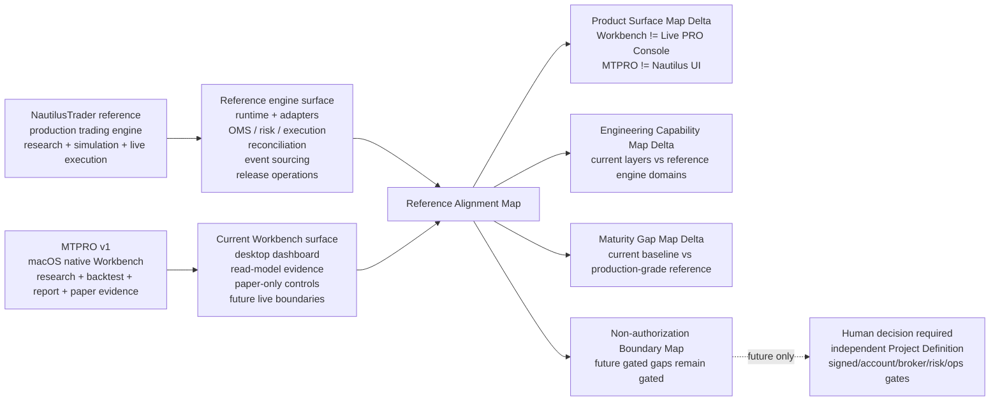
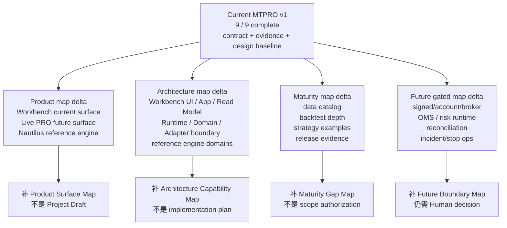
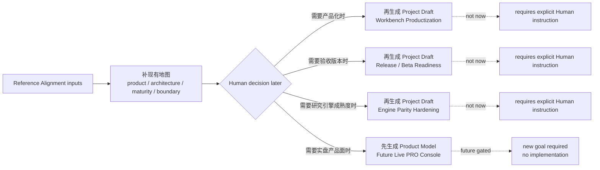

# MTPRO Reference Alignment & Product Gap Map v1

日期：2026-05-25

执行者：Codex

## 1. 文档定位

本文是 `MTPRO Reference Alignment & Product Gap Map v1`，用于在 Final Product Goal Progress 达到 `9 / 9 (100%)` 后，对齐参考项目 `atxinbao/nautilus_trader`，识别 MTPRO v1 与成熟交易系统参考之间的产品、架构、体验和发布差距。

本文不是 UI 设计稿，不是 SwiftUI 实现稿，不是 Linear execution 授权，不创建 Project / Issue，不推进 `Todo`，不启动 Symphony，不运行 Graphify，不授权 Future Live trading、Live PRO Console、真实 broker adapter、signed endpoint、real order lifecycle、incident replay runtime 或 production operations。

## 2. 输入和参考快照

| 输入 | 用途 |
| --- | --- |
| `GOAL.md` | 确认 MTPRO 当前使命、用户、9 / 9 完成事实和永久硬边界。 |
| `BLUEPRINT.md` | 确认完整产品蓝图、Future Construction Zones 和 Workbench / Live 边界。 |
| `docs/architecture.md` | 确认 SwiftPM-first、macOS-native、read-model-only 和 future live isolation 工程边界。 |
| `docs/roadmap.md` | 确认 12 / 12 closure、9 / 9 完成、Next Handoff 仍交给 Human + `@001 / PLN`。 |
| `docs/product/mtpro-product-surface-split-v1.md` | 确认 Workbench 与未来 Live PRO Console 是两个产品面。 |
| `docs/design/mtpro-workbench-user-facing-dashboard-high-fidelity-v3.md` | 确认当前 Workbench dashboard v3 是 macOS native business dashboard 设计依据。 |
| `docs/validation/latest-verification-summary.md` | 确认最近 Project closure、Root Docs Refresh Gate 和当前验证基线。 |
| `https://github.com/atxinbao/nautilus_trader` | 参考项目。2026-05-25 分析快照 clone 自 `develop`，commit `6e059dc Improve Blockchain snapshot fail-closed path`。 |

参考项目重点读取：

- `README.md`
- `ROADMAP.md`
- `ADAPTERS.md`
- `RELEASES.md`
- `docs/concepts/architecture.md`
- `docs/concepts/backtesting.md`
- `docs/concepts/execution.md`
- `docs/concepts/live.md`
- `docs/concepts/event_sourcing.md`
- `examples/backtest/*`
- `examples/live/*`

## 3. 结论摘要

MTPRO v1 已完成的是 **local-first macOS Workbench 的 contract / evidence / design baseline**，不是 NautilusTrader 级别的 production trading engine。

NautilusTrader 的成熟度集中在：

- Rust-native core trading engine。
- research / deterministic simulation / live execution 同一事件驱动架构。
- 多 venue data / execution adapters。
- 真实 order command、OMS、execution engine、risk engine。
- live reconciliation、execution reports、broker fills、position alignment。
- release cadence、Docker / package / examples / docs / benchmarking。

MTPRO 的成熟度集中在：

- macOS-native Workbench 产品面。
- Research -> Backtest -> Report -> Paper -> Events 证据链。
- append-only Event Log / Replay / Projection / Read Model / ViewModel 分层。
- Paper-only workflow、local session-level controls 和 dashboard evidence。
- Live trading / monitoring / execution / risk / incident stop 的 boundary、forbidden tests、blocked evidence 和 read-model-only surface。
- Workbench 与未来 Live PRO Console 的产品面分离。

因此本文的主要输出不是“立刻推进下一阶段”，而是把参考项目差距补进现有地图：

1. **Product Surface Map Delta**：确认 MTPRO Workbench 与 NautilusTrader 不是同类产品面；Workbench 继续作为 macOS native business dashboard，Live PRO Console 仍是 Future product surface。
2. **Engineering Capability Map Delta**：把 NautilusTrader 的 engine runtime、adapters、OMS、risk、execution、reconciliation、event sourcing 和 release operations 映射到 MTPRO 的当前层级与 Future Gated 区域。
3. **Maturity Gap Map Delta**：标出 MTPRO 现有 Workbench / evidence / Paper-only 能力，与参考项目 production-grade engine maturity 的差距。
4. **Non-authorization Boundary Map**：明确哪些差距只能进入 Future Construction Zones，不能被 9 / 9 完成状态误读为当前可实现能力。

后续如果要进入 Project planning，应由 Human + `@001 / PLN` 基于这些地图另行确认；本文本身不生成 Project Draft，不推进 Linear，不启动执行。

## 4. 产品面关系图

该图的用途是补充产品 / 架构地图，不表示 `Workbench Productization`、`Release Readiness` 或 `Live PRO Console` 已进入执行队列。

## 5. Existing Map Delta Inventory

| 现有地图 / 文档 | 参考项目带来的补充问题 | 本轮应补的地图信息 | 授权边界 |
| --- | --- | --- | --- |
| Product Surface Map | NautilusTrader 是 production trading engine，不是桌面 UI；MTPRO 是 macOS Workbench | 标清 Workbench、Shared Evidence Semantics、Future Live PRO Console 和 reference engine 的关系 | 不把 Workbench 改成 trading terminal |
| Architecture Layer Map | NautilusTrader 有 kernel、message bus、cache、data engine、execution engine、risk engine、live reconciliation | 把这些 reference domains 映射到 MTPRO 的 Workbench UI、App Interface、Evidence Read Model、Local Runtime / Eventing、Domain + Adapter Boundary 和 Future Gated 区域 | 不引入 Nautilus runtime dependency |
| Evidence Data Flow | Nautilus event sourcing 覆盖 commands、reports、events、reconciliation outputs 和 recovery sealing | 标明 MTPRO 当前只拥有 append-only Event Log / Replay / Projection / Read Model / ViewModel；live command/report capture 仍 gated | 不实现 live audit trail runtime |
| Workbench Dashboard Map | Nautilus 不做 dashboards；MTPRO 的差异化是原生 macOS business dashboard | 保留 `91:*` 的 sidebar / toolbar / workspace / inspector 结构，把 reference 只作为 workflow completeness 输入 | 不复用 Workbench 作为 Live PRO Console |
| Release / Validation Map | Nautilus 有 release notes、package、Docker、examples、docs site 和 release cadence | 标出 MTPRO 如果要变成可验收版本，需要补 install / launch / demo / release checklist 地图 | 不新增业务能力或 live runtime |
| Future Construction Zones | Nautilus 真实覆盖 adapters、OMS、risk runtime、execution reports、fills、reconciliation | 把这些差距归入 Future Live PRO Console / signed-account-broker-risk-ops gates | 9 / 9 不等于 live runtime unlocked |

## 6. Engineering Capability Overlay

| NautilusTrader reference capability | MTPRO 当前对应层级 | 当前地图状态 | 需要补的地图说明 |
| --- | --- | --- | --- |
| Kernel / message bus / cache | Local Runtime / Eventing + Domain | MTPRO 有 Event Log / Replay / Projection，但不是 Nautilus kernel | 说明 MTPRO 是 SwiftPM-first local runtime，不是 Nautilus engine wrapper |
| Data engine / data catalog | Adapter Boundary + Evidence Read Model | Binance public read-only batch / replay / freshness 已完成 | 补 Data catalog / replay UX 差距，不接 signed/account/broker |
| Backtest engine / node | Domain + App Read Model | 有 deterministic replay、EMA / order-book evidence、Report evidence | 补 backtest config depth、scenario UX、strategy examples 的地图位置 |
| Execution engine / OMS | Future Gated | 只有 paper-only workflow 和 future execution blocked evidence | 明确 submit / cancel / replace、OMS、real order state machine 仍不可实现 |
| Risk engine | Paper Risk + Future Live Risk Gate | 有 paper blocker 和 Live Risk blocked evidence | 区分 paper-only risk usability 与 future real pre-trade risk runtime |
| Live reconciliation | Future Gated | 只有 execution-control contract + blocked evidence | 标清 execution report、broker fill、reconciliation 只能进入 Future Boundary Map |
| Event sourcing / audit recovery | Event Log / Replay / Stage Audit + Future Incident Stop Boundary | MTPRO 有审计证据链，但没有 production recovery / incident replay runtime | 标清 audit semantics 可参考，incident runtime / recovery 不授权 |
| Release operations | Validation / Release Map | 有 `bash checks/run.sh`、Stage Audit、Root Docs Refresh | 补安装、启动、demo、release notes 和验收路径地图 |

## 7. Product Surface Comparison

| 维度 | MTPRO v1 当前状态 | NautilusTrader 参考状态 | 差距判断 | 地图归属 |
| --- | --- | --- | --- | --- |
| 产品面 | macOS Workbench；Research / Backtest / Report / Paper / Portfolio / Risk / Events / Live readiness / read-model-only monitoring | 核心交易引擎；README 明确覆盖 research、deterministic simulation 和 live execution；ROADMAP 明确 UI dashboards / frontends out of scope | 两者不是同类产品面；Nautilus 不是 UI 参考，主要是 engine / ops / release 参考 | Product Surface Map |
| 用户每日路径 | Workbench dashboard v3 已形成今日数据、signal、backtest、report、Paper、Portfolio / Risk、Live summary | 更偏开发者 / quant engine workflow：脚本、config、node、examples、docs | MTPRO 需要把业务面板落成真实 macOS app flow；Nautilus 可提供 workflow completeness 参考 | Workbench Productization Map |
| Research -> Live parity | MTPRO 已有 Research -> Backtest -> Report -> Paper 证据链；Live 仍是 boundary / blocked evidence | 同一 execution semantics 和 deterministic time model 横跨 research、simulation、live；策略可从 research 到 live 不重写 | MTPRO 尚无真实 live runtime parity；不能从 9 / 9 自动解锁 | Future Boundary Map / Engine Parity Map |
| Backtest engine | MTPRO 有 deterministic replay、EMA / order book evidence、Report evidence、Dashboard smoke | BacktestEngine / BacktestNode、高低层 API、多 venue / instrument / strategy、streaming data、data catalog | MTPRO 回测产品可用性和配置深度不足 | Engine Parity Map |
| Data catalog / replay | MTPRO 有 Binance public read-only batch / replay / freshness / projection consistency | Nautilus 有 ParquetDataCatalog、大数据 streaming、order book / trade / bar / custom data examples | MTPRO 缺面向用户的数据管理和大样本工作流 | Workbench Productization Map / Engine Parity Map |
| Adapters | MTPRO 只有 Binance public read-only；future live adapter 被 forbidden | Nautilus official adapters 覆盖 Binance、IB、Bybit、OKX、Kraken、Coinbase、Databento、Tardis 等，分 Data / Execution | MTPRO 与 live / multi-venue adapter 成熟度差距巨大，当前不能补 live | Future Boundary Map |
| Execution / OMS | MTPRO 只允许 paper-only session-level controls；submit / cancel / replace 仅 future gate | Nautilus Strategy 暴露 submit / modify / cancel / close / query；ExecutionEngine / OMS / ExecutionClient 管真实和模拟 order lifecycle | 这是最大 live-runtime gap，不能在 Workbench 阶段偷渡 | Future Boundary Map |
| Risk | MTPRO 有 paper risk blocker 和 Live Risk Gate contract / blocked evidence | Nautilus RiskEngine 位于 submit / modify path，覆盖 precision、quantity、notional、balance、rate limit、trading state | MTPRO 没有真实 pre-trade runtime；只能先改善 paper risk 可用性 | Workbench Productization Map / Future Boundary Map |
| Live reconciliation | MTPRO 只有 execution / risk / incident stop contract + blocked evidence | Nautilus LiveExecutionEngine 做 startup reconciliation、order/fill/position reports、external orders、in-flight checks | MTPRO 只完成术语和 blocked evidence，不具备 runtime | Future Boundary Map |
| Event sourcing / audit | MTPRO 有 append-only Event Log、Replay、Projection、Read Model、ViewModel 和 stage audit evidence | Nautilus event sourcing 设计覆盖 command/report/event capture、run manifest、recovery sealing、correlation / causation | MTPRO 审计概念接近，但缺 live command/report capture runtime 和 release ops | Engine Parity Map / Future Boundary Map |
| Release / packaging | MTPRO 有 `bash checks/run.sh`、SwiftPM、Dashboard smoke、Stage Audit、Root Docs Refresh | Nautilus 有 release notes、bi-weekly cadence、Docker variants、Makefile、package metadata、docs site、examples | MTPRO 缺安装包、demo path、sample data bundle、release checklist | Release / Beta Readiness Map |
| Native desktop UX | MTPRO 有 Figma `91:*` macOS native Workbench dashboard v3 | Nautilus 明确 UI dashboards / frontends out of scope | 这是 MTPRO 自有优势，不应向 Nautilus 对齐为 CLI-only engine | Workbench Productization Map |

## 8. Gap Dependency Graph

## 9. Gap Matrix

| Gap | Severity | Why it matters | What not to do | Map bucket |
| --- | --- | --- | --- | --- |
| Workbench is designed but not productized as a daily native app | P1 | 9 / 9 证明边界和证据链完成，但用户每天使用仍需要真实 macOS navigation、state, sample data, and inspector flow | 不把 Workbench 改成 trading terminal | Workbench Productization Map |
| Release / beta path missing | P1 | Nautilus 有 package / Docker / release notes / examples；MTPRO 目前主要是 dev checkout + checks | 不先接 broker 或 live runtime 来证明价值 | Release / Beta Readiness Map |
| Backtest / data workflow depth below reference | P1 | Nautilus 的 high-level / low-level backtest、streaming data 和 data catalog 是研究工作流成熟度参考 | 不引入 Nautilus runtime dependency | Engine Parity Map |
| Strategy examples too narrow | P2 | MTPRO 当前强调 EMA / order book evidence，Nautilus examples 展示 more realistic strategy range | 不做策略市场或黑盒策略平台 | Workbench Productization Map / Engine Parity Map |
| Live execution / OMS absent by design | P0 future gated | 这是与 Nautilus 最大差距，但当前硬边界禁止真实 live | 不实现 submit / cancel / replace、OMS、broker adapter | Future Boundary Map |
| Live risk runtime absent by design | P0 future gated | Nautilus RiskEngine 已在 command path；MTPRO 只有 blocked evidence | 不实现 real pre-trade allow / reject runtime | Future Boundary Map |
| Reconciliation / broker fill runtime absent by design | P0 future gated | Nautilus live docs 将 reconciliation 作为 production live 前提；MTPRO 只有 contract | 不实现 execution report / broker fill / reconciliation | Future Boundary Map |
| Incident / stop operations absent by design | P0 future gated | Nautilus crash-only / event sourcing / ops docs可作为参考；MTPRO 只有 incident stop boundary | 不实现 emergency stop / shutdown / restore | Future Boundary Map |

## 10. 地图补充分区

本节只把差距归入地图分区，方便后续产品 / 架构讨论；它不是下一阶段任务清单，不生成 Linear Project Draft。

### 分区 A：Workbench Productization Map

用途：说明当前 Workbench dashboard v3、Product Surface Split、Interaction Model、Screen Layout、UI/UX Rules 和 Component Spec 与“每天可用的 macOS native Workbench”之间还缺哪些产品地图信息。

地图应覆盖：

- Figma `91:*` 到 Workbench 产品区的对应关系。
- Sidebar / toolbar / workspace / inspector / Events route 的目标用户路径。
- Sample data / fixture-backed daily workflow 的信息地图。
- Overview -> Research -> Backtest -> Report -> Paper -> Portfolio / Risk -> Events 的用户路径。
- Live readiness / monitoring / execution / risk / incident stop 在 Workbench 中的 read-model-only / blocked evidence 位置。

不表示：

- Live PRO Console。
- signed endpoint、account endpoint、listenKey。
- broker / execution adapter。
- real order lifecycle、OMS、submit / cancel / replace。
- real live risk runtime、reconciliation、incident replay runtime、stop controls。

### 分区 B：Release / Beta Readiness Map

用途：对齐 NautilusTrader 的 release notes、package、Docker / examples / docs 习惯，识别 MTPRO 如果要被验收，需要补哪些发布地图信息。

地图应覆盖：

- macOS app build / launch instructions。
- Demo dataset / fixture scenario。
- Release checklist。
- Docs index cleanup。
- Environment validation。
- Smoke script and user-facing demo path。
- Version / release note template。

不表示：

- 新 product capability。
- Live PRO Console。
- broker / signed endpoint / real order behavior。

### 分区 C：Engine Parity Hardening Map

用途：参考 NautilusTrader 的 engine maturity，把 MTPRO 当前研究 / 回测 / 数据工作流与成熟 reference engine 的非 live-runtime 差距画清楚。

地图应覆盖：

- Backtest configuration depth。
- Data catalog / replay scenario UX。
- Strategy example coverage。
- Large fixture / streaming replay boundary。
- Report metrics / tear-sheet-lite summary。

不表示：

- 引入 NautilusTrader runtime dependency。
- 复制 NautilusTrader codebase。
- live execution engine / OMS / broker adapters。

### 分区 D：Future Live PRO Console Boundary Map

用途：只把参考项目中的 live execution / OMS / risk / reconciliation / incident operations 差距归入 Future Construction Zones，避免当前 Workbench 被误读成实盘操作台。

地图应覆盖：

- Live PRO Console 用户、任务、权限、运行态、风险态、事故态。
- signed / account / broker / risk / ops gates。
- 与 Workbench Shared Evidence Contract 的边界。

不表示：

- SwiftUI implementation。
- broker connection。
- API key / secret storage。
- order command。
- emergency stop runtime。

## 11. 地图阅读顺序

建议先阅读：**Workbench Productization Map**。

理由：

- 它直接服务当前产品面，而不是跳到 future live。
- 它承接 Figma `91:*` 和 Product Surface Split 的成熟设计资产。
- 它能解释 9 / 9 的 contract / evidence baseline 如何被用户每天理解和使用。
- 它可以完全停留在 deterministic fixtures 和 local read models，不需要 broker / signed endpoint / live runtime。
- 它不会与 NautilusTrader 的 open-source scope 冲突：Nautilus 不做 UI dashboard，而 MTPRO 的差异化正是 macOS native Workbench。

第二阅读：**Release / Beta Readiness Map**。

它用于说明当前成果如果要被验收，需要哪些安装、启动、demo、release 和 docs 证据；它不增加业务能力。

第三阅读：**Engine Parity Hardening Map**。

它只吸收 data / backtest / report 成熟实践的地图信息，不触碰 live engine。

最后阅读：**Future Live PRO Console Boundary Map**。

Live PRO Console 是新产品面，需要独立 Final Product Goal 或至少独立 Human decision。当前 100% 不等于 live runtime unlocked；该分区只用于说明哪些参考项目能力仍必须留在 Future Construction Zones。

## 12. 地图补充工作流

## 13. 非授权边界

本文档不授权：

- 创建 Linear Project / Issue。
- 修改 Linear status。
- 推进 `Todo`。
- 启动 `@002 / PAR`。
- 启动 Symphony / symphony-issue。
- 运行 Graphify update。
- 修改 Figma。
- 写业务代码。
- SwiftUI implementation。
- 引入 NautilusTrader 作为运行依赖。
- 复制 NautilusTrader 整仓代码。
- signed endpoint、account endpoint、listenKey。
- broker / exchange execution adapter。
- `LiveExecutionAdapter`。
- real order lifecycle、OMS、submit / cancel / replace。
- live risk engine、real pre-trade allow / reject runtime。
- execution report / broker fill / reconciliation runtime。
- incident replay runtime、emergency stop、shutdown、restore、production operations。
- Live PRO Console 或实盘操作台进入当前 execution scope。
