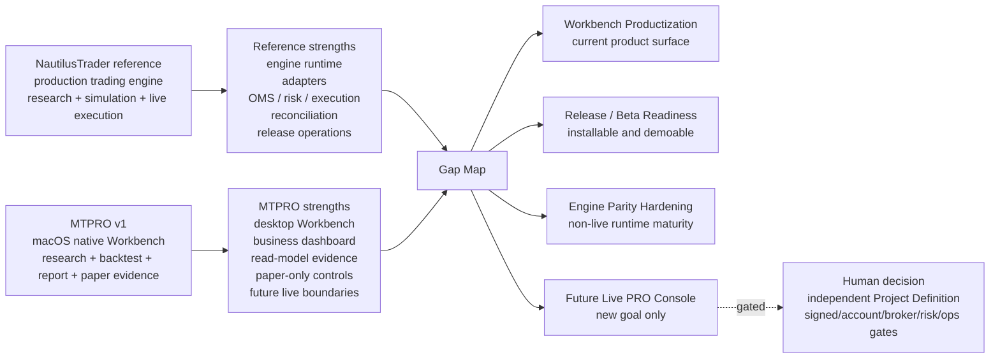
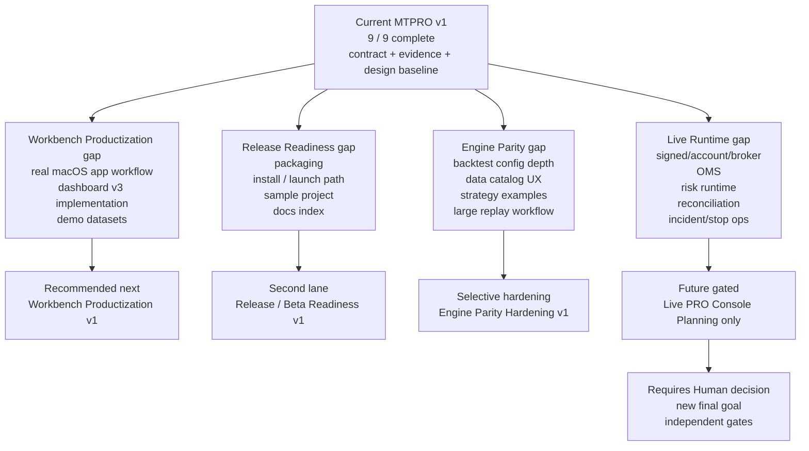
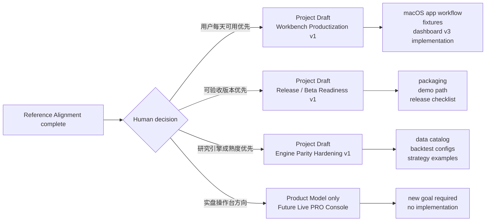

# MTPRO Reference Alignment & Product Gap Map v1

日期：2026-05-25

执行者：Codex

## 1. 文档定位

本文是 `MTPRO Reference Alignment & Product Gap Map v1`，用于在 Final Product Goal Progress 达到 `9 / 9 (100%)` 后，对齐参考项目 `atxinbao/nautilus_trader`，识别 MTPRO v1 与成熟交易系统参考之间的产品、架构、体验和发布差距。

本文不是 UI 设计稿，不是 SwiftUI 实现稿，不是 Linear execution 授权，不创建 Project / Issue，不推进 `Todo`，不启动 Symphony，不运行 Graphify，不授权 Future Live trading、Live PRO Console、真实 broker adapter、signed endpoint、real order lifecycle、incident replay runtime 或 production operations。

## 2. 输入和参考快照

| 输入 | 用途 |
| --- | --- |
| `GOAL.md` | 确认 MTPRO 当前使命、用户、9 / 9 完成事实和永久硬边界。 |
| `BLUEPRINT.md` | 确认完整产品蓝图、Future Construction Zones 和 Workbench / Live 边界。 |
| `docs/architecture.md` | 确认 SwiftPM-first、macOS-native、read-model-only 和 future live isolation 工程边界。 |
| `docs/roadmap.md` | 确认 12 / 12 closure、9 / 9 完成、Next Handoff 仍交给 Human + `@001 / PLN`。 |
| `docs/product/mtpro-product-surface-split-v1.md` | 确认 Workbench 与未来 Live PRO Console 是两个产品面。 |
| `docs/design/mtpro-workbench-user-facing-dashboard-high-fidelity-v3.md` | 确认当前 Workbench dashboard v3 是 macOS native business dashboard 设计依据。 |
| `docs/validation/latest-verification-summary.md` | 确认最近 Project closure、Root Docs Refresh Gate 和当前验证基线。 |
| `https://github.com/atxinbao/nautilus_trader` | 参考项目。2026-05-25 分析快照 clone 自 `develop`，commit `6e059dc Improve Blockchain snapshot fail-closed path`。 |

参考项目重点读取：

- `README.md`
- `ROADMAP.md`
- `ADAPTERS.md`
- `RELEASES.md`
- `docs/concepts/architecture.md`
- `docs/concepts/backtesting.md`
- `docs/concepts/execution.md`
- `docs/concepts/live.md`
- `docs/concepts/event_sourcing.md`
- `examples/backtest/*`
- `examples/live/*`

## 3. 结论摘要

MTPRO v1 已完成的是 **local-first macOS Workbench 的 contract / evidence / design baseline**，不是 NautilusTrader 级别的 production trading engine。

NautilusTrader 的成熟度集中在：

- Rust-native core trading engine。
- research / deterministic simulation / live execution 同一事件驱动架构。
- 多 venue data / execution adapters。
- 真实 order command、OMS、execution engine、risk engine。
- live reconciliation、execution reports、broker fills、position alignment。
- release cadence、Docker / package / examples / docs / benchmarking。

MTPRO 的成熟度集中在：

- macOS-native Workbench 产品面。
- Research -> Backtest -> Report -> Paper -> Events 证据链。
- append-only Event Log / Replay / Projection / Read Model / ViewModel 分层。
- Paper-only workflow、local session-level controls 和 dashboard evidence。
- Live trading / monitoring / execution / risk / incident stop 的 boundary、forbidden tests、blocked evidence 和 read-model-only surface。
- Workbench 与未来 Live PRO Console 的产品面分离。

因此下一阶段不应该直接进入 Live PRO Console 或真实 live runtime。更合理的推进顺序是：

1. **Workbench Productization v1**：把当前 Workbench dashboard v3 和 read models 做成更可用的 macOS 原生工作台。
2. **Release / Beta Readiness v1**：把当前成果变成可安装、可演示、可验收的 beta package。
3. **Engine Parity Hardening v1**：选择性吸收 NautilusTrader 的 data catalog、backtest config、strategy examples、release docs 等非 live-runtime 成熟实践。
4. **Future Live PRO Console Planning**：只有 Human 明确授权新的 final goal 后，才单独规划真实实盘产品面。

## 4. 产品面关系图

## 5. Product Surface Comparison

| 维度 | MTPRO v1 当前状态 | NautilusTrader 参考状态 | 差距判断 | 下一步归属 |
| --- | --- | --- | --- | --- |
| 产品面 | macOS Workbench；Research / Backtest / Report / Paper / Portfolio / Risk / Events / Live readiness / read-model-only monitoring | 核心交易引擎；README 明确覆盖 research、deterministic simulation 和 live execution；ROADMAP 明确 UI dashboards / frontends out of scope | 两者不是同类产品面；Nautilus 不是 UI 参考，主要是 engine / ops / release 参考 | Workbench Productization；不要照搬 Nautilus UI |
| 用户每日路径 | Workbench dashboard v3 已形成今日数据、signal、backtest、report、Paper、Portfolio / Risk、Live summary | 更偏开发者 / quant engine workflow：脚本、config、node、examples、docs | MTPRO 需要把业务面板落成真实 macOS app flow；Nautilus 可提供 workflow completeness 参考 | Workbench Productization |
| Research -> Live parity | MTPRO 已有 Research -> Backtest -> Report -> Paper 证据链；Live 仍是 boundary / blocked evidence | 同一 execution semantics 和 deterministic time model 横跨 research、simulation、live；策略可从 research 到 live 不重写 | MTPRO 尚无真实 live runtime parity；不能从 9 / 9 自动解锁 | Future Live PRO Console / Engine Parity Hardening |
| Backtest engine | MTPRO 有 deterministic replay、EMA / order book evidence、Report evidence、Dashboard smoke | BacktestEngine / BacktestNode、高低层 API、多 venue / instrument / strategy、streaming data、data catalog | MTPRO 回测产品可用性和配置深度不足 | Engine Parity Hardening |
| Data catalog / replay | MTPRO 有 Binance public read-only batch / replay / freshness / projection consistency | Nautilus 有 ParquetDataCatalog、大数据 streaming、order book / trade / bar / custom data examples | MTPRO 缺面向用户的数据管理和大样本工作流 | Workbench Productization + Engine Parity Hardening |
| Adapters | MTPRO 只有 Binance public read-only；future live adapter 被 forbidden | Nautilus official adapters 覆盖 Binance、IB、Bybit、OKX、Kraken、Coinbase、Databento、Tardis 等，分 Data / Execution | MTPRO 与 live / multi-venue adapter 成熟度差距巨大，当前不能补 live | Future Live PRO Console Planning，不进入当前实现 |
| Execution / OMS | MTPRO 只允许 paper-only session-level controls；submit / cancel / replace 仅 future gate | Nautilus Strategy 暴露 submit / modify / cancel / close / query；ExecutionEngine / OMS / ExecutionClient 管真实和模拟 order lifecycle | 这是最大 live-runtime gap，不能在 Workbench 阶段偷渡 | Future Live PRO Console only |
| Risk | MTPRO 有 paper risk blocker 和 Live Risk Gate contract / blocked evidence | Nautilus RiskEngine 位于 submit / modify path，覆盖 precision、quantity、notional、balance、rate limit、trading state | MTPRO 没有真实 pre-trade runtime；只能先改善 paper risk 可用性 | Workbench Productization；live risk future gated |
| Live reconciliation | MTPRO 只有 execution / risk / incident stop contract + blocked evidence | Nautilus LiveExecutionEngine 做 startup reconciliation、order/fill/position reports、external orders、in-flight checks | MTPRO 只完成术语和 blocked evidence，不具备 runtime | Future Live PRO Console only |
| Event sourcing / audit | MTPRO 有 append-only Event Log、Replay、Projection、Read Model、ViewModel 和 stage audit evidence | Nautilus event sourcing 设计覆盖 command/report/event capture、run manifest、recovery sealing、correlation / causation | MTPRO 审计概念接近，但缺 live command/report capture runtime 和 release ops | Engine Parity Hardening；incident runtime future gated |
| Release / packaging | MTPRO 有 `bash checks/run.sh`、SwiftPM、Dashboard smoke、Stage Audit、Root Docs Refresh | Nautilus 有 release notes、bi-weekly cadence、Docker variants、Makefile、package metadata、docs site、examples | MTPRO 缺安装包、demo path、sample data bundle、release checklist | Release / Beta Readiness |
| Native desktop UX | MTPRO 有 Figma `91:*` macOS native Workbench dashboard v3 | Nautilus 明确 UI dashboards / frontends out of scope | 这是 MTPRO 自有优势，不应向 Nautilus 对齐为 CLI-only engine | Workbench Productization |

## 6. Gap Dependency Graph

## 7. Gap Matrix

| Gap | Severity | Why it matters | What not to do | Candidate direction |
| --- | --- | --- | --- | --- |
| Workbench is designed but not productized as a daily native app | P1 | 9 / 9 证明边界和证据链完成，但用户每天使用仍需要真实 macOS navigation、state, sample data, and inspector flow | 不把 Workbench 改成 trading terminal | Workbench Productization v1 |
| Release / beta path missing | P1 | Nautilus 有 package / Docker / release notes / examples；MTPRO 目前主要是 dev checkout + checks | 不先接 broker 或 live runtime 来证明价值 | Release / Beta Readiness v1 |
| Backtest / data workflow depth below reference | P1 | Nautilus 的 high-level / low-level backtest、streaming data 和 data catalog 是研究工作流成熟度参考 | 不引入 Nautilus runtime dependency | Engine Parity Hardening v1 |
| Strategy examples too narrow | P2 | MTPRO 当前强调 EMA / order book evidence，Nautilus examples 展示 more realistic strategy range | 不做策略市场或黑盒策略平台 | Workbench Productization or Engine Parity Hardening |
| Live execution / OMS absent by design | P0 future gated | 这是与 Nautilus 最大差距，但当前硬边界禁止真实 live | 不实现 submit / cancel / replace、OMS、broker adapter | Future Live PRO Console Planning only |
| Live risk runtime absent by design | P0 future gated | Nautilus RiskEngine 已在 command path；MTPRO 只有 blocked evidence | 不实现 real pre-trade allow / reject runtime | Future Live PRO Console Planning only |
| Reconciliation / broker fill runtime absent by design | P0 future gated | Nautilus live docs 将 reconciliation 作为 production live 前提；MTPRO 只有 contract | 不实现 execution report / broker fill / reconciliation | Future Live PRO Console Planning only |
| Incident / stop operations absent by design | P0 future gated | Nautilus crash-only / event sourcing / ops docs可作为参考；MTPRO 只有 incident stop boundary | 不实现 emergency stop / shutdown / restore | Future Live PRO Console Planning only |

## 8. 下一阶段候选方向

### 方向 A：MTPRO Workbench Productization v1

目标：把当前 Workbench dashboard v3、Product Surface Split、Interaction Model、Screen Layout、UI/UX Rules 和 Component Spec 转成更可用的 macOS native Workbench 产品切片。

候选范围：

- SwiftUI / macOS shell 与 Figma `91:*` 对齐。
- Sidebar / toolbar / workspace / inspector / Events route 的真实产品 flow。
- Sample data / fixture-backed daily workflow。
- Overview -> Research -> Backtest -> Report -> Paper -> Portfolio / Risk -> Events 的用户路径。
- 继续保持 Live readiness / monitoring / execution / risk / incident stop 为 read-model-only / blocked evidence。

不进入：

- Live PRO Console。
- signed endpoint、account endpoint、listenKey。
- broker / execution adapter。
- real order lifecycle、OMS、submit / cancel / replace。
- real live risk runtime、reconciliation、incident replay runtime、stop controls。

### 方向 B：MTPRO Release / Beta Readiness v1

目标：不增加业务能力，先把 9 / 9 成果变成可安装、可演示、可验收的 beta baseline。

候选范围：

- macOS app build / launch instructions。
- Demo dataset / fixture scenario。
- Release checklist。
- Docs index cleanup。
- Environment validation。
- Smoke script and user-facing demo path。
- Version / release note template。

不进入：

- 新 product capability。
- Live PRO Console。
- broker / signed endpoint / real order behavior。

### 方向 C：MTPRO Engine Parity Hardening v1

目标：参考 NautilusTrader 的 engine maturity，选择非 live-runtime 的安全切片加强 MTPRO 的研究 / 回测 / 数据工作流。

候选范围：

- Backtest configuration depth。
- Data catalog / replay scenario UX。
- Strategy example coverage。
- Large fixture / streaming replay boundary。
- Report metrics / tear-sheet-lite summary。

不进入：

- 引入 NautilusTrader runtime dependency。
- 复制 NautilusTrader codebase。
- live execution engine / OMS / broker adapters。

### 方向 D：MTPRO Future Live PRO Console Product Model v1

目标：只做未来实盘产品面规划，不实现。

候选范围：

- Live PRO Console 用户、任务、权限、运行态、风险态、事故态。
- signed / account / broker / risk / ops gates。
- 与 Workbench Shared Evidence Contract 的边界。

不进入：

- SwiftUI implementation。
- broker connection。
- API key / secret storage。
- order command。
- emergency stop runtime。

## 9. 推荐推进顺序

推荐首选：**MTPRO Workbench Productization v1**。

理由：

- 它直接服务当前产品面，而不是跳到 future live。
- 它承接 Figma `91:*` 和 Product Surface Split 的成熟设计资产。
- 它能把 9 / 9 的 contract / evidence baseline 转成用户每天可用的 macOS app experience。
- 它可以使用 deterministic fixtures 和 local read models 验证，不需要 broker / signed endpoint / live runtime。
- 它不会与 NautilusTrader 的 open-source scope 冲突：Nautilus 不做 UI dashboard，而 MTPRO 的差异化正是 macOS native Workbench。

第二优先：**MTPRO Release / Beta Readiness v1**。

如果 Human 更想先做可验收 demo，而不是继续 UI/product implementation，则 Release / Beta Readiness 可作为首选。

第三优先：**MTPRO Engine Parity Hardening v1**。

该方向应拆得很窄，只吸收 data / backtest / report 成熟实践，不触碰 live engine。

不建议当前进入：**Future Live PRO Console Product Model v1**。

Live PRO Console 是新产品面，需要独立 Final Product Goal 或至少独立 Human decision。当前 100% 不等于 live runtime unlocked。

## 10. 下一步建议图

## 11. 非授权边界

本文档不授权：

- 创建 Linear Project / Issue。
- 修改 Linear status。
- 推进 `Todo`。
- 启动 `@002 / PAR`。
- 启动 Symphony / symphony-issue。
- 运行 Graphify update。
- 修改 Figma。
- 写业务代码。
- SwiftUI implementation。
- 引入 NautilusTrader 作为运行依赖。
- 复制 NautilusTrader 整仓代码。
- signed endpoint、account endpoint、listenKey。
- broker / exchange execution adapter。
- `LiveExecutionAdapter`。
- real order lifecycle、OMS、submit / cancel / replace。
- live risk engine、real pre-trade allow / reject runtime。
- execution report / broker fill / reconciliation runtime。
- incident replay runtime、emergency stop、shutdown、restore、production operations。
- Live PRO Console 或实盘操作台进入当前 execution scope。

